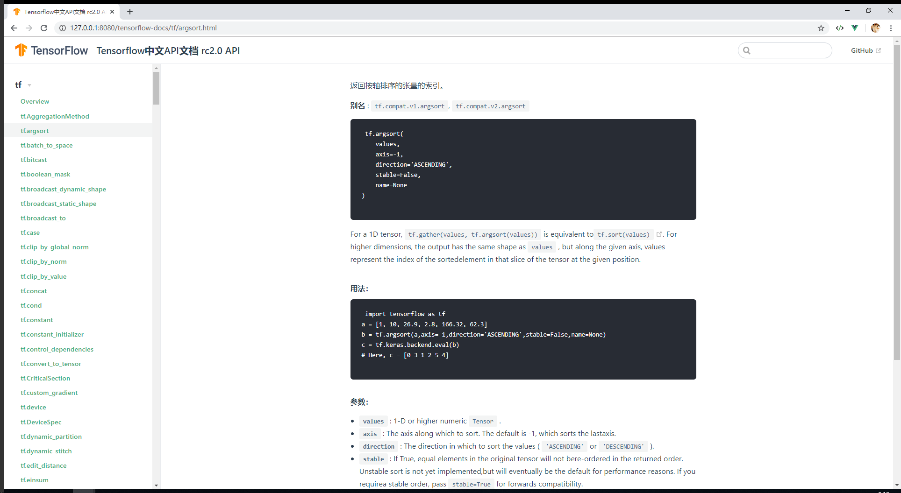

# tensorflow-docs
python 的 RC 2.0 版本 中文API文档,进行中，基于vuepress 作为静态驱动器主题、python作为项目脚本通过自动化Selenium爬取内容、百度翻译API  

## 关于本项目
- 基于python+vuepress搭建 Google Tensorflow 最新版本 2.0 API 中文文档
- 直接copy 自己用过的vuepress theme
- 所有开发文档见`/scripts` 目录
- 内容可通过脚本一键填充
- 用到爬虫工具等手段，需要一点python 编程知识
- 用到机器翻译，本项目用到百度翻译API 作为翻译支撑（因为：free~~哈哈）
- 完全很方便的可将本项目拓展到i18n项目，只要你想的话可以很快
    - 写i18n字典，见`/script/i18n.py`
    - 新起docs目录
    - 调整`docs/.vupress`里面的配置文件即可
### 统计

|类别|统计|
|---|---|
|tensorflow 文档文件个数（含丢弃）|2767|
|tensorflow 文档总行数|169618|
|tensorflow 总字符数|9487919|
|tensorflow 实际翻译字符长度|235238|

### 英文版网页展示图（在dev分支）

### 中文版网页展示图（master、docs分支）

### 项目起初一些废话

- 预计半年到一年的时间
- 2019年9月29日15:31:42 今天 中途有人告诉我API 有中文版的，呃呃呃？都做到这程度了，继续下去呗，反正也没人看咯。
- RC 1.5 API https://www.tensorflow.org/versions/r1.15/api_docs/python/tf  1.5
- 基于 2.0：https://www.tensorflow.org/versions/r2.0/api_docs/python/tf 2.0
- www.w3cschool.cn 一年前的文档： https://www.w3cschool.cn/tensorflow_python/ 
- w3c 也是基于 这个翻译的：https://devdocs.io/tensorflow~python/
- 找不到官网的markdown文件在哪~~ 喵
- 3000+ 个文件要翻译，噗。。。
- 想要机器翻译来完成，实在是整个文档太过于庞大了。

### 模块划分

|模块|英文迁移|中文|
|---|---|---|
|tf|√||
|tf.audio|√||
|tf.autograph|√||
|tf.bitwise|√||
|tf.compat|√||
|tf.config|√||
|tf.data|√||
|tf.debugging|√||
|tf.distribute|√||
|tf.dtypes|√||
|tf.errors|√||
|tf.estimator|√||
|tf.experimental|√||
|tf.feature_column|√||
|tf.graph_util|√||
|tf.image|√||
|tf.initializers|√||
|tf.io|√||
|tf.keras|√||
|tf.linalg|√||
|tf.lite|√||
|tf.lookup|√||
|tf.losses|√||
|tf.math|√||
|tf.metrics|√||
|tf.nest|√||
|tf.nn|√||
|tf.optimizers|√||
|tf.quantization|√||
|tf.queue|√||
|tf.ragged|√||
|tf.random|√||
|tf.raw_ops|√||
|tf.sets|v||
|tf.signal|√||
|tf.sparse|√||
|tf.strings|√||
|tf.summary|√||
|tf.sysconfig|√||
|tf.test|√||
|tf.tpu|√||
|tf.train|√||
|tf.version|√||
|tf.xla|√||

### 导致解析出错的地址：
- √ docs\tf.compat\v1\estimator\tpu\experimental\EmbeddingConfigSpec.md
- √ docs\tf.compat\v1\keras\initializers\Constant.md
- √ docs\tf.distribute\experimental\ParameterServerStrategy.md
- √ docs\tf.estimator\VocabInfo.md
- √ docs\tf.linalg\LinearOperatorHouseholder.md
- √ docs\tf.linalg\LinearOperatorToeplitz.md
- √ docs\tf.ragged\stack.md
- √ docs\tf.keras\backend\transpose.md
- √ docs\tf.compat\v1\flags\tf_decorator\rewrap.md
- √ docs\tf.compat\v1\estimator\BaselineClassifier.md
- √ docs\tf.compat\v1\estimator\BaselineEstimator.md
- √ docs\tf.compat\v1\estimator\BaselineRegressor.md
- √ docs\tf.compat\v1\estimator\DNNClassifier.md
- √ docs\tf.compat\v1\estimator\DNNEstimator.md
- √ docs\tf.compat\v1\estimator\DNNLinearCombinedClassifier.md
- √ docs\tf.compat\v1\estimator\DNNLinearCombinedEstimator.md
- √ docs\tf.compat\v1\estimator\DNNLinearCombinedRegressor.md
- √ docs\tf.compat\v1\estimator\DNNRegressor.md
- √ docs\tf.compat\v1\estimator\Estimator.md
- √ docs\tf.compat\v1\estimator\LinearClassifier.md
- √ docs\tf.compat\v1\estimator\LinearRegressor.md
- √ docs\tf.compat\v1\space_to_batch.md
- √ docs\tf.estimator\Estimator.md
- √ docs\tf.compat\v1\DeviceSpec.md
- √ docs\tf.compat\v1\gradients.md
- √ docs\tf.compat\v1\queue\Overview.md
- √ docs\tf.keras\backend\floatx.md
- √ docs\tf.math\log.md

## vuepress theme 阅读规范

- 下划线，代表有链接 todo

## TODO 额外：尝试迁移前端项目到Python平台

已迁移到新的仓库：[pypackjs](https://github.com/veaba/pypackjs)

> vuepress build 构建本项目需要3个小时，所以想找一种替代方案来完成，之前尝试过python 的线程池 将工作效率提高20倍以上，这或许是一种方式  

2.6K个文件，生成js等静态文件，多达5.2k多，需要等待3个小时才能打包完毕。

这对于node来说毕竟也是单线程。

如果将node 这一套打包机制迁移到多线程的编程语言平台上，会不会很快呢？

因为对于前端打包机制不太清楚，但理论上应该是：

1. 根据文件构建关系
2. 构建内联和引用
3. 根据html结构生成语法树，然后给vue 的SPA应用使用的
4. vuepress 通过一些工具类（本质上也就是正则的方式）将markdown文件翻译为HTML文件

我的构想是，python其实可以调用js平台处理一些事情，这样是可以配合webpack打包机制+python 多线程（之前享受过线程池带来的快感）来处理文件的转化，速度会不会更快呢？

而重点是:
1. vuepress 项目文件关系如何连接
2. 怎么将md文件转为html文件
3. html转为语法树的js文件

工作内容（几乎要翻写一个webpack了）：

- style load
- sass load
- styl load
- scss load
- ts load
- vue load，打包vue项目
- url load
- file load
- markdown-load >
    - markdown-html
- html->AST
- js-load 解析js文件,但也是可以调用JS引擎做一些事情
- v-node load
- python 版本的js压缩工具  

分析了一波，所以需要看一下vuepres 的核心源码是怎么做的，并迁移到python平台

## 工作进度

### 新增分支
- 新增dev分支，保留原始docs en 文档，用来生成中文文档
- 新增tag origin-bookmark ，保留原始文档  
