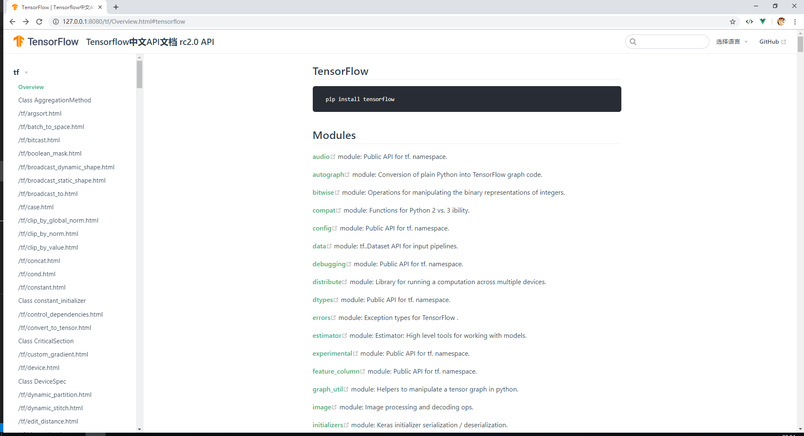

# tensorflow-docs
python 的 RC 2.0 版本 中文API文档,进行中，基于vuepress 作为静态驱动器主题
## 工作进度

### 新增分支
- 新增dev分支，保留原始docs en 文档，用来生成中文文档
- 新增tag origin-bookmark ，保留原始文档


### 模块


|模块|英文迁移|中文|
|---|---|---|
|tf|√||
|tf.audio|√||
|tf.autograph|√||
|tf.bitwise|√||
|tf.compat|√||
|tf.config|√||
|tf.data|√||
|tf.debugging|√||
|tf.distribute|√||
|tf.dtypes|√||
|tf.errors|√||
|tf.estimator|√||
|tf.experimental|√||
|tf.feature_column|√||
|tf.graph_util|√||
|tf.image|√||
|tf.initializers|√||
|tf.io|√||
|tf.keras|√||
|tf.linalg|√||
|tf.lite|√||
|tf.lookup|√||
|tf.losses|√||
|tf.math|√||
|tf.metrics|√||
|tf.nest|√||
|tf.nn|√||
|tf.optimizers|√||
|tf.quantization|√||
|tf.queue|√||
|tf.ragged|√||
|tf.random|√||
|tf.raw_ops|√||
|tf.sets|v||
|tf.signal|√||
|tf.sparse|√||
|tf.strings|√||
|tf.summary|√||
|tf.sysconfig|√||
|tf.test|√||
|tf.tpu|√||
|tf.train|√||
|tf.version|√||
|tf.xla|√||
||||


    
## 统计

|类别|统计|
|---|---|
|tensorflow文档文件个数（含丢弃）|2767|
|tensorflow文档总行数|169618|
|tensorflow 总字符数|9487919|
|||


## API 计费标准

### 百度翻译API

|版本|计费|耗时|
|---|---|---|
|普通版本|免费|47个小时，1次/s|
|高级版本|月低于200w，超过则49元百万/字符，需要366RMB|4.7个小时，10次/1s|
|企业版|月低于200w，超过则49元百万/字符，需要366RMB|0.47个小时=28分钟，100次/1s|
||||

翻译 create_i18n_file 所消耗时间： 2683.6810030937195，将5334行英文转为中文。


## 网页展示图



- 预计半年到一年的时间
- 2019年9月29日15:31:42 今天 中途有人告诉我API 有中文版的，呃呃呃？都做到这程度了，继续下去呗，反正也没人看咯。

RC 1.5 API https://www.tensorflow.org/versions/r1.15/api_docs/python/tf  1.5

基于 2.0：https://www.tensorflow.org/versions/r2.0/api_docs/python/tf 2.0

www.w3cschool.cn 一年前的文档： https://www.w3cschool.cn/tensorflow_python/ 

w3c 也是基于 这个翻译的：https://devdocs.io/tensorflow~python/

https://github.com/zalandoresearch/fashion-mnist

找不到官网的markdown文件在哪~~ 喵

3000+ 个文件要翻译，噗。。。

想要机器翻译来完成，实在是整个文档太过于庞大了。


## 机器翻译

### 方法一：找到了1.14的
1. 先找到官方md文件
2. 通过百度API 把MD文件翻译为中文
3. 官方文档在这里:https://github.com/tensorflow/docs/tree/r1.14/site/en/api_docs/python/tf/data


### 方法二：胎死腹中，谷歌的反爬虫实在是太厉害了，我不知道怎么突破。爬不过页面
1. 通过Python 爬虫拉取文档HTML
    - 解析code
2. HTML 转markdown
3. markdown 通过百度API翻译为中文mk

http://www.bejson.com/convert/html2markdown/ 可以通过html 转markdown

### 方法三(目前)：selenium+webdriver+百度API 的方式（自动化测试策略）

1. 通过python自动化工具selenium + webdriver
2. 爬取tensorflow API 文档
3. 定制爬取规则后，通过百度API 去翻译文档（现已成功）
4. 目前套餐是免费的1s（无限量使用）
5. demo见（scripts/spider_tensorflow_docs.py）
6. 需要安装chromeDriver，目前是在windows平台完成
7. TODO Image、Table
8. TODO 需要多线程处理这个异步请求！
9. 完成了文件的爬取，但此时是英文

### 特点（TODO）

- 有view source on Github 的按钮
- h标签系列
- images标签
- 表格
- a标签
- code
- pre标签
- ul 标签
- h1
- h2
- h3
- h4
- h5

## 使用

### 开发
- 安装node
- 开发命令行

```text
npm install
cnpm run dev

```

### 生产(未验证)
```text
npm install
cnpm run build

```


## scripts 是脚本目录

|文件|用途|
|---|---|
|[category.py](scripts/category.py)|目录|
|[check_empty_file.py](scripts/check_empty_file.py)|用途检查文件docs的文件是否为空不被写入|
|[config.py](scripts/config.py)|百度翻译秘钥，不上传到仓库|
|[create_file.py](scripts/create_file.py)|创建docs 的文件|
|[create_json.py](scripts/create_json.py)|创建sidebar文件的脚本|
|[spider.py](scripts/spider.py)|爬虫，暂无用到|
|[spider_tensorflow_docs.py](scripts/spider_tensorflow_docs.py) |核心文件，爬取google 的tensorflow rc 2.0 API 文档。速度很慢，需要优化，跑完这个项目的文件，耗费24小时吧|
|[test.py](scripts/test.py)|测试文件|
|[line_to_line.py](scripts/line_to_line.py)|TODO 读行准备去跑API，需要解析md文件|
|[total.py](scripts/total.py)|统计脚本|

## 基于vuepress 搭建

- 直接copy 自己用过的vuepress theme
- 内容尚未填充


## 技巧

### 基于vscode 正则替换

需要将category.py 的结构转为vuepress使用，但写个函数考虑成本比较多，所以需要手动替换文本

    查找："tf(.*?)"
    替换：{title:$0,type:"group",link:$0}
