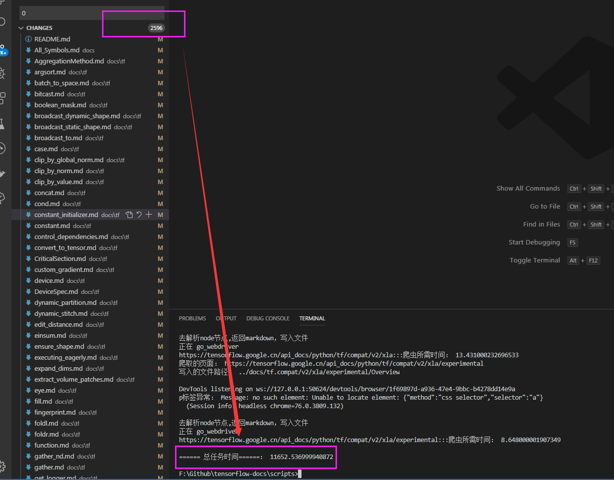

# tensorflow-docs
python 的 RC 2.0 版本 中文API文档,进行中，基于vuepress 作为静态驱动器主题、python作为项目脚本通过自动化Selenium爬取内容、百度翻译API


### TODO
- 增加丢弃的模块标注或者移除
- 发现tf目录文档重复，需要重爬这个目录 2019年10月11日16:29:15
- 现在进入对比源文档阶段1%
- All_Symbols.md 这个不知道干嘛了！
    - 给官方提供一个正则溢出bug： https://bugs.python.org/issue38582 由于使用八进制导致当双斜杠替换符//100 混淆了,但现阶段似乎不准备修复这个问题。
    - 由于进制混淆的原因，准备限制到99就报错了，而不再支持超过99的双斜杠替换符
    - F:\Github\tensorflow-docs\docs\tf.ragged\Overview.md
    - F:\Github\tensorflow-docs\docs\tf.compat\v2\ragged\Overview.md
    - F:\Github\tensorflow-docs\docs\tf.compat\v1\ragged\Overview.md
    - F:\Github\tensorflow-docs\docs\All_Symbols.md

```python
# 替换后(过于简介，引起舒适，当初怎么想起一坨坨代码的。。。还第一个发现的python 正则溢出)：
def fn_parse_code_after(list_str, text):
    for code in list_str:
        text=text.replace(code,'`'+code+'`')
    return text

# 替换前：
def fn_parse_code_before(list_str, text):
    code_text_str = list_to_str(list_str, '|')  # 转为字符 xxx|oo
    reg_list = ['+', '.', '[', ']', '((', '))']
    # 再次转换
    for reg in reg_list:
        code_text_str = code_text_str.replace(reg, "\\" + reg)

    # 编译为正则
    pattern_str = re.compile(r'' + code_text_str + '')

    # 根据list_str,转为\\1\\2

    flag_str = ''
    for item in enumerate(list_str):
        flag_str = flag_str + "\\" + str(item[0] + 1)

    # (\(ddd\))
    # flag_str ==>\\1\\2\\3
    reg_text = re.sub(pattern_str, "`" + flag_str + "`", text)
    return reg_text

```
- TODO 调整转移策略（2019年10月29日11:19:34），更优化精准的将HTML转为markdown
> get_attribute('innerHTML')
## TODO 额外：尝试迁移前端项目到Python平台

已迁移到新的仓库：[pypackjs](https://github.com/veaba/pypackjs)

> vuepress build 构建本项目需要3个小时，所以想找一种替代方案来完成，之前尝试过python 的线程池 将工作效率提高20倍以上，这或许是一种方式


2.6K个文件，生成js等静态文件，多达5.2k多，需要等待3个小时才能打包完毕。

这对于node来说毕竟也是单线程。

如果将node 这一套打包机制迁移到多线程的编程语言平台上，会不会很快呢？

因为对于前端打包机制不太清楚，但理论上应该是：

1. 根据文件构建关系
2. 构建内联和引用
3. 根据html结构生成语法树，然后给vue 的SPA应用使用的
4. vuepress 通过一些工具类（本质上也就是正则的方式）将markdown文件翻译为HTML文件

我的构想是，python其实可以调用js平台处理一些事情，这样是可以配合webpack打包机制+python 多线程（之前享受过线程池带来的快感）来处理文件的转化，速度会不会更快呢？

而重点是:
1. vuepress 项目文件关系如何连接
2. 怎么将md文件转为html文件
3. html转为语法树的js文件

工作内容（几乎要翻写一个webpack了）：

- style load
- sass load
- styl load
- scss load
- ts load
- vue load，打包vue项目
- url load
- file load
- markdown-load >
    - markdown-html
- html->AST
- js-load 解析js文件,但也是可以调用JS引擎做一些事情
- v-node load
- python 版本的js压缩工具


分析了一波，所以需要看一下vuepres 的核心源码是怎么做的，并迁移到python平台
## 关于本项目
- 基于python+vuepress搭建 Google Tensorflow 最新版本 2.0 API 中文文档
- 直接copy 自己用过的vuepress theme
- 内容可通过脚本一键填充
- 用到爬虫工具等手段，需要一点python 编程知识
- 用到机器翻译，本项目用到百度翻译API 作为翻译支撑（因为：free~~哈哈）
- 完全很方便的可将本项目拓展到i18n项目，只要你想的话可以很快
    - 写i18n字典，见`/script/i18n.py`
    - 新起docs目录
    - 调整`docs/.vupress`里面的配置文件即可
### 统计

|类别|统计|
|---|---|
|tensorflow 文档文件个数（含丢弃）|2767|
|tensorflow 文档总行数|169618|
|tensorflow 总字符数|9487919|
|tensorflow 实际翻译字符长度|235238|

### 网页展示图


## 工作进度

### 官方文档实际上还没有完成翻译，所以我被坑了

- https://tensorflow.google.cn/api_docs/python/tf/batch_to_space 排版错误
- 

### 新增分支
- 新增dev分支，保留原始docs en 文档，用来生成中文文档
- 新增tag origin-bookmark ，保留原始文档


### 项目起初一些废话

- 预计半年到一年的时间
- 2019年9月29日15:31:42 今天 中途有人告诉我API 有中文版的，呃呃呃？都做到这程度了，继续下去呗，反正也没人看咯。

RC 1.5 API https://www.tensorflow.org/versions/r1.15/api_docs/python/tf  1.5

基于 2.0：https://www.tensorflow.org/versions/r2.0/api_docs/python/tf 2.0

www.w3cschool.cn 一年前的文档： https://www.w3cschool.cn/tensorflow_python/ 

w3c 也是基于 这个翻译的：https://devdocs.io/tensorflow~python/

https://github.com/zalandoresearch/fashion-mnist

找不到官网的markdown文件在哪~~ 喵

3000+ 个文件要翻译，噗。。。

想要机器翻译来完成，实在是整个文档太过于庞大了。

### 模块划分

|模块|英文迁移|中文|
|---|---|---|
|tf|√||
|tf.audio|√||
|tf.autograph|√||
|tf.bitwise|√||
|tf.compat|√||
|tf.config|√||
|tf.data|√||
|tf.debugging|√||
|tf.distribute|√||
|tf.dtypes|√||
|tf.errors|√||
|tf.estimator|√||
|tf.experimental|√||
|tf.feature_column|√||
|tf.graph_util|√||
|tf.image|√||
|tf.initializers|√||
|tf.io|√||
|tf.keras|√||
|tf.linalg|√||
|tf.lite|√||
|tf.lookup|√||
|tf.losses|√||
|tf.math|√||
|tf.metrics|√||
|tf.nest|√||
|tf.nn|√||
|tf.optimizers|√||
|tf.quantization|√||
|tf.queue|√||
|tf.ragged|√||
|tf.random|√||
|tf.raw_ops|√||
|tf.sets|v||
|tf.signal|√||
|tf.sparse|√||
|tf.strings|√||
|tf.summary|√||
|tf.sysconfig|√||
|tf.test|√||
|tf.tpu|√||
|tf.train|√||
|tf.version|√||
|tf.xla|√||

## 机器翻译

### 方法一：找到了1.14的
1. 先找到官方md文件
2. 通过百度API 把MD文件翻译为中文
3. 官方文档在这里:https://github.com/tensorflow/docs/tree/r1.14/site/en/api_docs/python/tf/data

### 方法二：胎死腹中，谷歌的反爬虫实在是太厉害了，我不知道怎么突破。爬不过页面
1. 通过Python 爬虫拉取文档HTML
    - 解析code
2. HTML 转markdown
3. markdown 通过百度API翻译为中文mk

### 方法三(目前)：selenium+webdriver+百度API 的方式（自动化测试策略）

1. 通过python自动化工具selenium + webdriver
2. 爬取tensorflow API 文档
3. 定制爬取规则后，通过百度API 去翻译文档（现已成功）
4. 目前套餐是免费的1s（无限量使用）
5. demo见（scripts/spider_tensorflow_docs.py）
6. 需要安装chromeDriver，目前是在windows平台完成
7. TODO Image、Table
8. 需要多线程处理这个异步请求！
9. 完成了文件的爬取，但此时是英文


### 百度翻译API

|版本|计费|耗时|
|---|---|---|
|普通版本|免费|47个小时，1次/s|
|高级版本|月低于200w，超过则49元百万/字符，需要366RMB|4.7个小时，10次/1s|
|企业版|月低于200w，超过则49元百万/字符，需要366RMB|0.47个小时=28分钟，100次/1s|
||||

翻译 create_i18n_file 所消耗时间： 2683.6810030937195，将5334行英文转为中文。

### 基于vscode 正则替换

需要将category.py 的结构转为vuepress使用，但写个函数考虑成本比较多，所以需要手动替换文本

    查找："tf(.*?)"
    替换：{title:$0,type:"group",link:$0}

### 特点

- 有view source on Github 的按钮
- h标签系列
- images标签
- 表格
- a标签
- code
- pre标签
- ul 标签
- h1
- h2
- h3
- h4
- h5

## 使用

### 开发
- 安装node
- 开发命令行

```text
npm install
cnpm run dev

```

### 生产(未验证)
```text
npm install
cnpm run build

```
### 优化手段
为什么这文件个数有点不一样呀。需要走一下check_empty的脚本来检查

|测试次数|描述|指标|
|---|---|---|
|第一次|同步，超过24小时才能完成2.56k文件的爬虫，|同时没有手动关闭driver情况下，导致N多进程在资源管理器停留|
|第二次|异步，引入线程池，调用20个线程|3.2个小时完成2.56k个文件，耗时：11652.326999940872|
|第三次|异步，修复Python正则溢出带来的字符串乱码问题|3.29个小时完成,引入线程池，调用200个线程，耗时：11874s
|第四次|异步，不存储实例，移除无关打印|调用200个线程，2602个文件，2.3个小时，8322.792520046234s
|第五次|异步，不存储实例，移除无关打印|调用1000个线程，2602个文件，2.2个小时,8020.099550962448
|第六次|异步，不存储实例，移除无关打印|调用8个线程，2602个文件，2.27个小时,8187.604654073715
|第七次|异步，不存储实例，移除无关打印|调用8个线程，100个文件，无递归，152s不等
|第七次|异步，不存储实例，移除无关打印|调用16个线程，100个文件，无递归，104s、111s、116不等
|第八次|异步，不存储实例，移除无关打印|调用20个线程，100个文件，无递归，104s、303s不等
|第九次|异步，不存储实例，移除无关打印|调用30个线程，100个文件，无递归，250s不等
|第十次|异步，不存储实例，移除无关打印|调用50个线程，100个文件，无递归，278s、2974s不等
|第十一次|异步，不存储实例，移除无关打印|调用100个线程，100个文件，无递归，116s不等
|第十二次|异步，不存储实例，移除无关打印|调用16个线程，2593个文件，无递归，2751s、2444s

### 举一反三：
- 使用线程池，从超过24小时的爬虫任务（爬取2.56k个页面，20个线程）直接降低到只需3.2个小时(194分钟)


- 优化截断式、嵌套式代码判断时间冗余
- 过滤无关翻译代码块，从990w+字符 降低到23w字符
- TODO 优化：因为for 取节点，然后再写入，能不能一边写入一边读节点？
- TODO 下面代码是一次改造，由于创建webdriver的时间不对，不能不能保存实例，下次直接调用即可
    1、new 一个实例出来耗时1-10s不等
    2、a 实例完成工作时候先不销毁，将实例存储到一个数组array里面
    3、下一个任务，直接从数组array里面拿实例a过来使用，减少重复创建实例的时间
```python
# 实际优化的源码,尚未优化
def go_webdriver(url_path, file_path):
    if not can_write(file_path):
        print("已存在文件，将忽略跳过：", file_path)
        return
    start_time1 = time.time()
    # 静默运行,如果把下面这四行一直保持
    # todo 然后转走driver.get去更换url，速度应该可以继续提升
    option = webdriver.ChromeOptions()
    option.add_argument("headless")
    driver = webdriver.Chrome(options=option)
    # todo 把这个driver 存储到一个数组里面，保存这个状态，然后下一次再取出来
    driver.get(url_path)

    node_level(driver, file_markdown_path=file_path)
    # 在这里，将driver append 到driverQueueList里面去。只需要判断存在则继续调用，而不需要再次建立
    print('正在 go_webdriver')
    end_time1 = time.time()
    print(url_path + ':::爬虫所需时间：', end_time1 - start_time1)
```

- 使用实例存储竟然无法增加时间，
```python
 # TODO 下面的判断是通过存储临时实例来减少重复创建实例的时间
    if len(DRIVER_INSTANCE_LIST):
        DRIVER_INSTANCE_LIST[len(DRIVER_INSTANCE_LIST)-1].get(url_path)  # 提取第一个实例
        node_level(DRIVER_INSTANCE_LIST[len(DRIVER_INSTANCE_LIST)-1], file_markdown_path=file_path)
    else:
        # 静默运行,如果把下面这四行一直保持
        # todo 然后转走driver.get去更换url，速度应该可以继续提升
        option = webdriver.ChromeOptions()
        option.add_argument("headless")
        driver = webdriver.Chrome(options=option)
        # todo 把这个driver 存储到一个数组里面，保存这个状态，然后下一次再取出来
        DRIVER_INSTANCE_LIST.append(driver)
        driver.get(url_path)
        node_level(driver, file_markdown_path=file_path)
        # 在这里，将driver append 到driverQueueList里面去。只需要判断存在则继续调用，而不需要再次建立
```

# 优化前的代码
```python
# 存储实例测试
import time
instanceList=[]

class A:
    def __init__(self):
        instanceList.append(self)
        time.sleep(1)
    def go(self,i):
        # time.sleep(1)
        print(i,'我被实例化拉！',time.time())


start=time.time()
for i in range(10):
    a=A()
    a.go(i)
instanceList=[] #销毁
end=time.time()
print(instanceList)
print('消耗时间：',end-start) # 消耗时间： 1.0
```

优化后的代码
````python
# 存储实例测试
import time
instanceList=[]

class A:
    def __init__(self):
        instanceList.append(self)
        time.sleep(1)
    def go(self,i):
        # time.sleep(1)
        print(i,'我被实例化拉！',time.time())


start=time.time()
for i in range(10):
    if len(instanceList):
        instanceList[0].go(i)
    else:
        a=A()
        a.go(i)

instanceList=[] #销毁
end=time.time()
print(instanceList)
print('消耗时间：',end-start) # 消耗时间： 1.0
````

## scripts 脚本目录

> 如果感兴趣的，可以checkout 到dev分支来完整体验这个项目的机器翻译的过程

这个脚本是通过Python来完成，懂和不懂都可以玩下哈~~

提示：这个scripts目录是少一个存储百度翻译的秘钥`config.py`文件，我忽略gitignore了，里面就是这样：

```python
appid="xxxxx"
key="xxxx"
```

- 第一步：收集目录文件。先爬取tensorflow 的目录，生成`category.py` 对外暴露`category` 这个变量（核心文件）。
   
    - 这个过程很耗费时间，并抽离整理全部的文档结构
    - 需要人工手动操作dom操作来录入的，很容易出问题。如果花点时间也是可以自动化爬取的。

- 第二步：生成预置文件。多次执行`create_markdown.py`预生成markdown文件，因为目录需要递归，需要这边是手动执行多次（tensorflow文档目前最多有六层的结构）来生成空文件

    - 警告：请不要在翻译好的文件执行这一步，因为会预生成空文件覆盖源文件
    - 警告：爬虫脚本`spider_tensorflow_docs.py` 还不是完善，不能万能，对于字符："`"字符还是有点小问题，需要手动调整脚本了和手动翻译了

- 第三步：爬取文档内容。根据第一步的`category.py`的目录，利用自动化测试软件selenium 工具配合chrome driver方案爬取tensorflow的API 文档，见`spider_tensorflow_docs.py`

    - 这一步是写递归函数，将`category.py` 的路径拼成为url地址，然后根据url去爬取页面
    - 再把HTML 文档标签的关键信息，写函数拼凑成为mardown格式文件，写到docs目录
    - 这一步是最慢的，全跑完2500+个markdown文件，耗费了24小时左右，我想这一个步骤是可以优化的

- 第四步：制作目录文件。根据`category.py` 去生成`vuepress` 的`links.js`文件，用来组织左侧菜单目录

    - 这一步因为目前只是用`vscode`加人工的方式正则替换，同样耗费一天工作量
    - 拼凑成为`vuepress` 可用的结构

- 第五步：申请翻译API。去申请百度翻译API [规格看百度翻译API](#百度翻译API) ，后续用到

    - 百度翻译平台地址：http://api.fanyi.baidu.com/api/trans/product/index
    - 价格比较低廉，毕竟普通版本无限！！免费！！遗憾的是并发只能1次/s

- 第六步：生成字典文件。根据`create_i18n_py.py`筛选，生成空的英文字典以及对应的中文i18n字典文件`i18n.py`

    - 这个脚本含有两个函数，第一个`create_i18n_py.py`,创建空字典文件`i18n_dict`，
    - 第二个函数`i18n_translate`,根据上面生成空字典`i18n_dict.py`对应的字典key 通过第五步的API 补齐i18n字典的value值
    - 这里的关键是需要写函数判断避开无需翻译的字段，比如整个项目900W的字符，需要真正翻译的也是就`235238`字符
    - 这里建议选择百度翻译的高级模式，调整下延时，可以节省几倍的时间

- 第七步：一键翻译文档。执行`create_zh_docs.py`,一键生成中文文档。
    - 这一步根据翻译完成`i18n.py`后会得到一个字典文件，，生成中文文档替换原来的英文文档。
    - 根据这个字典来替换文件或者覆盖源文件，本项目采取的是覆盖模式，所以有需要翻译什么日语啊、法语的，需要注意下。
    - 生成其他语言的需求，需要注意下路径问题，需要copy出来新的一份docs api markdown文件，并翻译出新的他国字典
    - 如果翻译的不对的话，可以调整下字典文件，并返回原英文文档重新生成即可
    - 但建议：脚本一键生成之后脚本可以做保留用，后续手动调整markdown文件即可，无需再用脚本生成，尽管biubiu~一下就完成，很好玩~~
    - 记住，做备份！

- 第八步：发布
    - 因为文件太多，vuepress 生成2.5k个文件确实很慢，起码两个小时才能build完成


### 目录

|文件|用途|
|---|---|
|[category.py](scripts/category.py)|目录|
|[check_empty_file.py](scripts/check_empty_file.py)|用途检查文件docs的文件是否为空不被写入|
|[config.py](scripts/config.py)|百度翻译秘钥，不上传到仓库|
|[create_file.py](scripts/create_file.py)|创建docs 的文件|
|[create_json.py](scripts/create_json.py)|创建sidebar文件的脚本|
|[spider.py](scripts/spider.py)|爬虫，暂无用到|
|[spider_tensorflow_docs.py](scripts/spider_tensorflow_docs.py) |核心文件，爬取google 的tensorflow rc 2.0 API 文档。速度很慢，需要优化，跑完这个项目的文件，耗费24小时吧|
|[test.py](scripts/test.py)|测试文件|
|[create_zh_docs.py](scripts/create_zh_docs.py)|将跑出来的i18n文件，直接做字典替换覆写原英文md文件|
|[create_i18n.py](scripts/create_i18n.py)|创建英文字典、第二步通过百度API翻译之后的文档添加到i18n，并手动调整|
|[total.py](scripts/total.py)|统计脚本|

