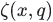

Bring in all of the public TensorFlow interface into this module.

## Modules
[ `app` ](https://tensorflow.google.cn/api_docs/python/tf/compat/v1/app) module: Generic entry point script.

[ `audio` ](https://tensorflow.google.cn/api_docs/python/tf/compat/v1/audio) module: Public API for tf.audio namespace.

[ `autograph` ](https://tensorflow.google.cn/api_docs/python/tf/compat/v1/autograph) module: Conversion of plain Python into TensorFlow graph code.

[ `bitwise` ](https://tensorflow.google.cn/api_docs/python/tf/compat/v1/bitwise) module: Operations for manipulating the binary representations of integers.

[ `compat` ](https://tensorflow.google.cn/api_docs/python/tf/compat/v1/compat) module: Functions for Python 2 vs. 3 compatibility.

[ `config` ](https://tensorflow.google.cn/api_docs/python/tf/compat/v1/config) module: Public API for tf.config namespace.

[ `data` ](https://tensorflow.google.cn/api_docs/python/tf/compat/v1/data) module: [ `tf.data.Dataset` ](https://tensorflow.google.cn/api_docs/python/tf/data/Dataset) API for input pipelines.

[ `debugging` ](https://tensorflow.google.cn/api_docs/python/tf/compat/v1/debugging) module: Public API for tf.debugging namespace.

[ `distribute` ](https://tensorflow.google.cn/api_docs/python/tf/compat/v1/distribute) module: Library for running a computation across multiple devices.

[ `distributions` ](https://tensorflow.google.cn/api_docs/python/tf/compat/v1/distributions) module: Core module for TensorFlow distribution objects and helpers.

[ `dtypes` ](https://tensorflow.google.cn/api_docs/python/tf/compat/v1/dtypes) module: Public API for tf.dtypes namespace.

[ `errors` ](https://tensorflow.google.cn/api_docs/python/tf/compat/v1/errors) module: Exception types for TensorFlow errors.

[ `estimator` ](https://tensorflow.google.cn/api_docs/python/tf/compat/v1/estimator) module: Estimator: High level tools for working with models.

[ `experimental` ](https://tensorflow.google.cn/api_docs/python/tf/compat/v1/experimental) module: Public API for tf.experimental namespace.

[ `feature_column` ](https://tensorflow.google.cn/api_docs/python/tf/compat/v1/feature_column) module: Public API for tf.feature_column namespace.

[ `flags` ](https://tensorflow.google.cn/api_docs/python/tf/compat/v1/flags) module: Import router for absl.flags. See https://github.com/abseil/abseil-py.

[ `gfile` ](https://tensorflow.google.cn/api_docs/python/tf/compat/v1/gfile) module: Import router for file_io.

[ `graph_util` ](https://tensorflow.google.cn/api_docs/python/tf/compat/v1/graph_util) module: Helpers to manipulate a tensor graph in python.

[ `image` ](https://tensorflow.google.cn/api_docs/python/tf/compat/v1/image) module: Image processing and decoding ops.

[ `initializers` ](https://tensorflow.google.cn/api_docs/python/tf/compat/v1/initializers) module: Public API for tf.initializers namespace.

[ `io` ](https://tensorflow.google.cn/api_docs/python/tf/compat/v1/io) module: Public API for tf.io namespace.

[ `keras` ](https://tensorflow.google.cn/api_docs/python/tf/compat/v1/keras) module: Implementation of the Keras API meant to be a high-level API for TensorFlow.

[ `layers` ](https://tensorflow.google.cn/api_docs/python/tf/compat/v1/layers) module: Public API for tf.layers namespace.

[ `linalg` ](https://tensorflow.google.cn/api_docs/python/tf/compat/v1/linalg) module: Operations for linear algebra.

[ `lite` ](https://tensorflow.google.cn/api_docs/python/tf/compat/v1/lite) module: Public API for tf.lite namespace.

[ `logging` ](https://tensorflow.google.cn/api_docs/python/tf/compat/v1/logging) module: Logging and Summary Operations.

[ `lookup` ](https://tensorflow.google.cn/api_docs/python/tf/compat/v1/lookup) module: Public API for tf.lookup namespace.

[ `losses` ](https://tensorflow.google.cn/api_docs/python/tf/compat/v1/losses) module: Loss operations for use in neural networks.

[ `manip` ](https://tensorflow.google.cn/api_docs/python/tf/compat/v1/manip) module: Operators for manipulating tensors.

[ `math` ](https://tensorflow.google.cn/api_docs/python/tf/compat/v1/math) module: Math Operations.

[ `metrics` ](https://tensorflow.google.cn/api_docs/python/tf/compat/v1/metrics) module: Evaluation-related metrics.

[ `nest` ](https://tensorflow.google.cn/api_docs/python/tf/compat/v1/nest) module: Public API for tf.nest namespace.

[ `nn` ](https://tensorflow.google.cn/api_docs/python/tf/compat/v1/nn) module: Wrappers for primitive Neural Net (NN) Operations.

[ `profiler` ](https://tensorflow.google.cn/api_docs/python/tf/compat/v1/profiler) module: Public API for tf.profiler namespace.

[ `python_io` ](https://tensorflow.google.cn/api_docs/python/tf/compat/v1/python_io) module: Python functions for directly manipulating TFRecord-formatted files.

[ `quantization` ](https://tensorflow.google.cn/api_docs/python/tf/compat/v1/quantization) module: Public API for tf.quantization namespace.

[ `queue` ](https://tensorflow.google.cn/api_docs/python/tf/compat/v1/queue) module: Public API for tf.queue namespace.

[ `ragged` ](https://tensorflow.google.cn/api_docs/python/tf/compat/v1/ragged) module: Ragged Tensors.

[ `random` ](https://tensorflow.google.cn/api_docs/python/tf/compat/v1/random) module: Public API for tf.random namespace.

[ `raw_ops` ](https://tensorflow.google.cn/api_docs/python/tf/compat/v1/raw_ops) module: Public API for tf.raw_ops namespace.

[ `resource_loader` ](https://tensorflow.google.cn/api_docs/python/tf/compat/v1/resource_loader) module: Resource management library.

[ `saved_model` ](https://tensorflow.google.cn/api_docs/python/tf/compat/v1/saved_model) module: Public API for tf.saved_model namespace.

[ `sets` ](https://tensorflow.google.cn/api_docs/python/tf/compat/v1/sets) module: Tensorflow set operations.

[ `signal` ](https://tensorflow.google.cn/api_docs/python/tf/compat/v1/signal) module: Signal processing operations.

[ `sparse` ](https://tensorflow.google.cn/api_docs/python/tf/compat/v1/sparse) module: Sparse Tensor Representation.

[ `spectral` ](https://tensorflow.google.cn/api_docs/python/tf/compat/v1/spectral) module: Public API for tf.spectral namespace.

[ `strings` ](https://tensorflow.google.cn/api_docs/python/tf/compat/v1/strings) module: Operations for working with string Tensors.

[ `summary` ](https://tensorflow.google.cn/api_docs/python/tf/compat/v1/summary) module: Operations for writing summary data, for use in analysis and visualization.

[ `sysconfig` ](https://tensorflow.google.cn/api_docs/python/tf/compat/v1/sysconfig) module: System configuration library.

[ `test` ](https://tensorflow.google.cn/api_docs/python/tf/compat/v1/test) module: Testing.

[ `tpu` ](https://tensorflow.google.cn/api_docs/python/tf/compat/v1/tpu) module: Ops related to Tensor Processing Units.

[ `train` ](https://tensorflow.google.cn/api_docs/python/tf/compat/v1/train) module: Support for training models.

[ `user_ops` ](https://tensorflow.google.cn/api_docs/python/tf/compat/v1/user_ops) module: Public API for tf.user_ops namespace.

[ `version` ](https://tensorflow.google.cn/api_docs/python/tf/compat/v1/version) module: Public API for tf.version namespace.

[ `xla` ](https://tensorflow.google.cn/api_docs/python/tf/compat/v1/xla) module: Public API for tf.xla namespace.

## Classes
[ `class AggregationMethod` ](https://tensorflow.google.cn/api_docs/python/tf/AggregationMethod): A class listing aggregation methods used to combine gradients.

[ `class AttrValue` ](https://tensorflow.google.cn/api_docs/python/tf/compat/v1/AttrValue): A ProtocolMessage

[ `class ConditionalAccumulator` ](https://tensorflow.google.cn/api_docs/python/tf/compat/v1/ConditionalAccumulator): A conditional accumulator for aggregating gradients.

[ `class ConditionalAccumulatorBase` ](https://tensorflow.google.cn/api_docs/python/tf/compat/v1/ConditionalAccumulatorBase): A conditional accumulator for aggregating gradients.

[ `class ConfigProto` ](https://tensorflow.google.cn/api_docs/python/tf/compat/v1/ConfigProto): A ProtocolMessage

[ `class CriticalSection` ](https://tensorflow.google.cn/api_docs/python/tf/CriticalSection): Critical section.

[ `class DType` ](https://tensorflow.google.cn/api_docs/python/tf/dtypes/DType): Represents the type of the elements in a  `Tensor` .

[ `class DeviceSpec` ](https://tensorflow.google.cn/api_docs/python/tf/compat/v1/DeviceSpec): Represents a (possibly partial) specification for a TensorFlow device.

[ `class Dimension` ](https://tensorflow.google.cn/api_docs/python/tf/compat/v1/Dimension): Represents the value of one dimension in a TensorShape.

[ `class Event` ](https://tensorflow.google.cn/api_docs/python/tf/compat/v1/Event): A ProtocolMessage

[ `class FIFOQueue` ](https://tensorflow.google.cn/api_docs/python/tf/queue/FIFOQueue): A queue implementation that dequeues elements in first-in first-out order.

[ `class FixedLenFeature` ](https://tensorflow.google.cn/api_docs/python/tf/io/FixedLenFeature): Configuration for parsing a fixed-length input feature.

[ `class FixedLenSequenceFeature` ](https://tensorflow.google.cn/api_docs/python/tf/io/FixedLenSequenceFeature): Configuration for parsing a variable-length input feature into a  `Tensor` .

[ `class FixedLengthRecordReader` ](https://tensorflow.google.cn/api_docs/python/tf/compat/v1/FixedLengthRecordReader): A Reader that outputs fixed-length records from a file.

[ `class GPUOptions` ](https://tensorflow.google.cn/api_docs/python/tf/compat/v1/GPUOptions): A ProtocolMessage

[ `class GradientTape` ](https://tensorflow.google.cn/api_docs/python/tf/GradientTape): Record operations for automatic differentiation.

[ `class Graph` ](https://tensorflow.google.cn/api_docs/python/tf/Graph): A TensorFlow computation, represented as a dataflow graph.

[ `class GraphDef` ](https://tensorflow.google.cn/api_docs/python/tf/compat/v1/GraphDef): A ProtocolMessage

[ `class GraphKeys` ](https://tensorflow.google.cn/api_docs/python/tf/compat/v1/GraphKeys): Standard names to use for graph collections.

[ `class GraphOptions` ](https://tensorflow.google.cn/api_docs/python/tf/compat/v1/GraphOptions): A ProtocolMessage

[ `class HistogramProto` ](https://tensorflow.google.cn/api_docs/python/tf/compat/v1/HistogramProto): A ProtocolMessage

[ `class IdentityReader` ](https://tensorflow.google.cn/api_docs/python/tf/compat/v1/IdentityReader): A Reader that outputs the queued work as both the key and value.

[ `class IndexedSlices` ](https://tensorflow.google.cn/api_docs/python/tf/IndexedSlices): A sparse representation of a set of tensor slices at given indices.

[ `class IndexedSlicesSpec` ](https://tensorflow.google.cn/api_docs/python/tf/IndexedSlicesSpec): Type specification for a [ `tf.IndexedSlices` ](https://tensorflow.google.cn/api_docs/python/tf/IndexedSlices).

[ `class InteractiveSession` ](https://tensorflow.google.cn/api_docs/python/tf/compat/v1/InteractiveSession): A TensorFlow  `Session`  for use in interactive contexts, such as a shell.

[ `class LMDBReader` ](https://tensorflow.google.cn/api_docs/python/tf/compat/v1/LMDBReader): A Reader that outputs the records from a LMDB file.

[ `class LogMessage` ](https://tensorflow.google.cn/api_docs/python/tf/compat/v1/LogMessage): A ProtocolMessage

[ `class MetaGraphDef` ](https://tensorflow.google.cn/api_docs/python/tf/compat/v1/MetaGraphDef): A ProtocolMessage

[ `class Module` ](https://tensorflow.google.cn/api_docs/python/tf/Module): Base neural network module class.

[ `class NameAttrList` ](https://tensorflow.google.cn/api_docs/python/tf/compat/v1/NameAttrList): A ProtocolMessage

[ `class NodeDef` ](https://tensorflow.google.cn/api_docs/python/tf/compat/v1/NodeDef): A ProtocolMessage

[ `class OpError` ](https://tensorflow.google.cn/api_docs/python/tf/errors/OpError): A generic error that is raised when TensorFlow execution fails.

[ `class Operation` ](https://tensorflow.google.cn/api_docs/python/tf/Operation): Represents a graph node that performs computation on tensors.

[ `class OptimizerOptions` ](https://tensorflow.google.cn/api_docs/python/tf/compat/v1/OptimizerOptions): A ProtocolMessage

[ `class OptionalSpec` ](https://tensorflow.google.cn/api_docs/python/tf/OptionalSpec): Represents an optional potentially containing a structured value.

[ `class PaddingFIFOQueue` ](https://tensorflow.google.cn/api_docs/python/tf/queue/PaddingFIFOQueue): A FIFOQueue that supports batching variable-sized tensors by padding.

[ `class PriorityQueue` ](https://tensorflow.google.cn/api_docs/python/tf/queue/PriorityQueue): A queue implementation that dequeues elements in prioritized order.

[ `class QueueBase` ](https://tensorflow.google.cn/api_docs/python/tf/queue/QueueBase): Base class for queue implementations.

[ `class RaggedTensor` ](https://tensorflow.google.cn/api_docs/python/tf/RaggedTensor): Represents a ragged tensor.

[ `class RaggedTensorSpec` ](https://tensorflow.google.cn/api_docs/python/tf/RaggedTensorSpec): Type specification for a [ `tf.RaggedTensor` ](https://tensorflow.google.cn/api_docs/python/tf/RaggedTensor).

[ `class RandomShuffleQueue` ](https://tensorflow.google.cn/api_docs/python/tf/queue/RandomShuffleQueue): A queue implementation that dequeues elements in a random order.

[ `class ReaderBase` ](https://tensorflow.google.cn/api_docs/python/tf/compat/v1/ReaderBase): Base class for different Reader types, that produce a record every step.

[ `class RegisterGradient` ](https://tensorflow.google.cn/api_docs/python/tf/RegisterGradient): A decorator for registering the gradient function for an op type.

[ `class RunMetadata` ](https://tensorflow.google.cn/api_docs/python/tf/compat/v1/RunMetadata): A ProtocolMessage

[ `class RunOptions` ](https://tensorflow.google.cn/api_docs/python/tf/compat/v1/RunOptions): A ProtocolMessage

[ `class Session` ](https://tensorflow.google.cn/api_docs/python/tf/compat/v1/Session): A class for running TensorFlow operations.

[ `class SessionLog` ](https://tensorflow.google.cn/api_docs/python/tf/compat/v1/SessionLog): A ProtocolMessage

[ `class SparseConditionalAccumulator` ](https://tensorflow.google.cn/api_docs/python/tf/compat/v1/SparseConditionalAccumulator): A conditional accumulator for aggregating sparse gradients.

[ `class SparseFeature` ](https://tensorflow.google.cn/api_docs/python/tf/io/SparseFeature): Configuration for parsing a sparse input feature from an  `Example` .

[ `class SparseTensor` ](https://tensorflow.google.cn/api_docs/python/tf/sparse/SparseTensor): Represents a sparse tensor.

[ `class SparseTensorSpec` ](https://tensorflow.google.cn/api_docs/python/tf/SparseTensorSpec): Type specification for a [ `tf.SparseTensor` ](https://tensorflow.google.cn/api_docs/python/tf/sparse/SparseTensor).

[ `class SparseTensorValue` ](https://tensorflow.google.cn/api_docs/python/tf/compat/v1/SparseTensorValue): SparseTensorValue(indices, values, dense_shape)

[ `class Summary` ](https://tensorflow.google.cn/api_docs/python/tf/compat/v1/Summary): A ProtocolMessage

[ `class SummaryMetadata` ](https://tensorflow.google.cn/api_docs/python/tf/compat/v1/SummaryMetadata): A ProtocolMessage

[ `class TFRecordReader` ](https://tensorflow.google.cn/api_docs/python/tf/compat/v1/TFRecordReader): A Reader that outputs the records from a TFRecords file.

[ `class Tensor` ](https://tensorflow.google.cn/api_docs/python/tf/Tensor): Represents one of the outputs of an  `Operation` .

[ `class TensorArray` ](https://tensorflow.google.cn/api_docs/python/tf/TensorArray): Class wrapping dynamic-sized, per-time-step, write-once Tensor arrays.

[ `class TensorArraySpec` ](https://tensorflow.google.cn/api_docs/python/tf/TensorArraySpec): Type specification for a [ `tf.TensorArray` ](https://tensorflow.google.cn/api_docs/python/tf/TensorArray).

[ `class TensorInfo` ](https://tensorflow.google.cn/api_docs/python/tf/compat/v1/TensorInfo): A ProtocolMessage

[ `class TensorShape` ](https://tensorflow.google.cn/api_docs/python/tf/TensorShape): Represents the shape of a  `Tensor` .

[ `class TensorSpec` ](https://tensorflow.google.cn/api_docs/python/tf/TensorSpec): Describes a tf.Tensor.

[ `class TextLineReader` ](https://tensorflow.google.cn/api_docs/python/tf/compat/v1/TextLineReader): A Reader that outputs the lines of a file delimited by newlines.

[ `class TypeSpec` ](https://tensorflow.google.cn/api_docs/python/tf/TypeSpec): Specifies a TensorFlow value type.

[ `class UnconnectedGradients` ](https://tensorflow.google.cn/api_docs/python/tf/UnconnectedGradients): Controls how gradient computation behaves when y does not depend on x.

[ `class VarLenFeature` ](https://tensorflow.google.cn/api_docs/python/tf/io/VarLenFeature): Configuration for parsing a variable-length input feature.

[ `class Variable` ](https://tensorflow.google.cn/api_docs/python/tf/compat/v1/Variable): See the [Variables Guide](https://tensorflow.org/guide/variables).

[ `class VariableAggregation` ](https://tensorflow.google.cn/api_docs/python/tf/compat/v1/VariableAggregation): Indicates how a distributed variable will be aggregated.

[ `class VariableScope` ](https://tensorflow.google.cn/api_docs/python/tf/compat/v1/VariableScope): Variable scope object to carry defaults to provide to  `get_variable` .

[ `class VariableSynchronization` ](https://tensorflow.google.cn/api_docs/python/tf/VariableSynchronization): Indicates when a distributed variable will be synced.

[ `class WholeFileReader` ](https://tensorflow.google.cn/api_docs/python/tf/compat/v1/WholeFileReader): A Reader that outputs the entire contents of a file as a value.

[ `class constant_initializer` ](https://tensorflow.google.cn/api_docs/python/tf/compat/v1/keras/initializers/Constant): Initializer that generates tensors with constant values.

[ `class glorot_normal_initializer` ](https://tensorflow.google.cn/api_docs/python/tf/compat/v1/keras/initializers/glorot_normal): The Glorot normal initializer, also called Xavier normal initializer.

[ `class glorot_uniform_initializer` ](https://tensorflow.google.cn/api_docs/python/tf/compat/v1/keras/initializers/glorot_uniform): The Glorot uniform initializer, also called Xavier uniform initializer.

[ `class name_scope` ](https://tensorflow.google.cn/api_docs/python/tf/compat/v1/keras/backend/name_scope): A context manager for use when defining a Python op.

[ `class ones_initializer` ](https://tensorflow.google.cn/api_docs/python/tf/compat/v1/keras/initializers/Ones): Initializer that generates tensors initialized to 1.

[ `class orthogonal_initializer` ](https://tensorflow.google.cn/api_docs/python/tf/compat/v1/keras/initializers/Orthogonal): Initializer that generates an orthogonal matrix.

[ `class random_normal_initializer` ](https://tensorflow.google.cn/api_docs/python/tf/compat/v1/random_normal_initializer): Initializer that generates tensors with a normal distribution.

[ `class random_uniform_initializer` ](https://tensorflow.google.cn/api_docs/python/tf/compat/v1/random_uniform_initializer): Initializer that generates tensors with a uniform distribution.

[ `class truncated_normal_initializer` ](https://tensorflow.google.cn/api_docs/python/tf/compat/v1/truncated_normal_initializer): Initializer that generates a truncated normal distribution.

[ `class uniform_unit_scaling_initializer` ](https://tensorflow.google.cn/api_docs/python/tf/compat/v1/uniform_unit_scaling_initializer): Initializer that generates tensors without scaling variance.

[ `class variable_scope` ](https://tensorflow.google.cn/api_docs/python/tf/compat/v1/variable_scope): A context manager for defining ops that creates variables (layers).

[ `class variance_scaling_initializer` ](https://tensorflow.google.cn/api_docs/python/tf/compat/v1/keras/initializers/VarianceScaling): Initializer capable of adapting its scale to the shape of weights tensors.

[ `class zeros_initializer` ](https://tensorflow.google.cn/api_docs/python/tf/compat/v1/keras/initializers/Zeros): Initializer that generates tensors initialized to 0.

## Functions
[ `Assert(...)` ](https://tensorflow.google.cn/api_docs/python/tf/debugging/Assert): Asserts that the given condition is true.

[ `NoGradient(...)` ](https://tensorflow.google.cn/api_docs/python/tf/no_gradient): Specifies that ops of type  `op_type`  is not differentiable.

[ `NotDifferentiable(...)` ](https://tensorflow.google.cn/api_docs/python/tf/no_gradient): Specifies that ops of type  `op_type`  is not differentiable.

[ `Print(...)` ](https://tensorflow.google.cn/api_docs/python/tf/compat/v1/Print): Prints a list of tensors. (deprecated)

[ `abs(...)` ](https://tensorflow.google.cn/api_docs/python/tf/math/abs): Computes the absolute value of a tensor.

[ `accumulate_n(...)` ](https://tensorflow.google.cn/api_docs/python/tf/math/accumulate_n): Returns the element-wise sum of a list of tensors.

[ `acos(...)` ](https://tensorflow.google.cn/api_docs/python/tf/math/acos): Computes acos of x element-wise.

[ `acosh(...)` ](https://tensorflow.google.cn/api_docs/python/tf/math/acosh): Computes inverse hyperbolic cosine of x element-wise.

[ `add(...)` ](https://tensorflow.google.cn/api_docs/python/tf/math/add): Returns x + y element-wise.

[ `add_check_numerics_ops(...)` ](https://tensorflow.google.cn/api_docs/python/tf/compat/v1/add_check_numerics_ops): Connect a [ `tf.debugging.check_numerics` ](https://tensorflow.google.cn/api_docs/python/tf/debugging/check_numerics) to every floating point tensor.

[ `add_n(...)` ](https://tensorflow.google.cn/api_docs/python/tf/math/add_n): Adds all input tensors element-wise.

[ `add_to_collection(...)` ](https://tensorflow.google.cn/api_docs/python/tf/compat/v1/add_to_collection): Wrapper for [ `Graph.add_to_collection()` ](/api_docs/python/tf/Graph#add_to_collection) using the default graph.

[ `add_to_collections(...)` ](https://tensorflow.google.cn/api_docs/python/tf/compat/v1/add_to_collections): Wrapper for [ `Graph.add_to_collections()` ](/api_docs/python/tf/Graph#add_to_collections) using the default graph.

[ `all_variables(...)` ](https://tensorflow.google.cn/api_docs/python/tf/compat/v1/all_variables): Use [ `tf.compat.v1.global_variables` ](https://tensorflow.google.cn/api_docs/python/tf/compat/v1/global_variables) instead. (deprecated)

[ `angle(...)` ](https://tensorflow.google.cn/api_docs/python/tf/math/angle): Returns the element-wise argument of a complex (or real) tensor.

[ `arg_max(...)` ](https://tensorflow.google.cn/api_docs/python/tf/compat/v1/arg_max): Returns the index with the largest value across dimensions of a tensor.

[ `arg_min(...)` ](https://tensorflow.google.cn/api_docs/python/tf/compat/v1/arg_min): Returns the index with the smallest value across dimensions of a tensor.

[ `argmax(...)` ](https://tensorflow.google.cn/api_docs/python/tf/compat/v1/argmax): Returns the index with the largest value across axes of a tensor. (deprecated arguments)

[ `argmin(...)` ](https://tensorflow.google.cn/api_docs/python/tf/compat/v1/argmin): Returns the index with the smallest value across axes of a tensor. (deprecated arguments)

[ `argsort(...)` ](https://tensorflow.google.cn/api_docs/python/tf/argsort): Returns the indices of a tensor that give its sorted order along an axis.

[ `as_dtype(...)` ](https://tensorflow.google.cn/api_docs/python/tf/dtypes/as_dtype): Converts the given  `type_value`  to a  `DType` .

[ `as_string(...)` ](https://tensorflow.google.cn/api_docs/python/tf/strings/as_string): Converts each entry in the given tensor to strings.

[ `asin(...)` ](https://tensorflow.google.cn/api_docs/python/tf/math/asin): Computes the trignometric inverse sine of x element-wise.

[ `asinh(...)` ](https://tensorflow.google.cn/api_docs/python/tf/math/asinh): Computes inverse hyperbolic sine of x element-wise.

[ `assert_equal(...)` ](https://tensorflow.google.cn/api_docs/python/tf/compat/v1/assert_equal): Assert the condition  `x == y`  holds element-wise.

[ `assert_greater(...)` ](https://tensorflow.google.cn/api_docs/python/tf/compat/v1/assert_greater): Assert the condition  `x > y`  holds element-wise.

[ `assert_greater_equal(...)` ](https://tensorflow.google.cn/api_docs/python/tf/compat/v1/assert_greater_equal): Assert the condition  `x >= y`  holds element-wise.

[ `assert_integer(...)` ](https://tensorflow.google.cn/api_docs/python/tf/compat/v1/assert_integer): Assert that  `x`  is of integer dtype.

[ `assert_less(...)` ](https://tensorflow.google.cn/api_docs/python/tf/compat/v1/assert_less): Assert the condition  `x < y`  holds element-wise.

[ `assert_less_equal(...)` ](https://tensorflow.google.cn/api_docs/python/tf/compat/v1/assert_less_equal): Assert the condition  `x <= y`  holds element-wise.

[ `assert_near(...)` ](https://tensorflow.google.cn/api_docs/python/tf/compat/v1/assert_near): Assert the condition  `x`  and  `y`  are close element-wise.

[ `assert_negative(...)` ](https://tensorflow.google.cn/api_docs/python/tf/compat/v1/assert_negative): Assert the condition  `x < 0`  holds element-wise.

[ `assert_non_negative(...)` ](https://tensorflow.google.cn/api_docs/python/tf/compat/v1/assert_non_negative): Assert the condition  `x >= 0`  holds element-wise.

[ `assert_non_positive(...)` ](https://tensorflow.google.cn/api_docs/python/tf/compat/v1/assert_non_positive): Assert the condition  `x <= 0`  holds element-wise.

[ `assert_none_equal(...)` ](https://tensorflow.google.cn/api_docs/python/tf/compat/v1/assert_none_equal): Assert the condition  `x != y`  holds for all elements.

[ `assert_positive(...)` ](https://tensorflow.google.cn/api_docs/python/tf/compat/v1/assert_positive): Assert the condition  `x > 0`  holds element-wise.

[ `assert_proper_iterable(...)` ](https://tensorflow.google.cn/api_docs/python/tf/debugging/assert_proper_iterable): Static assert that values is a "proper" iterable.

[ `assert_rank(...)` ](https://tensorflow.google.cn/api_docs/python/tf/compat/v1/assert_rank): Assert  `x`  has rank equal to  `rank` .

[ `assert_rank_at_least(...)` ](https://tensorflow.google.cn/api_docs/python/tf/compat/v1/assert_rank_at_least): Assert  `x`  has rank equal to  `rank`  or higher.

[ `assert_rank_in(...)` ](https://tensorflow.google.cn/api_docs/python/tf/compat/v1/assert_rank_in): Assert  `x`  has rank in  `ranks` .

[ `assert_same_float_dtype(...)` ](https://tensorflow.google.cn/api_docs/python/tf/debugging/assert_same_float_dtype): Validate and return float type based on  `tensors`  and  `dtype` .

[ `assert_scalar(...)` ](https://tensorflow.google.cn/api_docs/python/tf/compat/v1/assert_scalar): Asserts that the given  `tensor`  is a scalar (i.e. zero-dimensional).

[ `assert_type(...)` ](https://tensorflow.google.cn/api_docs/python/tf/compat/v1/assert_type): Statically asserts that the given  `Tensor`  is of the specified type.

[ `assert_variables_initialized(...)` ](https://tensorflow.google.cn/api_docs/python/tf/compat/v1/assert_variables_initialized): Returns an Op to check if variables are initialized.

[ `assign(...)` ](https://tensorflow.google.cn/api_docs/python/tf/compat/v1/assign): Update  `ref`  by assigning  `value`  to it.

[ `assign_add(...)` ](https://tensorflow.google.cn/api_docs/python/tf/compat/v1/assign_add): Update  `ref`  by adding  `value`  to it.

[ `assign_sub(...)` ](https://tensorflow.google.cn/api_docs/python/tf/compat/v1/assign_sub): Update  `ref`  by subtracting  `value`  from it.

[ `atan(...)` ](https://tensorflow.google.cn/api_docs/python/tf/math/atan): Computes the trignometric inverse tangent of x element-wise.

[ `atan2(...)` ](https://tensorflow.google.cn/api_docs/python/tf/math/atan2): Computes arctangent of  `y/x`  element-wise, respecting signs of the arguments.

[ `atanh(...)` ](https://tensorflow.google.cn/api_docs/python/tf/math/atanh): Computes inverse hyperbolic tangent of x element-wise.

[ `batch_gather(...)` ](https://tensorflow.google.cn/api_docs/python/tf/compat/v1/batch_gather): Gather slices from params according to indices with leading batch dims. (deprecated)

[ `batch_scatter_update(...)` ](https://tensorflow.google.cn/api_docs/python/tf/compat/v1/batch_scatter_update): Generalization of [ `tf.compat.v1.scatter_update` ](https://tensorflow.google.cn/api_docs/python/tf/compat/v1/scatter_update) to axis different than 0. (deprecated)

[ `batch_to_space(...)` ](https://tensorflow.google.cn/api_docs/python/tf/compat/v1/batch_to_space): BatchToSpace for 4-D tensors of type T.

[ `batch_to_space_nd(...)` ](https://tensorflow.google.cn/api_docs/python/tf/compat/v1/batch_to_space_nd): BatchToSpace for N-D tensors of type T.

[ `betainc(...)` ](https://tensorflow.google.cn/api_docs/python/tf/math/betainc): Compute the regularized incomplete beta integral .

[ `bincount(...)` ](https://tensorflow.google.cn/api_docs/python/tf/compat/v1/bincount): Counts the number of occurrences of each value in an integer array.

[ `bitcast(...)` ](https://tensorflow.google.cn/api_docs/python/tf/bitcast): Bitcasts a tensor from one type to another without copying data.

[ `boolean_mask(...)` ](https://tensorflow.google.cn/api_docs/python/tf/compat/v1/boolean_mask): Apply boolean mask to tensor.

[ `broadcast_dynamic_shape(...)` ](https://tensorflow.google.cn/api_docs/python/tf/broadcast_dynamic_shape): Computes the shape of a broadcast given symbolic shapes.

[ `broadcast_static_shape(...)` ](https://tensorflow.google.cn/api_docs/python/tf/broadcast_static_shape): Computes the shape of a broadcast given known shapes.

[ `broadcast_to(...)` ](https://tensorflow.google.cn/api_docs/python/tf/broadcast_to): Broadcast an array for a compatible shape.

[ `case(...)` ](https://tensorflow.google.cn/api_docs/python/tf/compat/v1/case): Create a case operation.

[ `cast(...)` ](https://tensorflow.google.cn/api_docs/python/tf/dtypes/cast): Casts a tensor to a new type.

[ `ceil(...)` ](https://tensorflow.google.cn/api_docs/python/tf/math/ceil): Returns element-wise smallest integer not less than x.

[ `check_numerics(...)` ](https://tensorflow.google.cn/api_docs/python/tf/debugging/check_numerics): Checks a tensor for NaN and Inf values.

[ `cholesky(...)` ](https://tensorflow.google.cn/api_docs/python/tf/linalg/cholesky): Computes the Cholesky decomposition of one or more square matrices.

[ `cholesky_solve(...)` ](https://tensorflow.google.cn/api_docs/python/tf/linalg/cholesky_solve): Solves systems of linear eqns  `A X = RHS` , given Cholesky factorizations.

[ `clip_by_average_norm(...)` ](https://tensorflow.google.cn/api_docs/python/tf/compat/v1/clip_by_average_norm): Clips tensor values to a maximum average L2-norm. (deprecated)

[ `clip_by_global_norm(...)` ](https://tensorflow.google.cn/api_docs/python/tf/clip_by_global_norm): Clips values of multiple tensors by the ratio of the sum of their norms.

[ `clip_by_norm(...)` ](https://tensorflow.google.cn/api_docs/python/tf/clip_by_norm): Clips tensor values to a maximum L2-norm.

[ `clip_by_value(...)` ](https://tensorflow.google.cn/api_docs/python/tf/clip_by_value): Clips tensor values to a specified min and max.

[ `colocate_with(...)` ](https://tensorflow.google.cn/api_docs/python/tf/compat/v1/colocate_with): DEPRECATED FUNCTION

[ `complex(...)` ](https://tensorflow.google.cn/api_docs/python/tf/dtypes/complex): Converts two real numbers to a complex number.

[ `concat(...)` ](https://tensorflow.google.cn/api_docs/python/tf/concat): Concatenates tensors along one dimension.

[ `cond(...)` ](https://tensorflow.google.cn/api_docs/python/tf/compat/v1/cond): Return  `true_fn()`  if the predicate  `pred`  is true else  `false_fn()` . (deprecated arguments)

[ `confusion_matrix(...)` ](https://tensorflow.google.cn/api_docs/python/tf/compat/v1/confusion_matrix): Computes the confusion matrix from predictions and labels.

[ `conj(...)` ](https://tensorflow.google.cn/api_docs/python/tf/math/conj): Returns the complex conjugate of a complex number.

[ `constant(...)` ](https://tensorflow.google.cn/api_docs/python/tf/compat/v1/constant): Creates a constant tensor.

[ `container(...)` ](https://tensorflow.google.cn/api_docs/python/tf/compat/v1/container): Wrapper for [ `Graph.container()` ](/api_docs/python/tf/Graph#container) using the default graph.

[ `control_dependencies(...)` ](https://tensorflow.google.cn/api_docs/python/tf/control_dependencies): Wrapper for [ `Graph.control_dependencies()` ](/api_docs/python/tf/Graph#control_dependencies) using the default graph.

[ `control_flow_v2_enabled(...)` ](https://tensorflow.google.cn/api_docs/python/tf/compat/v1/control_flow_v2_enabled): Returns  `True`  if v2 control flow is enabled.

[ `convert_to_tensor(...)` ](https://tensorflow.google.cn/api_docs/python/tf/compat/v1/convert_to_tensor): Converts the given  `value`  to a  `Tensor` .

[ `convert_to_tensor_or_indexed_slices(...)` ](https://tensorflow.google.cn/api_docs/python/tf/compat/v1/convert_to_tensor_or_indexed_slices): Converts the given object to a  `Tensor`  or an  `IndexedSlices` .

[ `convert_to_tensor_or_sparse_tensor(...)` ](https://tensorflow.google.cn/api_docs/python/tf/compat/v1/convert_to_tensor_or_sparse_tensor): Converts value to a  `SparseTensor`  or  `Tensor` .

[ `cos(...)` ](https://tensorflow.google.cn/api_docs/python/tf/math/cos): Computes cos of x element-wise.

[ `cosh(...)` ](https://tensorflow.google.cn/api_docs/python/tf/math/cosh): Computes hyperbolic cosine of x element-wise.

[ `count_nonzero(...)` ](https://tensorflow.google.cn/api_docs/python/tf/compat/v1/count_nonzero): Computes number of nonzero elements across dimensions of a tensor. (deprecated arguments) (deprecated arguments)

[ `count_up_to(...)` ](https://tensorflow.google.cn/api_docs/python/tf/compat/v1/count_up_to): Increments 'ref' until it reaches 'limit'. (deprecated)

[ `create_partitioned_variables(...)` ](https://tensorflow.google.cn/api_docs/python/tf/compat/v1/create_partitioned_variables): Create a list of partitioned variables according to the given  `slicing` . (deprecated)

[ `cross(...)` ](https://tensorflow.google.cn/api_docs/python/tf/linalg/cross): Compute the pairwise cross product.

[ `cumprod(...)` ](https://tensorflow.google.cn/api_docs/python/tf/math/cumprod): Compute the cumulative product of the tensor  `x`  along  `axis` .

[ `cumsum(...)` ](https://tensorflow.google.cn/api_docs/python/tf/math/cumsum): Compute the cumulative sum of the tensor  `x`  along  `axis` .

[ `custom_gradient(...)` ](https://tensorflow.google.cn/api_docs/python/tf/custom_gradient): Decorator to define a function with a custom gradient.

[ `decode_base64(...)` ](https://tensorflow.google.cn/api_docs/python/tf/io/decode_base64): Decode web-safe base64-encoded strings.

[ `decode_compressed(...)` ](https://tensorflow.google.cn/api_docs/python/tf/io/decode_compressed): Decompress strings.

[ `decode_csv(...)` ](https://tensorflow.google.cn/api_docs/python/tf/compat/v1/decode_csv): Convert CSV records to tensors. Each column maps to one tensor.

[ `decode_json_example(...)` ](https://tensorflow.google.cn/api_docs/python/tf/io/decode_json_example): Convert JSON-encoded Example records to binary protocol buffer strings.

[ `decode_raw(...)` ](https://tensorflow.google.cn/api_docs/python/tf/compat/v1/decode_raw): Convert raw byte strings into tensors. (deprecated arguments)

[ `delete_session_tensor(...)` ](https://tensorflow.google.cn/api_docs/python/tf/compat/v1/delete_session_tensor): Delete the tensor for the given tensor handle.

[ `depth_to_space(...)` ](https://tensorflow.google.cn/api_docs/python/tf/compat/v1/depth_to_space): DepthToSpace for tensors of type T.

[ `dequantize(...)` ](https://tensorflow.google.cn/api_docs/python/tf/quantization/dequantize): Dequantize the 'input' tensor into a float Tensor.

[ `deserialize_many_sparse(...)` ](https://tensorflow.google.cn/api_docs/python/tf/io/deserialize_many_sparse): Deserialize and concatenate  `SparseTensors`  from a serialized minibatch.

[ `device(...)` ](https://tensorflow.google.cn/api_docs/python/tf/compat/v1/device): Wrapper for [ `Graph.device()` ](/api_docs/python/tf/Graph#device) using the default graph.

[ `diag(...)` ](https://tensorflow.google.cn/api_docs/python/tf/linalg/tensor_diag): Returns a diagonal tensor with a given diagonal values.

[ `diag_part(...)` ](https://tensorflow.google.cn/api_docs/python/tf/linalg/tensor_diag_part): Returns the diagonal part of the tensor.

[ `digamma(...)` ](https://tensorflow.google.cn/api_docs/python/tf/math/digamma): Computes Psi, the derivative of Lgamma (the log of the absolute value of

[ `dimension_at_index(...)` ](https://tensorflow.google.cn/api_docs/python/tf/compat/dimension_at_index): Compatibility utility required to allow for both V1 and V2 behavior in TF.

[ `dimension_value(...)` ](https://tensorflow.google.cn/api_docs/python/tf/compat/dimension_value): Compatibility utility required to allow for both V1 and V2 behavior in TF.

[ `disable_control_flow_v2(...)` ](https://tensorflow.google.cn/api_docs/python/tf/compat/v1/disable_control_flow_v2): Opts out of control flow v2.

[ `disable_eager_execution(...)` ](https://tensorflow.google.cn/api_docs/python/tf/compat/v1/disable_eager_execution): Disables eager execution.

[ `disable_resource_variables(...)` ](https://tensorflow.google.cn/api_docs/python/tf/compat/v1/disable_resource_variables): Opts out of resource variables. (deprecated)

[ `disable_tensor_equality(...)` ](https://tensorflow.google.cn/api_docs/python/tf/compat/v1/disable_tensor_equality): Compare Tensors by their id and be hashable.

[ `disable_v2_behavior(...)` ](https://tensorflow.google.cn/api_docs/python/tf/compat/v1/disable_v2_behavior): Disables TensorFlow 2.x behaviors.

[ `disable_v2_tensorshape(...)` ](https://tensorflow.google.cn/api_docs/python/tf/compat/v1/disable_v2_tensorshape): Disables the V2 TensorShape behavior and reverts to V1 behavior.

[ `div(...)` ](https://tensorflow.google.cn/api_docs/python/tf/RaggedTensor#__div__): Divides x / y elementwise (using Python 2 division operator semantics). (deprecated)

[ `div_no_nan(...)` ](https://tensorflow.google.cn/api_docs/python/tf/math/divide_no_nan): Computes an unsafe divide which returns 0 if the y is zero.

[ `divide(...)` ](https://tensorflow.google.cn/api_docs/python/tf/math/divide): Computes Python style division of  `x`  by  `y` .

[ `dynamic_partition(...)` ](https://tensorflow.google.cn/api_docs/python/tf/dynamic_partition): Partitions  `data`  into  `num_partitions`  tensors using indices from  `partitions` .

[ `dynamic_stitch(...)` ](https://tensorflow.google.cn/api_docs/python/tf/dynamic_stitch): Interleave the values from the  `data`  tensors into a single tensor.

[ `edit_distance(...)` ](https://tensorflow.google.cn/api_docs/python/tf/edit_distance): Computes the Levenshtein distance between sequences.

[ `einsum(...)` ](https://tensorflow.google.cn/api_docs/python/tf/einsum): A generalized contraction between tensors of arbitrary dimension.

[ `enable_control_flow_v2(...)` ](https://tensorflow.google.cn/api_docs/python/tf/compat/v1/enable_control_flow_v2): Use control flow v2.

[ `enable_eager_execution(...)` ](https://tensorflow.google.cn/api_docs/python/tf/compat/v1/enable_eager_execution): Enables eager execution for the lifetime of this program.

[ `enable_resource_variables(...)` ](https://tensorflow.google.cn/api_docs/python/tf/compat/v1/enable_resource_variables): Creates resource variables by default.

[ `enable_tensor_equality(...)` ](https://tensorflow.google.cn/api_docs/python/tf/compat/v1/enable_tensor_equality): Compare Tensors with element-wise comparison and thus be unhashable.

[ `enable_v2_behavior(...)` ](https://tensorflow.google.cn/api_docs/python/tf/compat/v1/enable_v2_behavior): Enables TensorFlow 2.x behaviors.

[ `enable_v2_tensorshape(...)` ](https://tensorflow.google.cn/api_docs/python/tf/compat/v1/enable_v2_tensorshape): In TensorFlow 2.0, iterating over a TensorShape instance returns values.

[ `encode_base64(...)` ](https://tensorflow.google.cn/api_docs/python/tf/io/encode_base64): Encode strings into web-safe base64 format.

[ `ensure_shape(...)` ](https://tensorflow.google.cn/api_docs/python/tf/ensure_shape): Updates the shape of a tensor and checks at runtime that the shape holds.

[ `equal(...)` ](https://tensorflow.google.cn/api_docs/python/tf/math/equal): Returns the truth value of (x == y) element-wise.

[ `erf(...)` ](https://tensorflow.google.cn/api_docs/python/tf/math/erf): Computes the Gauss error function of  `x`  element-wise.

[ `erfc(...)` ](https://tensorflow.google.cn/api_docs/python/tf/math/erfc): Computes the complementary error function of  `x`  element-wise.

[ `executing_eagerly(...)` ](https://tensorflow.google.cn/api_docs/python/tf/executing_eagerly): Returns True if the current thread has eager execution enabled.

[ `exp(...)` ](https://tensorflow.google.cn/api_docs/python/tf/math/exp): Computes exponential of x element-wise.  .

[ `expand_dims(...)` ](https://tensorflow.google.cn/api_docs/python/tf/compat/v1/expand_dims): Inserts a dimension of 1 into a tensor's shape. (deprecated arguments)

[ `expm1(...)` ](https://tensorflow.google.cn/api_docs/python/tf/math/expm1): Computes  `exp(x) - 1`  element-wise.

[ `extract_image_patches(...)` ](https://tensorflow.google.cn/api_docs/python/tf/compat/v1/extract_image_patches): Extract  `patches`  from  `images`  and put them in the "depth" output dimension.

[ `extract_volume_patches(...)` ](https://tensorflow.google.cn/api_docs/python/tf/extract_volume_patches): Extract  `patches`  from  `input`  and put them in the "depth" output dimension. 3D extension of  `extract_image_patches` .

[ `eye(...)` ](https://tensorflow.google.cn/api_docs/python/tf/eye): Construct an identity matrix, or a batch of matrices.

[ `fake_quant_with_min_max_args(...)` ](https://tensorflow.google.cn/api_docs/python/tf/quantization/fake_quant_with_min_max_args): Fake-quantize the 'inputs' tensor, type float to 'outputs' tensor of same type.

[ `fake_quant_with_min_max_args_gradient(...)` ](https://tensorflow.google.cn/api_docs/python/tf/quantization/fake_quant_with_min_max_args_gradient): Compute gradients for a FakeQuantWithMinMaxArgs operation.

[ `fake_quant_with_min_max_vars(...)` ](https://tensorflow.google.cn/api_docs/python/tf/quantization/fake_quant_with_min_max_vars): Fake-quantize the 'inputs' tensor of type float via global float scalars  `min` 

[ `fake_quant_with_min_max_vars_gradient(...)` ](https://tensorflow.google.cn/api_docs/python/tf/quantization/fake_quant_with_min_max_vars_gradient): Compute gradients for a FakeQuantWithMinMaxVars operation.

[ `fake_quant_with_min_max_vars_per_channel(...)` ](https://tensorflow.google.cn/api_docs/python/tf/quantization/fake_quant_with_min_max_vars_per_channel): Fake-quantize the 'inputs' tensor of type float and one of the shapes:  `[d]` ,

[ `fake_quant_with_min_max_vars_per_channel_gradient(...)` ](https://tensorflow.google.cn/api_docs/python/tf/quantization/fake_quant_with_min_max_vars_per_channel_gradient): Compute gradients for a FakeQuantWithMinMaxVarsPerChannel operation.

[ `fft(...)` ](https://tensorflow.google.cn/api_docs/python/tf/signal/fft): Fast Fourier transform.

[ `fft2d(...)` ](https://tensorflow.google.cn/api_docs/python/tf/signal/fft2d): 2D fast Fourier transform.

[ `fft3d(...)` ](https://tensorflow.google.cn/api_docs/python/tf/signal/fft3d): 3D fast Fourier transform.

[ `fill(...)` ](https://tensorflow.google.cn/api_docs/python/tf/fill): Creates a tensor filled with a scalar value.

[ `fingerprint(...)` ](https://tensorflow.google.cn/api_docs/python/tf/fingerprint): Generates fingerprint values.

[ `fixed_size_partitioner(...)` ](https://tensorflow.google.cn/api_docs/python/tf/compat/v1/fixed_size_partitioner): Partitioner to specify a fixed number of shards along given axis.

[ `floor(...)` ](https://tensorflow.google.cn/api_docs/python/tf/math/floor): Returns element-wise largest integer not greater than x.

[ `floor_div(...)` ](https://tensorflow.google.cn/api_docs/python/tf/compat/v1/floor_div): Returns x // y element-wise.

[ `floordiv(...)` ](https://tensorflow.google.cn/api_docs/python/tf/math/floordiv): Divides  `x / y`  elementwise, rounding toward the most negative integer.

[ `floormod(...)` ](https://tensorflow.google.cn/api_docs/python/tf/math/floormod): Returns element-wise remainder of division. When  `x < 0`  xor  `y < 0`  is

[ `foldl(...)` ](https://tensorflow.google.cn/api_docs/python/tf/foldl): foldl on the list of tensors unpacked from  `elems`  on dimension 0.

[ `foldr(...)` ](https://tensorflow.google.cn/api_docs/python/tf/foldr): foldr on the list of tensors unpacked from  `elems`  on dimension 0.

[ `function(...)` ](https://tensorflow.google.cn/api_docs/python/tf/function): Creates a callable TensorFlow graph from a Python function.

[ `gather(...)` ](https://tensorflow.google.cn/api_docs/python/tf/compat/v1/gather): Gather slices from params axis axis according to indices.

[ `gather_nd(...)` ](https://tensorflow.google.cn/api_docs/python/tf/compat/v1/gather_nd): Gather slices from  `params`  into a Tensor with shape specified by  `indices` .

[ `get_collection(...)` ](https://tensorflow.google.cn/api_docs/python/tf/compat/v1/get_collection): Wrapper for [ `Graph.get_collection()` ](/api_docs/python/tf/Graph#get_collection) using the default graph.

[ `get_collection_ref(...)` ](https://tensorflow.google.cn/api_docs/python/tf/compat/v1/get_collection_ref): Wrapper for [ `Graph.get_collection_ref()` ](/api_docs/python/tf/Graph#get_collection_ref) using the default graph.

[ `get_default_graph(...)` ](https://tensorflow.google.cn/api_docs/python/tf/compat/v1/get_default_graph): Returns the default graph for the current thread.

[ `get_default_session(...)` ](https://tensorflow.google.cn/api_docs/python/tf/compat/v1/get_default_session): Returns the default session for the current thread.

[ `get_local_variable(...)` ](https://tensorflow.google.cn/api_docs/python/tf/compat/v1/get_local_variable): Gets an existing *local* variable or creates a new one.

[ `get_logger(...)` ](https://tensorflow.google.cn/api_docs/python/tf/get_logger): Return TF logger instance.

[ `get_seed(...)` ](https://tensorflow.google.cn/api_docs/python/tf/compat/v1/get_seed): Returns the local seeds an operation should use given an op-specific seed.

[ `get_session_handle(...)` ](https://tensorflow.google.cn/api_docs/python/tf/compat/v1/get_session_handle): Return the handle of  `data` .

[ `get_session_tensor(...)` ](https://tensorflow.google.cn/api_docs/python/tf/compat/v1/get_session_tensor): Get the tensor of type  `dtype`  by feeding a tensor handle.

[ `get_static_value(...)` ](https://tensorflow.google.cn/api_docs/python/tf/get_static_value): Returns the constant value of the given tensor, if efficiently calculable.

[ `get_variable(...)` ](https://tensorflow.google.cn/api_docs/python/tf/compat/v1/get_variable): Gets an existing variable with these parameters or create a new one.

[ `get_variable_scope(...)` ](https://tensorflow.google.cn/api_docs/python/tf/compat/v1/get_variable_scope): Returns the current variable scope.

[ `global_norm(...)` ](https://tensorflow.google.cn/api_docs/python/tf/linalg/global_norm): Computes the global norm of multiple tensors.

[ `global_variables(...)` ](https://tensorflow.google.cn/api_docs/python/tf/compat/v1/global_variables): Returns global variables.

[ `global_variables_initializer(...)` ](https://tensorflow.google.cn/api_docs/python/tf/compat/v1/global_variables_initializer): Returns an Op that initializes global variables.

[ `grad_pass_through(...)` ](https://tensorflow.google.cn/api_docs/python/tf/grad_pass_through): Creates a grad-pass-through op with the forward behavior provided in f.

[ `gradients(...)` ](https://tensorflow.google.cn/api_docs/python/tf/compat/v1/gradients): Constructs symbolic derivatives of sum of  `ys`  w.r.t. x in  `xs` .

[ `greater(...)` ](https://tensorflow.google.cn/api_docs/python/tf/math/greater): Returns the truth value of (x > y) element-wise.

[ `greater_equal(...)` ](https://tensorflow.google.cn/api_docs/python/tf/math/greater_equal): Returns the truth value of (x >= y) element-wise.

[ `group(...)` ](https://tensorflow.google.cn/api_docs/python/tf/group): Create an op that groups multiple operations.

[ `guarantee_const(...)` ](https://tensorflow.google.cn/api_docs/python/tf/guarantee_const): Gives a guarantee to the TF runtime that the input tensor is a constant.

[ `hessians(...)` ](https://tensorflow.google.cn/api_docs/python/tf/compat/v1/hessians): Constructs the Hessian of sum of  `ys`  with respect to  `x`  in  `xs` .

[ `histogram_fixed_width(...)` ](https://tensorflow.google.cn/api_docs/python/tf/histogram_fixed_width): Return histogram of values.

[ `histogram_fixed_width_bins(...)` ](https://tensorflow.google.cn/api_docs/python/tf/histogram_fixed_width_bins): Bins the given values for use in a histogram.

[ `identity(...)` ](https://tensorflow.google.cn/api_docs/python/tf/identity): Return a tensor with the same shape and contents as input.

[ `identity_n(...)` ](https://tensorflow.google.cn/api_docs/python/tf/identity_n): Returns a list of tensors with the same shapes and contents as the input

[ `ifft(...)` ](https://tensorflow.google.cn/api_docs/python/tf/signal/ifft): Inverse fast Fourier transform.

[ `ifft2d(...)` ](https://tensorflow.google.cn/api_docs/python/tf/signal/ifft2d): Inverse 2D fast Fourier transform.

[ `ifft3d(...)` ](https://tensorflow.google.cn/api_docs/python/tf/signal/ifft3d): Inverse 3D fast Fourier transform.

[ `igamma(...)` ](https://tensorflow.google.cn/api_docs/python/tf/math/igamma): Compute the lower regularized incomplete Gamma function  `P(a, x)` .

[ `igammac(...)` ](https://tensorflow.google.cn/api_docs/python/tf/math/igammac): Compute the upper regularized incomplete Gamma function  `Q(a, x)` .

[ `imag(...)` ](https://tensorflow.google.cn/api_docs/python/tf/math/imag): Returns the imaginary part of a complex (or real) tensor.

[ `import_graph_def(...)` ](https://tensorflow.google.cn/api_docs/python/tf/graph_util/import_graph_def): Imports the graph from  `graph_def`  into the current default  `Graph` . (deprecated arguments)

[ `init_scope(...)` ](https://tensorflow.google.cn/api_docs/python/tf/init_scope): A context manager that lifts ops out of control-flow scopes and function-building graphs.

[ `initialize_all_tables(...)` ](https://tensorflow.google.cn/api_docs/python/tf/compat/v1/initialize_all_tables): Returns an Op that initializes all tables of the default graph. (deprecated)

[ `initialize_all_variables(...)` ](https://tensorflow.google.cn/api_docs/python/tf/compat/v1/initialize_all_variables): See [ `tf.compat.v1.global_variables_initializer` ](https://tensorflow.google.cn/api_docs/python/tf/compat/v1/global_variables_initializer). (deprecated)

[ `initialize_local_variables(...)` ](https://tensorflow.google.cn/api_docs/python/tf/compat/v1/initialize_local_variables): See [ `tf.compat.v1.local_variables_initializer` ](https://tensorflow.google.cn/api_docs/python/tf/compat/v1/local_variables_initializer). (deprecated)

[ `initialize_variables(...)` ](https://tensorflow.google.cn/api_docs/python/tf/compat/v1/initialize_variables): See [ `tf.compat.v1.variables_initializer` ](https://tensorflow.google.cn/api_docs/python/tf/compat/v1/variables_initializer). (deprecated)

[ `invert_permutation(...)` ](https://tensorflow.google.cn/api_docs/python/tf/math/invert_permutation): Computes the inverse permutation of a tensor.

[ `is_finite(...)` ](https://tensorflow.google.cn/api_docs/python/tf/math/is_finite): Returns which elements of x are finite.

[ `is_inf(...)` ](https://tensorflow.google.cn/api_docs/python/tf/math/is_inf): Returns which elements of x are Inf.

[ `is_nan(...)` ](https://tensorflow.google.cn/api_docs/python/tf/math/is_nan): Returns which elements of x are NaN.

[ `is_non_decreasing(...)` ](https://tensorflow.google.cn/api_docs/python/tf/math/is_non_decreasing): Returns  `True`  if  `x`  is non-decreasing.

[ `is_numeric_tensor(...)` ](https://tensorflow.google.cn/api_docs/python/tf/debugging/is_numeric_tensor): Returns  `True`  if the elements of  `tensor`  are numbers.

[ `is_strictly_increasing(...)` ](https://tensorflow.google.cn/api_docs/python/tf/math/is_strictly_increasing): Returns  `True`  if  `x`  is strictly increasing.

[ `is_tensor(...)` ](https://tensorflow.google.cn/api_docs/python/tf/is_tensor): Checks whether  `x`  is a tensor or "tensor-like".

[ `is_variable_initialized(...)` ](https://tensorflow.google.cn/api_docs/python/tf/compat/v1/is_variable_initialized): Tests if a variable has been initialized.

[ `lbeta(...)` ](https://tensorflow.google.cn/api_docs/python/tf/math/lbeta): Computes , reducing along the last dimension.

[ `less(...)` ](https://tensorflow.google.cn/api_docs/python/tf/math/less): Returns the truth value of (x < y) element-wise.

[ `less_equal(...)` ](https://tensorflow.google.cn/api_docs/python/tf/math/less_equal): Returns the truth value of (x <= y) element-wise.

[ `lgamma(...)` ](https://tensorflow.google.cn/api_docs/python/tf/math/lgamma): Computes the log of the absolute value of  `Gamma(x)`  element-wise.

[ `lin_space(...)` ](https://tensorflow.google.cn/api_docs/python/tf/linspace): Generates values in an interval.

[ `linspace(...)` ](https://tensorflow.google.cn/api_docs/python/tf/linspace): Generates values in an interval.

[ `load_file_system_library(...)` ](https://tensorflow.google.cn/api_docs/python/tf/compat/v1/load_file_system_library): Loads a TensorFlow plugin, containing file system implementation. (deprecated)

[ `load_library(...)` ](https://tensorflow.google.cn/api_docs/python/tf/load_library): Loads a TensorFlow plugin.

[ `load_op_library(...)` ](https://tensorflow.google.cn/api_docs/python/tf/load_op_library): Loads a TensorFlow plugin, containing custom ops and kernels.

[ `local_variables(...)` ](https://tensorflow.google.cn/api_docs/python/tf/compat/v1/local_variables): Returns local variables.

[ `local_variables_initializer(...)` ](https://tensorflow.google.cn/api_docs/python/tf/compat/v1/local_variables_initializer): Returns an Op that initializes all local variables.

[ `log(...)` ](https://tensorflow.google.cn/api_docs/python/tf/math/log): Computes natural logarithm of x element-wise.

[ `log1p(...)` ](https://tensorflow.google.cn/api_docs/python/tf/math/log1p): Computes natural logarithm of (1 + x) element-wise.

[ `log_sigmoid(...)` ](https://tensorflow.google.cn/api_docs/python/tf/math/log_sigmoid): Computes log sigmoid of  `x`  element-wise.

[ `logical_and(...)` ](https://tensorflow.google.cn/api_docs/python/tf/math/logical_and): Returns the truth value of x AND y element-wise.

[ `logical_not(...)` ](https://tensorflow.google.cn/api_docs/python/tf/math/logical_not): Returns the truth value of NOT x element-wise.

[ `logical_or(...)` ](https://tensorflow.google.cn/api_docs/python/tf/math/logical_or): Returns the truth value of x OR y element-wise.

[ `logical_xor(...)` ](https://tensorflow.google.cn/api_docs/python/tf/math/logical_xor): Logical XOR function.

[ `make_ndarray(...)` ](https://tensorflow.google.cn/api_docs/python/tf/make_ndarray): Create a numpy ndarray from a tensor.

[ `make_template(...)` ](https://tensorflow.google.cn/api_docs/python/tf/compat/v1/make_template): Given an arbitrary function, wrap it so that it does variable sharing.

[ `make_tensor_proto(...)` ](https://tensorflow.google.cn/api_docs/python/tf/make_tensor_proto): Create a TensorProto.

[ `map_fn(...)` ](https://tensorflow.google.cn/api_docs/python/tf/map_fn): map on the list of tensors unpacked from  `elems`  on dimension 0.

[ `matching_files(...)` ](https://tensorflow.google.cn/api_docs/python/tf/io/matching_files): Returns the set of files matching one or more glob patterns.

[ `matmul(...)` ](https://tensorflow.google.cn/api_docs/python/tf/linalg/matmul): Multiplies matrix  `a`  by matrix  `b` , producing  `a`  *  `b` .

[ `matrix_band_part(...)` ](https://tensorflow.google.cn/api_docs/python/tf/linalg/band_part): Copy a tensor setting everything outside a central band in each innermost matrix

[ `matrix_determinant(...)` ](https://tensorflow.google.cn/api_docs/python/tf/linalg/det): Computes the determinant of one or more square matrices.

[ `matrix_diag(...)` ](https://tensorflow.google.cn/api_docs/python/tf/linalg/diag): Returns a batched diagonal tensor with given batched diagonal values.

[ `matrix_diag_part(...)` ](https://tensorflow.google.cn/api_docs/python/tf/linalg/diag_part): Returns the batched diagonal part of a batched tensor.

[ `matrix_inverse(...)` ](https://tensorflow.google.cn/api_docs/python/tf/linalg/inv): Computes the inverse of one or more square invertible matrices or their

[ `matrix_set_diag(...)` ](https://tensorflow.google.cn/api_docs/python/tf/linalg/set_diag): Returns a batched matrix tensor with new batched diagonal values.

[ `matrix_solve(...)` ](https://tensorflow.google.cn/api_docs/python/tf/linalg/solve): Solves systems of linear equations.

[ `matrix_solve_ls(...)` ](https://tensorflow.google.cn/api_docs/python/tf/linalg/lstsq): Solves one or more linear least-squares problems.

[ `matrix_square_root(...)` ](https://tensorflow.google.cn/api_docs/python/tf/linalg/sqrtm): Computes the matrix square root of one or more square matrices:

[ `matrix_transpose(...)` ](https://tensorflow.google.cn/api_docs/python/tf/linalg/matrix_transpose): Transposes last two dimensions of tensor  `a` .

[ `matrix_triangular_solve(...)` ](https://tensorflow.google.cn/api_docs/python/tf/linalg/triangular_solve): Solves systems of linear equations with upper or lower triangular matrices by backsubstitution.

[ `maximum(...)` ](https://tensorflow.google.cn/api_docs/python/tf/math/maximum): Returns the max of x and y (i.e. x > y ? x : y) element-wise.

[ `meshgrid(...)` ](https://tensorflow.google.cn/api_docs/python/tf/meshgrid): Broadcasts parameters for evaluation on an N-D grid.

[ `min_max_variable_partitioner(...)` ](https://tensorflow.google.cn/api_docs/python/tf/compat/v1/min_max_variable_partitioner): Partitioner to allocate minimum size per slice.

[ `minimum(...)` ](https://tensorflow.google.cn/api_docs/python/tf/math/minimum): Returns the min of x and y (i.e. x < y ? x : y) element-wise.

[ `mod(...)` ](https://tensorflow.google.cn/api_docs/python/tf/math/floormod): Returns element-wise remainder of division. When  `x < 0`  xor  `y < 0`  is

[ `model_variables(...)` ](https://tensorflow.google.cn/api_docs/python/tf/compat/v1/model_variables): Returns all variables in the MODEL_VARIABLES collection.

[ `moving_average_variables(...)` ](https://tensorflow.google.cn/api_docs/python/tf/compat/v1/moving_average_variables): Returns all variables that maintain their moving averages.

[ `multinomial(...)` ](https://tensorflow.google.cn/api_docs/python/tf/compat/v1/multinomial): Draws samples from a multinomial distribution. (deprecated)

[ `multiply(...)` ](https://tensorflow.google.cn/api_docs/python/tf/math/multiply): Returns x * y element-wise.

[ `negative(...)` ](https://tensorflow.google.cn/api_docs/python/tf/math/negative): Computes numerical negative value element-wise.

[ `no_gradient(...)` ](https://tensorflow.google.cn/api_docs/python/tf/no_gradient): Specifies that ops of type  `op_type`  is not differentiable.

[ `no_op(...)` ](https://tensorflow.google.cn/api_docs/python/tf/no_op): Does nothing. Only useful as a placeholder for control edges.

[ `no_regularizer(...)` ](https://tensorflow.google.cn/api_docs/python/tf/compat/v1/no_regularizer): Use this function to prevent regularization of variables.

[ `nondifferentiable_batch_function(...)` ](https://tensorflow.google.cn/api_docs/python/tf/nondifferentiable_batch_function): Batches the computation done by the decorated function.

[ `norm(...)` ](https://tensorflow.google.cn/api_docs/python/tf/compat/v1/norm): Computes the norm of vectors, matrices, and tensors. (deprecated arguments)

[ `not_equal(...)` ](https://tensorflow.google.cn/api_docs/python/tf/math/not_equal): Returns the truth value of (x != y) element-wise.

[ `numpy_function(...)` ](https://tensorflow.google.cn/api_docs/python/tf/numpy_function): Wraps a python function and uses it as a TensorFlow op.

[ `one_hot(...)` ](https://tensorflow.google.cn/api_docs/python/tf/one_hot): Returns a one-hot tensor.

[ `ones(...)` ](https://tensorflow.google.cn/api_docs/python/tf/ones): Creates a tensor with all elements set to 1.

[ `ones_like(...)` ](https://tensorflow.google.cn/api_docs/python/tf/compat/v1/ones_like): Creates a tensor with all elements set to 1.

[ `op_scope(...)` ](https://tensorflow.google.cn/api_docs/python/tf/compat/v1/op_scope): DEPRECATED. Same as name_scope above, just different argument order.

[ `pad(...)` ](https://tensorflow.google.cn/api_docs/python/tf/compat/v1/pad): Pads a tensor.

[ `parallel_stack(...)` ](https://tensorflow.google.cn/api_docs/python/tf/parallel_stack): Stacks a list of rank- `R`  tensors into one rank- `(R+1)`  tensor in parallel.

[ `parse_example(...)` ](https://tensorflow.google.cn/api_docs/python/tf/compat/v1/parse_example): Parses  `Example`  protos into a  `dict`  of tensors.

[ `parse_single_example(...)` ](https://tensorflow.google.cn/api_docs/python/tf/compat/v1/parse_single_example): Parses a single  `Example`  proto.

[ `parse_single_sequence_example(...)` ](https://tensorflow.google.cn/api_docs/python/tf/io/parse_single_sequence_example): Parses a single  `SequenceExample`  proto.

[ `parse_tensor(...)` ](https://tensorflow.google.cn/api_docs/python/tf/io/parse_tensor): Transforms a serialized tensorflow.TensorProto proto into a Tensor.

[ `placeholder(...)` ](https://tensorflow.google.cn/api_docs/python/tf/compat/v1/placeholder): Inserts a placeholder for a tensor that will be always fed.

[ `placeholder_with_default(...)` ](https://tensorflow.google.cn/api_docs/python/tf/compat/v1/placeholder_with_default): A placeholder op that passes through  `input`  when its output is not fed.

[ `polygamma(...)` ](https://tensorflow.google.cn/api_docs/python/tf/math/polygamma): Compute the polygamma function .

[ `pow(...)` ](https://tensorflow.google.cn/api_docs/python/tf/math/pow): Computes the power of one value to another.

[ `print(...)` ](https://tensorflow.google.cn/api_docs/python/tf/print): Print the specified inputs.

[ `py_func(...)` ](https://tensorflow.google.cn/api_docs/python/tf/compat/v1/py_func): Wraps a python function and uses it as a TensorFlow op.

[ `py_function(...)` ](https://tensorflow.google.cn/api_docs/python/tf/py_function): Wraps a python function into a TensorFlow op that executes it eagerly.

[ `qr(...)` ](https://tensorflow.google.cn/api_docs/python/tf/linalg/qr): Computes the QR decompositions of one or more matrices.

[ `quantize(...)` ](https://tensorflow.google.cn/api_docs/python/tf/quantization/quantize): Quantize the 'input' tensor of type float to 'output' tensor of type 'T'.

[ `quantize_v2(...)` ](https://tensorflow.google.cn/api_docs/python/tf/compat/v1/quantize_v2): Please use [ `tf.quantization.quantize` ](https://tensorflow.google.cn/api_docs/python/tf/quantization/quantize) instead.

[ `quantized_concat(...)` ](https://tensorflow.google.cn/api_docs/python/tf/quantization/quantized_concat): Concatenates quantized tensors along one dimension.

[ `random_crop(...)` ](https://tensorflow.google.cn/api_docs/python/tf/image/random_crop): Randomly crops a tensor to a given size.

[ `random_gamma(...)` ](https://tensorflow.google.cn/api_docs/python/tf/random/gamma): Draws  `shape`  samples from each of the given Gamma distribution(s).

[ `random_normal(...)` ](https://tensorflow.google.cn/api_docs/python/tf/random/normal): Outputs random values from a normal distribution.

[ `random_poisson(...)` ](https://tensorflow.google.cn/api_docs/python/tf/compat/v1/random_poisson): Draws  `shape`  samples from each of the given Poisson distribution(s).

[ `random_shuffle(...)` ](https://tensorflow.google.cn/api_docs/python/tf/random/shuffle): Randomly shuffles a tensor along its first dimension.

[ `random_uniform(...)` ](https://tensorflow.google.cn/api_docs/python/tf/random/uniform): Outputs random values from a uniform distribution.

[ `range(...)` ](https://tensorflow.google.cn/api_docs/python/tf/range): Creates a sequence of numbers.

[ `rank(...)` ](https://tensorflow.google.cn/api_docs/python/tf/rank): Returns the rank of a tensor.

[ `read_file(...)` ](https://tensorflow.google.cn/api_docs/python/tf/io/read_file): Reads and outputs the entire contents of the input filename.

[ `real(...)` ](https://tensorflow.google.cn/api_docs/python/tf/math/real): Returns the real part of a complex (or real) tensor.

[ `realdiv(...)` ](https://tensorflow.google.cn/api_docs/python/tf/realdiv): Returns x / y element-wise for real types.

[ `reciprocal(...)` ](https://tensorflow.google.cn/api_docs/python/tf/math/reciprocal): Computes the reciprocal of x element-wise.

[ `recompute_grad(...)` ](https://tensorflow.google.cn/api_docs/python/tf/recompute_grad): An eager-compatible version of recompute_grad.

[ `reduce_all(...)` ](https://tensorflow.google.cn/api_docs/python/tf/compat/v1/reduce_all): Computes the "logical and" of elements across dimensions of a tensor. (deprecated arguments)

[ `reduce_any(...)` ](https://tensorflow.google.cn/api_docs/python/tf/compat/v1/reduce_any): Computes the "logical or" of elements across dimensions of a tensor. (deprecated arguments)

[ `reduce_join(...)` ](https://tensorflow.google.cn/api_docs/python/tf/compat/v1/reduce_join): Joins a string Tensor across the given dimensions.

[ `reduce_logsumexp(...)` ](https://tensorflow.google.cn/api_docs/python/tf/compat/v1/reduce_logsumexp): Computes log(sum(exp(elements across dimensions of a tensor))). (deprecated arguments)

[ `reduce_max(...)` ](https://tensorflow.google.cn/api_docs/python/tf/compat/v1/reduce_max): Computes the maximum of elements across dimensions of a tensor. (deprecated arguments)

[ `reduce_mean(...)` ](https://tensorflow.google.cn/api_docs/python/tf/compat/v1/reduce_mean): Computes the mean of elements across dimensions of a tensor.

[ `reduce_min(...)` ](https://tensorflow.google.cn/api_docs/python/tf/compat/v1/reduce_min): Computes the minimum of elements across dimensions of a tensor. (deprecated arguments)

[ `reduce_prod(...)` ](https://tensorflow.google.cn/api_docs/python/tf/compat/v1/reduce_prod): Computes the product of elements across dimensions of a tensor. (deprecated arguments)

[ `reduce_sum(...)` ](https://tensorflow.google.cn/api_docs/python/tf/compat/v1/reduce_sum): Computes the sum of elements across dimensions of a tensor. (deprecated arguments)

[ `regex_replace(...)` ](https://tensorflow.google.cn/api_docs/python/tf/strings/regex_replace): Replace elements of  `input`  matching regex  `pattern`  with  `rewrite` .

[ `register_tensor_conversion_function(...)` ](https://tensorflow.google.cn/api_docs/python/tf/register_tensor_conversion_function): Registers a function for converting objects of  `base_type`  to  `Tensor` .

[ `report_uninitialized_variables(...)` ](https://tensorflow.google.cn/api_docs/python/tf/compat/v1/report_uninitialized_variables): Adds ops to list the names of uninitialized variables.

[ `required_space_to_batch_paddings(...)` ](https://tensorflow.google.cn/api_docs/python/tf/required_space_to_batch_paddings): Calculate padding required to make block_shape divide input_shape.

[ `reset_default_graph(...)` ](https://tensorflow.google.cn/api_docs/python/tf/compat/v1/reset_default_graph): Clears the default graph stack and resets the global default graph.

[ `reshape(...)` ](https://tensorflow.google.cn/api_docs/python/tf/reshape): Reshapes a tensor.

[ `resource_variables_enabled(...)` ](https://tensorflow.google.cn/api_docs/python/tf/compat/v1/resource_variables_enabled): Returns  `True`  if resource variables are enabled.

[ `reverse(...)` ](https://tensorflow.google.cn/api_docs/python/tf/reverse): Reverses specific dimensions of a tensor.

[ `reverse_sequence(...)` ](https://tensorflow.google.cn/api_docs/python/tf/compat/v1/reverse_sequence): Reverses variable length slices.

[ `reverse_v2(...)` ](https://tensorflow.google.cn/api_docs/python/tf/reverse): Reverses specific dimensions of a tensor.

[ `rint(...)` ](https://tensorflow.google.cn/api_docs/python/tf/math/rint): Returns element-wise integer closest to x.

[ `roll(...)` ](https://tensorflow.google.cn/api_docs/python/tf/roll): Rolls the elements of a tensor along an axis.

[ `round(...)` ](https://tensorflow.google.cn/api_docs/python/tf/math/round): Rounds the values of a tensor to the nearest integer, element-wise.

[ `rsqrt(...)` ](https://tensorflow.google.cn/api_docs/python/tf/math/rsqrt): Computes reciprocal of square root of x element-wise.

[ `saturate_cast(...)` ](https://tensorflow.google.cn/api_docs/python/tf/dtypes/saturate_cast): Performs a safe saturating cast of  `value`  to  `dtype` .

[ `scalar_mul(...)` ](https://tensorflow.google.cn/api_docs/python/tf/compat/v1/scalar_mul): Multiplies a scalar times a  `Tensor`  or  `IndexedSlices`  object.

[ `scan(...)` ](https://tensorflow.google.cn/api_docs/python/tf/scan): scan on the list of tensors unpacked from  `elems`  on dimension 0.

[ `scatter_add(...)` ](https://tensorflow.google.cn/api_docs/python/tf/compat/v1/scatter_add): Adds sparse updates to the variable referenced by  `resource` .

[ `scatter_div(...)` ](https://tensorflow.google.cn/api_docs/python/tf/compat/v1/scatter_div): Divides a variable reference by sparse updates.

[ `scatter_max(...)` ](https://tensorflow.google.cn/api_docs/python/tf/compat/v1/scatter_max): Reduces sparse updates into a variable reference using the  `max`  operation.

[ `scatter_min(...)` ](https://tensorflow.google.cn/api_docs/python/tf/compat/v1/scatter_min): Reduces sparse updates into a variable reference using the  `min`  operation.

[ `scatter_mul(...)` ](https://tensorflow.google.cn/api_docs/python/tf/compat/v1/scatter_mul): Multiplies sparse updates into a variable reference.

[ `scatter_nd(...)` ](https://tensorflow.google.cn/api_docs/python/tf/scatter_nd): Scatter  `updates`  into a new tensor according to  `indices` .

[ `scatter_nd_add(...)` ](https://tensorflow.google.cn/api_docs/python/tf/compat/v1/scatter_nd_add): Applies sparse addition to individual values or slices in a Variable.

[ `scatter_nd_sub(...)` ](https://tensorflow.google.cn/api_docs/python/tf/compat/v1/scatter_nd_sub): Applies sparse subtraction to individual values or slices in a Variable.

[ `scatter_nd_update(...)` ](https://tensorflow.google.cn/api_docs/python/tf/compat/v1/scatter_nd_update): Applies sparse  `updates`  to individual values or slices in a Variable.

[ `scatter_sub(...)` ](https://tensorflow.google.cn/api_docs/python/tf/compat/v1/scatter_sub): Subtracts sparse updates to a variable reference.

[ `scatter_update(...)` ](https://tensorflow.google.cn/api_docs/python/tf/compat/v1/scatter_update): Applies sparse updates to a variable reference.

[ `searchsorted(...)` ](https://tensorflow.google.cn/api_docs/python/tf/searchsorted): Searches input tensor for values on the innermost dimension.

[ `segment_max(...)` ](https://tensorflow.google.cn/api_docs/python/tf/math/segment_max): Computes the maximum along segments of a tensor.

[ `segment_mean(...)` ](https://tensorflow.google.cn/api_docs/python/tf/math/segment_mean): Computes the mean along segments of a tensor.

[ `segment_min(...)` ](https://tensorflow.google.cn/api_docs/python/tf/math/segment_min): Computes the minimum along segments of a tensor.

[ `segment_prod(...)` ](https://tensorflow.google.cn/api_docs/python/tf/math/segment_prod): Computes the product along segments of a tensor.

[ `segment_sum(...)` ](https://tensorflow.google.cn/api_docs/python/tf/math/segment_sum): Computes the sum along segments of a tensor.

[ `self_adjoint_eig(...)` ](https://tensorflow.google.cn/api_docs/python/tf/linalg/eigh): Computes the eigen decomposition of a batch of self-adjoint matrices.

[ `self_adjoint_eigvals(...)` ](https://tensorflow.google.cn/api_docs/python/tf/linalg/eigvalsh): Computes the eigenvalues of one or more self-adjoint matrices.

[ `sequence_mask(...)` ](https://tensorflow.google.cn/api_docs/python/tf/sequence_mask): Returns a mask tensor representing the first N positions of each cell.

[ `serialize_many_sparse(...)` ](https://tensorflow.google.cn/api_docs/python/tf/compat/v1/serialize_many_sparse): Serialize  `N` -minibatch  `SparseTensor`  into an  `[N, 3]`   `Tensor` .

[ `serialize_sparse(...)` ](https://tensorflow.google.cn/api_docs/python/tf/compat/v1/serialize_sparse): Serialize a  `SparseTensor`  into a 3-vector (1-D  `Tensor` ) object.

[ `serialize_tensor(...)` ](https://tensorflow.google.cn/api_docs/python/tf/io/serialize_tensor): Transforms a Tensor into a serialized TensorProto proto.

[ `set_random_seed(...)` ](https://tensorflow.google.cn/api_docs/python/tf/compat/v1/set_random_seed): Sets the graph-level random seed for the default graph.

[ `setdiff1d(...)` ](https://tensorflow.google.cn/api_docs/python/tf/compat/v1/setdiff1d): Computes the difference between two lists of numbers or strings.

[ `shape(...)` ](https://tensorflow.google.cn/api_docs/python/tf/compat/v1/shape): Returns the shape of a tensor.

[ `shape_n(...)` ](https://tensorflow.google.cn/api_docs/python/tf/shape_n): Returns shape of tensors.

[ `sigmoid(...)` ](https://tensorflow.google.cn/api_docs/python/tf/math/sigmoid): Computes sigmoid of  `x`  element-wise.

[ `sign(...)` ](https://tensorflow.google.cn/api_docs/python/tf/math/sign): Returns an element-wise indication of the sign of a number.

[ `sin(...)` ](https://tensorflow.google.cn/api_docs/python/tf/math/sin): Computes sine of x element-wise.

[ `sinh(...)` ](https://tensorflow.google.cn/api_docs/python/tf/math/sinh): Computes hyperbolic sine of x element-wise.

[ `size(...)` ](https://tensorflow.google.cn/api_docs/python/tf/compat/v1/size): Returns the size of a tensor.

[ `slice(...)` ](https://tensorflow.google.cn/api_docs/python/tf/slice): Extracts a slice from a tensor.

[ `sort(...)` ](https://tensorflow.google.cn/api_docs/python/tf/sort): Sorts a tensor.

[ `space_to_batch(...)` ](https://tensorflow.google.cn/api_docs/python/tf/compat/v1/space_to_batch): SpaceToBatch for 4-D tensors of type T.

[ `space_to_batch_nd(...)` ](https://tensorflow.google.cn/api_docs/python/tf/space_to_batch_nd): SpaceToBatch for N-D tensors of type T.

[ `space_to_depth(...)` ](https://tensorflow.google.cn/api_docs/python/tf/compat/v1/space_to_depth): SpaceToDepth for tensors of type T.

[ `sparse_add(...)` ](https://tensorflow.google.cn/api_docs/python/tf/compat/v1/sparse_add): Adds two tensors, at least one of each is a  `SparseTensor` . (deprecated arguments)

[ `sparse_concat(...)` ](https://tensorflow.google.cn/api_docs/python/tf/compat/v1/sparse_concat): Concatenates a list of  `SparseTensor`  along the specified dimension. (deprecated arguments)

[ `sparse_fill_empty_rows(...)` ](https://tensorflow.google.cn/api_docs/python/tf/sparse/fill_empty_rows): Fills empty rows in the input 2-D  `SparseTensor`  with a default value.

[ `sparse_mask(...)` ](https://tensorflow.google.cn/api_docs/python/tf/sparse/mask): Masks elements of  `IndexedSlices` .

[ `sparse_matmul(...)` ](https://tensorflow.google.cn/api_docs/python/tf/compat/v1/sparse_matmul): Multiply matrix "a" by matrix "b".

[ `sparse_maximum(...)` ](https://tensorflow.google.cn/api_docs/python/tf/sparse/maximum): Returns the element-wise max of two SparseTensors.

[ `sparse_merge(...)` ](https://tensorflow.google.cn/api_docs/python/tf/compat/v1/sparse_merge): Combines a batch of feature ids and values into a single  `SparseTensor` . (deprecated)

[ `sparse_minimum(...)` ](https://tensorflow.google.cn/api_docs/python/tf/sparse/minimum): Returns the element-wise min of two SparseTensors.

[ `sparse_placeholder(...)` ](https://tensorflow.google.cn/api_docs/python/tf/compat/v1/sparse_placeholder): Inserts a placeholder for a sparse tensor that will be always fed.

[ `sparse_reduce_max(...)` ](https://tensorflow.google.cn/api_docs/python/tf/compat/v1/sparse_reduce_max): Computes the max of elements across dimensions of a SparseTensor. (deprecated arguments) (deprecated arguments)

[ `sparse_reduce_max_sparse(...)` ](https://tensorflow.google.cn/api_docs/python/tf/compat/v1/sparse_reduce_max_sparse): Computes the max of elements across dimensions of a SparseTensor. (deprecated arguments)

[ `sparse_reduce_sum(...)` ](https://tensorflow.google.cn/api_docs/python/tf/compat/v1/sparse_reduce_sum): Computes the sum of elements across dimensions of a SparseTensor. (deprecated arguments) (deprecated arguments)

[ `sparse_reduce_sum_sparse(...)` ](https://tensorflow.google.cn/api_docs/python/tf/compat/v1/sparse_reduce_sum_sparse): Computes the sum of elements across dimensions of a SparseTensor. (deprecated arguments)

[ `sparse_reorder(...)` ](https://tensorflow.google.cn/api_docs/python/tf/sparse/reorder): Reorders a  `SparseTensor`  into the canonical, row-major ordering.

[ `sparse_reset_shape(...)` ](https://tensorflow.google.cn/api_docs/python/tf/sparse/reset_shape): Resets the shape of a  `SparseTensor`  with indices and values unchanged.

[ `sparse_reshape(...)` ](https://tensorflow.google.cn/api_docs/python/tf/sparse/reshape): Reshapes a  `SparseTensor`  to represent values in a new dense shape.

[ `sparse_retain(...)` ](https://tensorflow.google.cn/api_docs/python/tf/sparse/retain): Retains specified non-empty values within a  `SparseTensor` .

[ `sparse_segment_mean(...)` ](https://tensorflow.google.cn/api_docs/python/tf/compat/v1/sparse_segment_mean): Computes the mean along sparse segments of a tensor.

[ `sparse_segment_sqrt_n(...)` ](https://tensorflow.google.cn/api_docs/python/tf/compat/v1/sparse_segment_sqrt_n): Computes the sum along sparse segments of a tensor divided by the sqrt(N).

[ `sparse_segment_sum(...)` ](https://tensorflow.google.cn/api_docs/python/tf/compat/v1/sparse_segment_sum): Computes the sum along sparse segments of a tensor.

[ `sparse_slice(...)` ](https://tensorflow.google.cn/api_docs/python/tf/sparse/slice): Slice a  `SparseTensor`  based on the  `start`  and `size.

[ `sparse_softmax(...)` ](https://tensorflow.google.cn/api_docs/python/tf/sparse/softmax): Applies softmax to a batched N-D  `SparseTensor` .

[ `sparse_split(...)` ](https://tensorflow.google.cn/api_docs/python/tf/compat/v1/sparse_split): Split a  `SparseTensor`  into  `num_split`  tensors along  `axis` . (deprecated arguments)

[ `sparse_tensor_dense_matmul(...)` ](https://tensorflow.google.cn/api_docs/python/tf/sparse/sparse_dense_matmul): Multiply SparseTensor (of rank 2) "A" by dense matrix "B".

[ `sparse_tensor_to_dense(...)` ](https://tensorflow.google.cn/api_docs/python/tf/sparse/to_dense): Converts a  `SparseTensor`  into a dense tensor.

[ `sparse_to_dense(...)` ](https://tensorflow.google.cn/api_docs/python/tf/compat/v1/sparse_to_dense): Converts a sparse representation into a dense tensor. (deprecated)

[ `sparse_to_indicator(...)` ](https://tensorflow.google.cn/api_docs/python/tf/sparse/to_indicator): Converts a  `SparseTensor`  of ids into a dense bool indicator tensor.

[ `sparse_transpose(...)` ](https://tensorflow.google.cn/api_docs/python/tf/sparse/transpose): Transposes a  `SparseTensor` 

[ `split(...)` ](https://tensorflow.google.cn/api_docs/python/tf/split): Splits a tensor into sub tensors.

[ `sqrt(...)` ](https://tensorflow.google.cn/api_docs/python/tf/math/sqrt): Computes square root of x element-wise.

[ `square(...)` ](https://tensorflow.google.cn/api_docs/python/tf/math/square): Computes square of x element-wise.

[ `squared_difference(...)` ](https://tensorflow.google.cn/api_docs/python/tf/math/squared_difference): Returns (x - y)(x - y) element-wise.

[ `squeeze(...)` ](https://tensorflow.google.cn/api_docs/python/tf/compat/v1/squeeze): Removes dimensions of size 1 from the shape of a tensor. (deprecated arguments)

[ `stack(...)` ](https://tensorflow.google.cn/api_docs/python/tf/stack): Stacks a list of rank- `R`  tensors into one rank- `(R+1)`  tensor.

[ `stop_gradient(...)` ](https://tensorflow.google.cn/api_docs/python/tf/stop_gradient): Stops gradient computation.

[ `strided_slice(...)` ](https://tensorflow.google.cn/api_docs/python/tf/strided_slice): Extracts a strided slice of a tensor (generalized python array indexing).

[ `string_join(...)` ](https://tensorflow.google.cn/api_docs/python/tf/strings/join): Joins the strings in the given list of string tensors into one tensor;

[ `string_split(...)` ](https://tensorflow.google.cn/api_docs/python/tf/compat/v1/string_split): Split elements of  `source`  based on  `delimiter` . (deprecated arguments)

[ `string_strip(...)` ](https://tensorflow.google.cn/api_docs/python/tf/strings/strip): Strip leading and trailing whitespaces from the Tensor.

[ `string_to_hash_bucket(...)` ](https://tensorflow.google.cn/api_docs/python/tf/compat/v1/string_to_hash_bucket): Converts each string in the input Tensor to its hash mod by a number of buckets.

[ `string_to_hash_bucket_fast(...)` ](https://tensorflow.google.cn/api_docs/python/tf/strings/to_hash_bucket_fast): Converts each string in the input Tensor to its hash mod by a number of buckets.

[ `string_to_hash_bucket_strong(...)` ](https://tensorflow.google.cn/api_docs/python/tf/strings/to_hash_bucket_strong): Converts each string in the input Tensor to its hash mod by a number of buckets.

[ `string_to_number(...)` ](https://tensorflow.google.cn/api_docs/python/tf/compat/v1/string_to_number): Converts each string in the input Tensor to the specified numeric type.

[ `substr(...)` ](https://tensorflow.google.cn/api_docs/python/tf/compat/v1/substr): Return substrings from  `Tensor`  of strings.

[ `subtract(...)` ](https://tensorflow.google.cn/api_docs/python/tf/math/subtract): Returns x - y element-wise.

[ `svd(...)` ](https://tensorflow.google.cn/api_docs/python/tf/linalg/svd): Computes the singular value decompositions of one or more matrices.

[ `switch_case(...)` ](https://tensorflow.google.cn/api_docs/python/tf/switch_case): Create a switch/case operation, i.e. an integer-indexed conditional.

[ `tables_initializer(...)` ](https://tensorflow.google.cn/api_docs/python/tf/compat/v1/tables_initializer): Returns an Op that initializes all tables of the default graph.

[ `tan(...)` ](https://tensorflow.google.cn/api_docs/python/tf/math/tan): Computes tan of x element-wise.

[ `tanh(...)` ](https://tensorflow.google.cn/api_docs/python/tf/math/tanh): Computes hyperbolic tangent of  `x`  element-wise.

[ `tensor_scatter_add(...)` ](https://tensorflow.google.cn/api_docs/python/tf/tensor_scatter_nd_add): Adds sparse  `updates`  to an existing tensor according to  `indices` .

[ `tensor_scatter_nd_add(...)` ](https://tensorflow.google.cn/api_docs/python/tf/tensor_scatter_nd_add): Adds sparse  `updates`  to an existing tensor according to  `indices` .

[ `tensor_scatter_nd_sub(...)` ](https://tensorflow.google.cn/api_docs/python/tf/tensor_scatter_nd_sub): Subtracts sparse  `updates`  from an existing tensor according to  `indices` .

[ `tensor_scatter_nd_update(...)` ](https://tensorflow.google.cn/api_docs/python/tf/tensor_scatter_nd_update): Scatter  `updates`  into an existing tensor according to  `indices` .

[ `tensor_scatter_sub(...)` ](https://tensorflow.google.cn/api_docs/python/tf/tensor_scatter_nd_sub): Subtracts sparse  `updates`  from an existing tensor according to  `indices` .

[ `tensor_scatter_update(...)` ](https://tensorflow.google.cn/api_docs/python/tf/tensor_scatter_nd_update): Scatter  `updates`  into an existing tensor according to  `indices` .

[ `tensordot(...)` ](https://tensorflow.google.cn/api_docs/python/tf/tensordot): Tensor contraction of a and b along specified axes.

[ `tile(...)` ](https://tensorflow.google.cn/api_docs/python/tf/tile): Constructs a tensor by tiling a given tensor.

[ `timestamp(...)` ](https://tensorflow.google.cn/api_docs/python/tf/timestamp): Provides the time since epoch in seconds.

[ `to_bfloat16(...)` ](https://tensorflow.google.cn/api_docs/python/tf/compat/v1/to_bfloat16): Casts a tensor to type  `bfloat16` . (deprecated)

[ `to_complex128(...)` ](https://tensorflow.google.cn/api_docs/python/tf/compat/v1/to_complex128): Casts a tensor to type  `complex128` . (deprecated)

[ `to_complex64(...)` ](https://tensorflow.google.cn/api_docs/python/tf/compat/v1/to_complex64): Casts a tensor to type  `complex64` . (deprecated)

[ `to_double(...)` ](https://tensorflow.google.cn/api_docs/python/tf/compat/v1/to_double): Casts a tensor to type  `float64` . (deprecated)

[ `to_float(...)` ](https://tensorflow.google.cn/api_docs/python/tf/compat/v1/to_float): Casts a tensor to type  `float32` . (deprecated)

[ `to_int32(...)` ](https://tensorflow.google.cn/api_docs/python/tf/compat/v1/to_int32): Casts a tensor to type  `int32` . (deprecated)

[ `to_int64(...)` ](https://tensorflow.google.cn/api_docs/python/tf/compat/v1/to_int64): Casts a tensor to type  `int64` . (deprecated)

[ `trace(...)` ](https://tensorflow.google.cn/api_docs/python/tf/linalg/trace): Compute the trace of a tensor  `x` .

[ `trainable_variables(...)` ](https://tensorflow.google.cn/api_docs/python/tf/compat/v1/trainable_variables): Returns all variables created with  `trainable=True` .

[ `transpose(...)` ](https://tensorflow.google.cn/api_docs/python/tf/compat/v1/transpose): Transposes  `a` .

[ `truediv(...)` ](https://tensorflow.google.cn/api_docs/python/tf/math/truediv): Divides x / y elementwise (using Python 3 division operator semantics).

[ `truncated_normal(...)` ](https://tensorflow.google.cn/api_docs/python/tf/random/truncated_normal): Outputs random values from a truncated normal distribution.

[ `truncatediv(...)` ](https://tensorflow.google.cn/api_docs/python/tf/truncatediv): Returns x / y element-wise for integer types.

[ `truncatemod(...)` ](https://tensorflow.google.cn/api_docs/python/tf/truncatemod): Returns element-wise remainder of division. This emulates C semantics in that

[ `tuple(...)` ](https://tensorflow.google.cn/api_docs/python/tf/compat/v1/tuple): Group tensors together.

[ `unique(...)` ](https://tensorflow.google.cn/api_docs/python/tf/unique): Finds unique elements in a 1-D tensor.

[ `unique_with_counts(...)` ](https://tensorflow.google.cn/api_docs/python/tf/unique_with_counts): Finds unique elements in a 1-D tensor.

[ `unravel_index(...)` ](https://tensorflow.google.cn/api_docs/python/tf/unravel_index): Converts a flat index or array of flat indices into a tuple of

[ `unsorted_segment_max(...)` ](https://tensorflow.google.cn/api_docs/python/tf/math/unsorted_segment_max): Computes the maximum along segments of a tensor.

[ `unsorted_segment_mean(...)` ](https://tensorflow.google.cn/api_docs/python/tf/math/unsorted_segment_mean): Computes the mean along segments of a tensor.

[ `unsorted_segment_min(...)` ](https://tensorflow.google.cn/api_docs/python/tf/math/unsorted_segment_min): Computes the minimum along segments of a tensor.

[ `unsorted_segment_prod(...)` ](https://tensorflow.google.cn/api_docs/python/tf/math/unsorted_segment_prod): Computes the product along segments of a tensor.

[ `unsorted_segment_sqrt_n(...)` ](https://tensorflow.google.cn/api_docs/python/tf/math/unsorted_segment_sqrt_n): Computes the sum along segments of a tensor divided by the sqrt(N).

[ `unsorted_segment_sum(...)` ](https://tensorflow.google.cn/api_docs/python/tf/math/unsorted_segment_sum): Computes the sum along segments of a tensor.

[ `unstack(...)` ](https://tensorflow.google.cn/api_docs/python/tf/unstack): Unpacks the given dimension of a rank- `R`  tensor into rank- `(R-1)`  tensors.

[ `variable_axis_size_partitioner(...)` ](https://tensorflow.google.cn/api_docs/python/tf/compat/v1/variable_axis_size_partitioner): Get a partitioner for VariableScope to keep shards below  `max_shard_bytes` .

[ `variable_creator_scope(...)` ](https://tensorflow.google.cn/api_docs/python/tf/compat/v1/variable_creator_scope): Scope which defines a variable creation function to be used by variable().

[ `variable_op_scope(...)` ](https://tensorflow.google.cn/api_docs/python/tf/compat/v1/variable_op_scope): Deprecated: context manager for defining an op that creates variables.

[ `variables_initializer(...)` ](https://tensorflow.google.cn/api_docs/python/tf/compat/v1/variables_initializer): Returns an Op that initializes a list of variables.

[ `vectorized_map(...)` ](https://tensorflow.google.cn/api_docs/python/tf/vectorized_map): Parallel map on the list of tensors unpacked from  `elems`  on dimension 0.

[ `verify_tensor_all_finite(...)` ](https://tensorflow.google.cn/api_docs/python/tf/compat/v1/verify_tensor_all_finite): Assert that the tensor does not contain any NaN's or Inf's.

[ `where(...)` ](https://tensorflow.google.cn/api_docs/python/tf/compat/v1/where): Return the elements, either from  `x`  or  `y` , depending on the  `condition` .

[ `where_v2(...)` ](https://tensorflow.google.cn/api_docs/python/tf/where): Return the elements, either from  `x`  or  `y` , depending on the  `condition` .

[ `while_loop(...)` ](https://tensorflow.google.cn/api_docs/python/tf/compat/v1/while_loop): Repeat  `body`  while the condition  `cond`  is true.

[ `wrap_function(...)` ](https://tensorflow.google.cn/api_docs/python/tf/compat/v1/wrap_function): Wraps the TF 1.x function fn into a graph function.

[ `write_file(...)` ](https://tensorflow.google.cn/api_docs/python/tf/io/write_file): Writes contents to the file at input filename. Creates file and recursively

[ `zeros(...)` ](https://tensorflow.google.cn/api_docs/python/tf/zeros): Creates a tensor with all elements set to zero.

[ `zeros_like(...)` ](https://tensorflow.google.cn/api_docs/python/tf/compat/v1/zeros_like): Creates a tensor with all elements set to zero.

[ `zeta(...)` ](https://tensorflow.google.cn/api_docs/python/tf/math/zeta): Compute the Hurwitz zeta function .

## Other Members
-  `AUTO_REUSE`  
-  `COMPILER_VERSION = '7.3.1 20180303'`  
-  `CXX11_ABI_FLAG = 0`  
-  `GIT_VERSION = 'v2.0.0-rc2-26-g64c3d38'`  
-  `GRAPH_DEF_VERSION = 119`  
-  `GRAPH_DEF_VERSION_MIN_CONSUMER = 0`  
-  `GRAPH_DEF_VERSION_MIN_PRODUCER = 0`  
-  `MONOLITHIC_BUILD = 0`  
-  `QUANTIZED_DTYPES`  
-  `VERSION = '2.0.0'`  
-  `__version__ = '2.0.0'`  
-  `bfloat16`  
-  `bool`  
-  `complex128`  
-  `complex64`  
-  `double`  
-  `float16`  
-  `float32`  
-  `float64`  
-  `half`  
-  `int16`  
-  `int32`  
-  `int64`  
-  `int8`  
-  `qint16`  
-  `qint32`  
-  `qint8`  
-  `quint16`  
-  `quint8`  
-  `resource`  
-  `string`  
-  `uint16`  
-  `uint32`  
-  `uint64`  
-  `uint8`  
-  `variant`  
