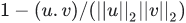

## Class  `KMeans` 
An Estimator for K-Means clustering.

Inherits From: [ `Estimator` ](https://tensorflow.google.cn/api_docs/python/tf/compat/v1/estimator/Estimator)

#### Example:


```
 import numpy as np
import tensorflow as tf

num_points = 100
dimensions = 2
points = np.random.uniform(0, 1000, [num_points, dimensions])

def input_fn():
  return tf.train.limit_epochs(
      tf.convert_to_tensor(points, dtype=tf.float32), num_epochs=1)

num_clusters = 5
kmeans = tf.estimator.experimental.KMeans(
    num_clusters=num_clusters, use_mini_batch=False)

# train
num_iterations = 10
previous_centers = None
for _ in xrange(num_iterations):
  kmeans.train(input_fn)
  cluster_centers = kmeans.cluster_centers()
  if previous_centers is not None:
    print 'delta:', cluster_centers - previous_centers
  previous_centers = cluster_centers
  print 'score:', kmeans.score(input_fn)
print 'cluster centers:', cluster_centers

# map the input points to their clusters
cluster_indices = list(kmeans.predict_cluster_index(input_fn))
for i, point in enumerate(points):
  cluster_index = cluster_indices[i]
  center = cluster_centers[cluster_index]
  print 'point:', point, 'is in cluster', cluster_index, 'centered at', center
 
```

The  `SavedModel`  saved by the  `export_saved_model`  method does not include thecluster centers. However, the cluster centers may be retrieved by thelatest checkpoint saved during training. Specifically,

```
 kmeans.cluster_centers()
 
```

is equivalent to

```
 tf.train.load_variable(
    kmeans.model_dir, KMeansClustering.CLUSTER_CENTERS_VAR_NAME)
 
```

##  `__init__` 
[View source](https://github.com/tensorflow/estimator/tree/master/tensorflow_estimator/python/estimator/canned/kmeans.py)

```
 __init__(
    num_clusters,
    model_dir=None,
    initial_clusters=RANDOM_INIT,
    distance_metric=SQUARED_EUCLIDEAN_DISTANCE,
    seed=None,
    use_mini_batch=True,
    mini_batch_steps_per_iteration=1,
    kmeans_plus_plus_num_retries=2,
    relative_tolerance=None,
    config=None,
    feature_columns=None
)
 
```

Creates an Estimator for running KMeans training and inference.

This Estimator implements the following variants of the K-means algorithm:

If  `use_mini_batch`  is False, it runs standard full batch K-means. Eachtraining step runs a single iteration of K-Means and must process the fullinput at once. To run in this mode, the  `input_fn`  passed to  `train`  mustreturn the entire input dataset.

If  `use_mini_batch`  is True, it runs a generalization of the mini-batchK-means algorithm. It runs multiple iterations, where each iteration iscomposed of  `mini_batch_steps_per_iteration`  steps. Each training stepaccumulates the contribution from one mini-batch into temporary storage.Every  `mini_batch_steps_per_iteration`  steps, the cluster centers areupdated and the temporary storage cleared for the next iteration.For example: the entire dataset contains 64k examples, where the batch sizeis 64. User can choose mini_batch_steps_per_iteration = 100 to run 10% ofthe entire data every iteration in order to update the cluster centers.Note that:  * If  `mini_batch_steps_per_iteration=1` , the algorithm reduces to the    standard K-means mini-batch algorithm.  * If  `mini_batch_steps_per_iteration = num_inputs / batch_size` , the    algorithm becomes an asynchronous version of the full-batch algorithm.    However, there is no guarantee by this implementation that each input    is seen exactly once per iteration. Also, different updates are applied    asynchronously without locking. So this asynchronous version may not    behave exactly like a full-batch version.

#### Args:
- **`num_clusters`** : An integer tensor specifying the number of clusters. Thisargument is ignored if  `initial_clusters`  is a tensor or numpy array.
- **`model_dir`** : The directory to save the model results and log files.
- **`initial_clusters`** : Specifies how the initial cluster centers are chosen.One of the following: * a tensor or numpy array with the initial clustercenters. * a callable  `f(inputs, k)`  that selects and returns up to `k`  centers from an input batch.  `f`  is free to return any number ofcenters from  `0`  to  `k` . It will be invoked on successive inputbatches as necessary until all  `num_clusters`  centers are chosen.
- **`distance_metric`** : The distance metric used for clustering. One of:
- **`seed`** : Python integer. Seed for PRNG used to initialize centers.
- **`use_mini_batch`** : A boolean specifying whether to use the mini-batch k-meansalgorithm. See explanation above.
- **`mini_batch_steps_per_iteration`** : The number of steps after which theupdated cluster centers are synced back to a master copy. Used only if `use_mini_batch=True` . See explanation above.
- **`kmeans_plus_plus_num_retries`** : For each point that is sampled duringkmeans++ initialization, this parameter specifies the number ofadditional points to draw from the current distribution before selectingthe best. If a negative value is specified, a heuristic is used tosample  `O(log(num_to_sample))`  additional points. Used only if `initial_clusters=KMeansClustering.KMEANS_PLUS_PLUS_INIT` .
- **`relative_tolerance`** : A relative tolerance of change in the loss betweeniterations. Stops learning if the loss changes less than this amount.This may not work correctly if  `use_mini_batch=True` .
- **`config`** : See [ `tf.estimator.Estimator` ](https://tensorflow.google.cn/api_docs/python/tf/estimator/Estimator).
- **`feature_columns`** : An optionable iterable containing all the feature columnsused by the model. All items in the set should be feature columninstances that can be passed to  `tf.feature_column.input_layer` . If thisis None, all features will be used.
    -  `KMeansClustering.RANDOM_INIT` : Choose centers randomly from an inputbatch. If the batch size is less than  `num_clusters`  then the entirebatch is chosen to be initial cluster centers and the remainingcenters are chosen from successive input batches.
    -  `KMeansClustering.KMEANS_PLUS_PLUS_INIT` : Use kmeans++ to choosecenters from the first input batch. If the batch size is less than `num_clusters` , a TensorFlow runtime error occurs.
    -  `KMeansClustering.SQUARED_EUCLIDEAN_DISTANCE` : Euclidean distancebetween vectors  `u`  and  `v`  is defined as ||u−v||2 which isthe square root of the sum of the absolute squares of the elements'difference.
    -  `KMeansClustering.COSINE_DISTANCE` : Cosine distance between vectors `u`  and  `v`  is defined as 1−(u.v)/(||u||2||v||2).


#### Raises:
- **`ValueError`** : An invalid argument was passed to  `initial_clusters`  or `distance_metric` .


## Properties


###  `config` 


###  `model_dir` 


###  `model_fn` 
Returns the  `model_fn`  which is bound to  `self.params` .

#### Returns:
The  `model_fn`  with following signature:   `def model_fn(features, labels, mode, config)` 

###  `params` 


## Methods


###  `cluster_centers` 
[View source](https://github.com/tensorflow/estimator/tree/master/tensorflow_estimator/python/estimator/canned/kmeans.py)

```
 cluster_centers()
 
```

Returns the cluster centers.

###  `eval_dir` 
[View source](https://github.com/tensorflow/estimator/tree/master/tensorflow_estimator/python/estimator/estimator.py)

```
 eval_dir(name=None)
 
```

Shows the directory name where evaluation metrics are dumped.

#### Args:
- **`name`** : Name of the evaluation if user needs to run multiple evaluations ondifferent data sets, such as on training data vs test data. Metrics fordifferent evaluations are saved in separate folders, and appearseparately in tensorboard.


#### Returns:
A string which is the path of directory contains evaluation metrics.

###  `evaluate` 
[View source](https://github.com/tensorflow/estimator/tree/master/tensorflow_estimator/python/estimator/estimator.py)

```
 evaluate(
    input_fn,
    steps=None,
    hooks=None,
    checkpoint_path=None,
    name=None
)
 
```

Evaluates the model given evaluation data  `input_fn` .

For each step, calls  `input_fn` , which returns one batch of data.Evaluates until:

-  `steps`  batches are processed, or
-  `input_fn`  raises an end-of-input exception ([ `tf.errors.OutOfRangeError` ](https://tensorflow.google.cn/api_docs/python/tf/errors/OutOfRangeError)or `StopIteration` ).


#### Args:
- **`input_fn`** : A function that constructs the input data for evaluation. See[Premade Estimators](https://tensorflow.org/guide/premade_estimators#create_input_functions)for more information. Thefunction should construct and return one of the following:  * A[ `tf.data.Dataset` ](https://tensorflow.google.cn/api_docs/python/tf/data/Dataset) object: Outputs of  `Dataset`  object must be a tuple `(features, labels)`  with same constraints as below. * A tuple `(features, labels)` : Where  `features`  is a [ `tf.Tensor` ](https://tensorflow.google.cn/api_docs/python/tf/Tensor) or a dictionaryof string feature name to  `Tensor`  and  `labels`  is a  `Tensor`  or adictionary of string label name to  `Tensor` . Both  `features`  and `labels`  are consumed by  `model_fn` . They should satisfy the expectationof  `model_fn`  from inputs.
- **`steps`** : Number of steps for which to evaluate model. If  `None` , evaluatesuntil  `input_fn`  raises an end-of-input exception.
- **`hooks`** : List of  `tf.train.SessionRunHook`  subclass instances. Used forcallbacks inside the evaluation call.
- **`checkpoint_path`** : Path of a specific checkpoint to evaluate. If  `None` , thelatest checkpoint in  `model_dir`  is used.  If there are no checkpointsin  `model_dir` , evaluation is run with newly initialized  `Variables` instead of ones restored from checkpoint.
- **`name`** : Name of the evaluation if user needs to run multiple evaluations ondifferent data sets, such as on training data vs test data. Metrics fordifferent evaluations are saved in separate folders, and appearseparately in tensorboard.


#### Returns:
A dict containing the evaluation metrics specified in  `model_fn`  keyed byname, as well as an entry  `global_step`  which contains the value of theglobal step for which this evaluation was performed. For cannedestimators, the dict contains the  `loss`  (mean loss per mini-batch) andthe  `average_loss`  (mean loss per sample). Canned classifiers also returnthe  `accuracy` . Canned regressors also return the  `label/mean`  and the `prediction/mean` .

#### Raises:
- **`ValueError`** : If  `steps <= 0` .


###  `experimental_export_all_saved_models` 
[View source](https://github.com/tensorflow/estimator/tree/master/tensorflow_estimator/python/estimator/estimator.py)

```
 experimental_export_all_saved_models(
    export_dir_base,
    input_receiver_fn_map,
    assets_extra=None,
    as_text=False,
    checkpoint_path=None
)
 
```

Exports a  `SavedModel`  with  `tf.MetaGraphDefs`  for each requested mode.

For each mode passed in via the  `input_receiver_fn_map` ,this method builds a new graph by calling the  `input_receiver_fn`  to obtainfeature and label  `Tensor` s. Next, this method calls the  `Estimator` 's `model_fn`  in the passed mode to generate the model graph based onthose features and labels, and restores the given checkpoint(or, lacking that, the most recent checkpoint) into the graph.Only one of the modes is used for saving variables to the  `SavedModel` (order of preference: [ `tf.estimator.ModeKeys.TRAIN` ](https://tensorflow.google.cn/api_docs/python/tf/estimator/ModeKeys#TRAIN),[ `tf.estimator.ModeKeys.EVAL` ](https://tensorflow.google.cn/api_docs/python/tf/estimator/ModeKeys#EVAL), then[ `tf.estimator.ModeKeys.PREDICT` ](https://tensorflow.google.cn/api_docs/python/tf/estimator/ModeKeys#PREDICT)), such that up to three `tf.MetaGraphDefs`  are saved with a single set of variables in a single `SavedModel`  directory.

For the variables and  `tf.MetaGraphDefs` , a timestamped export directorybelow `export_dir_base` , and writes a  `SavedModel`  into it containingthe  `tf.MetaGraphDef`  for the given mode and its associated signatures.

For prediction, the exported  `MetaGraphDef`  will provide one  `SignatureDef` for each element of the  `export_outputs`  dict returned from the  `model_fn` ,named using the same keys.  One of these keys is always `tf.saved_model.signature_constants.DEFAULT_SERVING_SIGNATURE_DEF_KEY` ,indicating whichsignature will be served when a serving request does not specify one.For each signature, the outputs are provided by the corresponding[ `tf.estimator.export.ExportOutput` ](https://tensorflow.google.cn/api_docs/python/tf/estimator/export/ExportOutput)s, and the inputs are always the inputreceivers provided bythe  `serving_input_receiver_fn` .

For training and evaluation, the  `train_op`  is stored in an extracollection,and loss, metrics, and predictions are included in a  `SignatureDef`  for themode in question.

Extra assets may be written into the  `SavedModel`  via the  `assets_extra` argument.  This should be a dict, where each key gives a destination path(including the filename) relative to the assets.extra directory.  Thecorresponding value gives the full path of the source file to be copied.For example, the simple case of copying a single file without renaming itis specified as  `{'my_asset_file.txt': '/path/to/my_asset_file.txt'}` .

#### Args:
- **`export_dir_base`** : A string containing a directory in which to createtimestamped subdirectories containing exported  `SavedModel` s.
- **`input_receiver_fn_map`** : dict of [ `tf.estimator.ModeKeys` ](https://tensorflow.google.cn/api_docs/python/tf/estimator/ModeKeys) to `input_receiver_fn`  mappings, where the  `input_receiver_fn`  is afunction that takes no arguments and returns the appropriate subclass of `InputReceiver` .
- **`assets_extra`** : A dict specifying how to populate the assets.extra directorywithin the exported  `SavedModel` , or  `None`  if no extra assets areneeded.
- **`as_text`** : whether to write the  `SavedModel`  proto in text format.
- **`checkpoint_path`** : The checkpoint path to export.  If  `None`  (the default),the most recent checkpoint found within the model directory is chosen.


#### Returns:
The string path to the exported directory.

#### Raises:
- **`ValueError`** : if any  `input_receiver_fn`  is  `None` , no  `export_outputs` are provided, or no checkpoint can be found.


###  `export_saved_model` 
[View source](https://github.com/tensorflow/estimator/tree/master/tensorflow_estimator/python/estimator/estimator.py)

```
 export_saved_model(
    export_dir_base,
    serving_input_receiver_fn,
    assets_extra=None,
    as_text=False,
    checkpoint_path=None,
    experimental_mode=ModeKeys.PREDICT
)
 
```

Exports inference graph as a  `SavedModel`  into the given dir.

For a detailed guide, see[Using SavedModel with Estimators](https://tensorflow.org/guide/saved_model#using_savedmodel_with_estimators).

This method builds a new graph by first calling the `serving_input_receiver_fn`  to obtain feature  `Tensor` s, and then callingthis  `Estimator` 's  `model_fn`  to generate the model graph based on thosefeatures. It restores the given checkpoint (or, lacking that, the mostrecent checkpoint) into this graph in a fresh session.  Finally it createsa timestamped export directory below the given  `export_dir_base` , and writesa  `SavedModel`  into it containing a single  `tf.MetaGraphDef`  saved from thissession.

The exported  `MetaGraphDef`  will provide one  `SignatureDef`  for eachelement of the  `export_outputs`  dict returned from the  `model_fn` , namedusingthe same keys.  One of these keys is always `tf.saved_model.signature_constants.DEFAULT_SERVING_SIGNATURE_DEF_KEY` ,indicating whichsignature will be served when a serving request does not specify one.For each signature, the outputs are provided by the corresponding[ `tf.estimator.export.ExportOutput` ](https://tensorflow.google.cn/api_docs/python/tf/estimator/export/ExportOutput)s, and the inputs are always the inputreceivers provided bythe  `serving_input_receiver_fn` .

Extra assets may be written into the  `SavedModel`  via the  `assets_extra` argument.  This should be a dict, where each key gives a destination path(including the filename) relative to the assets.extra directory.  Thecorresponding value gives the full path of the source file to be copied.For example, the simple case of copying a single file without renaming itis specified as  `{'my_asset_file.txt': '/path/to/my_asset_file.txt'}` .

The experimental_mode parameter can be used to export a singletrain/eval/predict graph as a  `SavedModel` .See  `experimental_export_all_saved_models`  for full docs.

#### Args:
- **`export_dir_base`** : A string containing a directory in which to createtimestamped subdirectories containing exported  `SavedModel` s.
- **`serving_input_receiver_fn`** : A function that takes no argument and returns a[ `tf.estimator.export.ServingInputReceiver` ](https://tensorflow.google.cn/api_docs/python/tf/estimator/export/ServingInputReceiver) or[ `tf.estimator.export.TensorServingInputReceiver` ](https://tensorflow.google.cn/api_docs/python/tf/estimator/export/TensorServingInputReceiver).
- **`assets_extra`** : A dict specifying how to populate the assets.extra directorywithin the exported  `SavedModel` , or  `None`  if no extra assets areneeded.
- **`as_text`** : whether to write the  `SavedModel`  proto in text format.
- **`checkpoint_path`** : The checkpoint path to export.  If  `None`  (the default),the most recent checkpoint found within the model directory is chosen.
- **`experimental_mode`** : [ `tf.estimator.ModeKeys` ](https://tensorflow.google.cn/api_docs/python/tf/estimator/ModeKeys) value indicating with modewill be exported. Note that this feature is experimental.


#### Returns:
The string path to the exported directory.

#### Raises:
- **`ValueError`** : if no  `serving_input_receiver_fn`  is provided, no `export_outputs`  are provided, or no checkpoint can be found.


###  `export_savedmodel` 
[View source](https://github.com/tensorflow/estimator/tree/master/tensorflow_estimator/python/estimator/estimator.py)

```
 export_savedmodel(
    export_dir_base,
    serving_input_receiver_fn,
    assets_extra=None,
    as_text=False,
    checkpoint_path=None,
    strip_default_attrs=False
)
 
```

Exports inference graph as a  `SavedModel`  into the given dir. (deprecated)


**Warning:**  THIS FUNCTION IS DEPRECATED. It will be removed in a future version.Instructions for updating:This function has been renamed, use  `export_saved_model`  instead.
For a detailed guide, see[Using SavedModel with Estimators](https://tensorflow.org/guide/saved_model#using_savedmodel_with_estimators).

This method builds a new graph by first calling the `serving_input_receiver_fn`  to obtain feature  `Tensor` s, and then callingthis  `Estimator` 's  `model_fn`  to generate the model graph based on thosefeatures. It restores the given checkpoint (or, lacking that, the mostrecent checkpoint) into this graph in a fresh session.  Finally it createsa timestamped export directory below the given  `export_dir_base` , and writesa  `SavedModel`  into it containing a single  `tf.MetaGraphDef`  saved from thissession.

The exported  `MetaGraphDef`  will provide one  `SignatureDef`  for eachelement of the  `export_outputs`  dict returned from the  `model_fn` , namedusingthe same keys.  One of these keys is always `tf.saved_model.signature_constants.DEFAULT_SERVING_SIGNATURE_DEF_KEY` ,indicating whichsignature will be served when a serving request does not specify one.For each signature, the outputs are provided by the corresponding[ `tf.estimator.export.ExportOutput` ](https://tensorflow.google.cn/api_docs/python/tf/estimator/export/ExportOutput)s, and the inputs are always the inputreceivers provided bythe  `serving_input_receiver_fn` .

Extra assets may be written into the  `SavedModel`  via the  `assets_extra` argument.  This should be a dict, where each key gives a destination path(including the filename) relative to the assets.extra directory.  Thecorresponding value gives the full path of the source file to be copied.For example, the simple case of copying a single file without renaming itis specified as  `{'my_asset_file.txt': '/path/to/my_asset_file.txt'}` .

#### Args:
- **`export_dir_base`** : A string containing a directory in which to createtimestamped subdirectories containing exported  `SavedModel` s.
- **`serving_input_receiver_fn`** : A function that takes no argument and returns a[ `tf.estimator.export.ServingInputReceiver` ](https://tensorflow.google.cn/api_docs/python/tf/estimator/export/ServingInputReceiver) or[ `tf.estimator.export.TensorServingInputReceiver` ](https://tensorflow.google.cn/api_docs/python/tf/estimator/export/TensorServingInputReceiver).
- **`assets_extra`** : A dict specifying how to populate the assets.extra directorywithin the exported  `SavedModel` , or  `None`  if no extra assets areneeded.
- **`as_text`** : whether to write the  `SavedModel`  proto in text format.
- **`checkpoint_path`** : The checkpoint path to export.  If  `None`  (the default),the most recent checkpoint found within the model directory is chosen.
- **`strip_default_attrs`** : Boolean. If  `True` , default-valued attributes will beremoved from the  `NodeDef` s. For a detailed guide, see [StrippingDefault-Valued Attributes](https://github.com/tensorflow/tensorflow/blob/master/tensorflow/python/saved_model/README.md#stripping-default-valued-attributes).


#### Returns:
The string path to the exported directory.

#### Raises:
- **`ValueError`** : if no  `serving_input_receiver_fn`  is provided, no `export_outputs`  are provided, or no checkpoint can be found.


###  `get_variable_names` 
[View source](https://github.com/tensorflow/estimator/tree/master/tensorflow_estimator/python/estimator/estimator.py)

```
 get_variable_names()
 
```

Returns list of all variable names in this model.

#### Returns:
List of names.

#### Raises:
- **`ValueError`** : If the  `Estimator`  has not produced a checkpoint yet.


###  `get_variable_value` 
[View source](https://github.com/tensorflow/estimator/tree/master/tensorflow_estimator/python/estimator/estimator.py)

```
 get_variable_value(name)
 
```

Returns value of the variable given by name.

#### Args:
- **`name`** : string or a list of string, name of the tensor.


#### Returns:
Numpy array - value of the tensor.

#### Raises:
- **`ValueError`** : If the  `Estimator`  has not produced a checkpoint yet.


###  `latest_checkpoint` 
[View source](https://github.com/tensorflow/estimator/tree/master/tensorflow_estimator/python/estimator/estimator.py)

```
 latest_checkpoint()
 
```

Finds the filename of the latest saved checkpoint file in  `model_dir` .

#### Returns:
The full path to the latest checkpoint or  `None`  if no checkpoint wasfound.

###  `predict` 
[View source](https://github.com/tensorflow/estimator/tree/master/tensorflow_estimator/python/estimator/estimator.py)

```
 predict(
    input_fn,
    predict_keys=None,
    hooks=None,
    checkpoint_path=None,
    yield_single_examples=True
)
 
```

Yields predictions for given features.

Please note that interleaving two predict outputs does not work. See:[issue/20506](https://github.com/tensorflow/tensorflow/issues/20506#issuecomment-422208517)

#### Args:
- **`input_fn`** : A function that constructs the features. Prediction continuesuntil  `input_fn`  raises an end-of-input exception([ `tf.errors.OutOfRangeError` ](https://tensorflow.google.cn/api_docs/python/tf/errors/OutOfRangeError) or  `StopIteration` ).See [Premade Estimators](https://tensorflow.org/guide/premade_estimators#create_input_functions)for more information. The function should construct and return one ofthe following:


- **`predict_keys`** : list of  `str` , name of the keys to predict. It is used ifthe [ `tf.estimator.EstimatorSpec.predictions` ](https://tensorflow.google.cn/api_docs/python/tf/estimator/EstimatorSpec#predictions) is a  `dict` . If `predict_keys`  is used then rest of the predictions will be filteredfrom the dictionary. If  `None` , returns all.


- **`hooks`** : List of  `tf.train.SessionRunHook`  subclass instances. Used forcallbacks inside the prediction call.


- **`checkpoint_path`** : Path of a specific checkpoint to predict. If  `None` , thelatest checkpoint in  `model_dir`  is used.  If there are no checkpointsin  `model_dir` , prediction is run with newly initialized  `Variables` instead of ones restored from checkpoint.


- **`yield_single_examples`** : If  `False` , yields the whole batch as returned bythe  `model_fn`  instead of decomposing the batch into individualelements. This is useful if  `model_fn`  returns some tensors whose firstdimension is not equal to the batch size.


    - A [ `tf.data.Dataset` ](https://tensorflow.google.cn/api_docs/python/tf/data/Dataset) object: Outputs of  `Dataset`  object must havesame constraints as below.
    - features: A [ `tf.Tensor` ](https://tensorflow.google.cn/api_docs/python/tf/Tensor) or a dictionary of string feature name to `Tensor` . features are consumed by  `model_fn` . They should satisfythe expectation of  `model_fn`  from inputs.
    - A tuple, in which case the first item is extracted as features.


#### Yields:
Evaluated values of  `predictions`  tensors.

#### Raises:
- **`ValueError`** : If batch length of predictions is not the same and `yield_single_examples`  is  `True` .
- **`ValueError`** : If there is a conflict between  `predict_keys`  and `predictions` . For example if  `predict_keys`  is not  `None`  but[ `tf.estimator.EstimatorSpec.predictions` ](https://tensorflow.google.cn/api_docs/python/tf/estimator/EstimatorSpec#predictions) is not a  `dict` .


###  `predict_cluster_index` 
[View source](https://github.com/tensorflow/estimator/tree/master/tensorflow_estimator/python/estimator/canned/kmeans.py)

```
 predict_cluster_index(input_fn)
 
```

Finds the index of the closest cluster center to each input point.

#### Args:
- **`input_fn`** : Input points. See [ `tf.estimator.Estimator.predict` ](https://tensorflow.google.cn/api_docs/python/tf/estimator/Estimator#predict).


#### Yields:
The index of the closest cluster center for each input point.

###  `score` 
[View source](https://github.com/tensorflow/estimator/tree/master/tensorflow_estimator/python/estimator/canned/kmeans.py)

```
 score(input_fn)
 
```

Returns the sum of squared distances to nearest clusters.

Note that this function is different from the corresponding one in sklearnwhich returns the negative sum.

#### Args:
- **`input_fn`** : Input points. See [ `tf.estimator.Estimator.evaluate` ](https://tensorflow.google.cn/api_docs/python/tf/estimator/Estimator#evaluate). Only onebatch is retrieved.


#### Returns:
The sum of the squared distance from each point in the first batch ofinputs to its nearest cluster center.

###  `train` 
[View source](https://github.com/tensorflow/estimator/tree/master/tensorflow_estimator/python/estimator/estimator.py)

```
 train(
    input_fn,
    hooks=None,
    steps=None,
    max_steps=None,
    saving_listeners=None
)
 
```

Trains a model given training data  `input_fn` .

#### Args:
- **`input_fn`** : A function that provides input data for training as minibatches.See [Premade Estimators](https://tensorflow.org/guide/premade_estimators#create_input_functions)for more information. The function should construct and return one ofthe following:
- **`hooks`** : List of  `tf.train.SessionRunHook`  subclass instances. Used forcallbacks inside the training loop.
- **`steps`** : Number of steps for which to train the model. If  `None` , trainforever or train until  `input_fn`  generates the  `tf.errors.OutOfRange` error or  `StopIteration`  exception.  `steps`  works incrementally. If youcall two times  `train(steps=10)`  then training occurs in total 20 steps.If  `OutOfRange`  or  `StopIteration`  occurs in the middle, training stopsbefore 20 steps. If you don't want to have incremental behavior pleaseset  `max_steps`  instead. If set,  `max_steps`  must be  `None` .
- **`max_steps`** : Number of total steps for which to train model. If  `None` ,train forever or train until  `input_fn`  generates the `tf.errors.OutOfRange`  error or  `StopIteration`  exception. If set, `steps`  must be  `None` . If  `OutOfRange`  or  `StopIteration`  occurs in themiddle, training stops before  `max_steps`  steps. Two calls to `train(steps=100)`  means 200 training iterations. On the other hand, twocalls to  `train(max_steps=100)`  means that the second call will not doany iteration since first call did all 100 steps.
- **`saving_listeners`** : list of  `CheckpointSaverListener`  objects. Used forcallbacks that run immediately before or after checkpoint savings.
    - A [ `tf.data.Dataset` ](https://tensorflow.google.cn/api_docs/python/tf/data/Dataset) object: Outputs of  `Dataset`  object must bea tuple  `(features, labels)`  with same constraints as below.
    - A tuple  `(features, labels)` : Where  `features`  is a [ `tf.Tensor` ](https://tensorflow.google.cn/api_docs/python/tf/Tensor) ora dictionary of string feature name to  `Tensor`  and  `labels`  is a `Tensor`  or a dictionary of string label name to  `Tensor` . Both `features`  and  `labels`  are consumed by  `model_fn` . They shouldsatisfy the expectation of  `model_fn`  from inputs.


#### Returns:
 `self` , for chaining.

#### Raises:
- **`ValueError`** : If both  `steps`  and  `max_steps`  are not  `None` .
- **`ValueError`** : If either  `steps`  or  `max_steps <= 0` .


###  `transform` 
[View source](https://github.com/tensorflow/estimator/tree/master/tensorflow_estimator/python/estimator/canned/kmeans.py)

```
 transform(input_fn)
 
```

Transforms each input point to its distances to all cluster centers.

Note that if  `distance_metric=KMeansClustering.SQUARED_EUCLIDEAN_DISTANCE` ,thisfunction returns the squared Euclidean distance while the correspondingsklearn function returns the Euclidean distance.

#### Args:
- **`input_fn`** : Input points. See [ `tf.estimator.Estimator.predict` ](https://tensorflow.google.cn/api_docs/python/tf/estimator/Estimator#predict).


#### Yields:
The distances from each input point to each cluster center.

## Class Members
-  `ALL_DISTANCES = 'all_distances'`  []()
-  `CLUSTER_CENTERS_VAR_NAME = 'clusters'`  []()
-  `CLUSTER_INDEX = 'cluster_index'`  []()
-  `COSINE_DISTANCE = 'cosine'`  []()
-  `KMEANS_PLUS_PLUS_INIT = 'kmeans_plus_plus'`  []()
-  `RANDOM_INIT = 'random'`  []()
-  `SCORE = 'score'`  []()
-  `SQUARED_EUCLIDEAN_DISTANCE = 'squared_euclidean'`  []()
