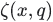

Math Operations.


**Note:**  Functions taking  `Tensor`  arguments can also take anything accepted by[ `tf.convert_to_tensor` ](https://tensorflow.google.cn/api_docs/python/tf/convert_to_tensor).

**Note:**  Elementwise binary operations in TensorFlow follow [numpy-stylebroadcasting](http://docs.scipy.org/doc/numpy/user/basics.broadcasting.html).
TensorFlow provides a variety of math functions including:

- Basic arithmetic operators and trigonometric functions.
- Special math functions (like: [ `tf.math.igamma` ](https://tensorflow.google.cn/api_docs/python/tf/math/igamma) and [ `tf.math.zeta` ](https://tensorflow.google.cn/api_docs/python/tf/math/zeta))
- Complex number functions (like: [ `tf.math.imag` ](https://tensorflow.google.cn/api_docs/python/tf/math/imag) and [ `tf.math.angle` ](https://tensorflow.google.cn/api_docs/python/tf/math/angle))
- Reductions and scans (like: [ `tf.math.reduce_mean` ](https://tensorflow.google.cn/api_docs/python/tf/math/reduce_mean) and [ `tf.math.cumsum` ](https://tensorflow.google.cn/api_docs/python/tf/math/cumsum))
- Segment functions (like: [ `tf.math.segment_sum` ](https://tensorflow.google.cn/api_docs/python/tf/math/segment_sum))
See: [ `tf.linalg` ](https://tensorflow.google.cn/api_docs/python/tf/linalg) for matrix and tensor functions.

[]()

## About Segmentation
TensorFlow provides several operations that you can use to perform commonmath computations on tensor segments.Here a segmentation is a partitioning of a tensor alongthe first dimension, i.e. it  defines a mapping from the first dimension onto `segment_ids` . The  `segment_ids`  tensor should be the size ofthe first dimension,  `d0` , with consecutive IDs in the range  `0`  to  `k` ,where  `k<d0` .In particular, a segmentation of a matrix tensor is a mapping of rows tosegments.

#### For example:


```
 c = tf.constant([[1,2,3,4], [-1,-2,-3,-4], [5,6,7,8]])
tf.math.segment_sum(c, tf.constant([0, 0, 1]))
#  ==>  [[0 0 0 0]
#        [5 6 7 8]]
 
```

The standard  `segment_*`  functions assert that the segment indices are sorted.If you have unsorted indices use the equivalent  `unsorted_segment_`  function.Thses functions take an additional argument  `num_segments`  so that the outputtensor can be efficiently allocated.

```
 c = tf.constant([[1,2,3,4], [-1,-2,-3,-4], [5,6,7,8]])
tf.math.unsorted_segment_sum(c, tf.constant([0, 1, 0]), num_segments=2)
# ==> [[ 6,  8, 10, 12],
#       [-1, -2, -3, -4]]
 
```

## Functions
[ `abs(...)` ](https://tensorflow.google.cn/api_docs/python/tf/math/abs): Computes the absolute value of a tensor.

[ `accumulate_n(...)` ](https://tensorflow.google.cn/api_docs/python/tf/math/accumulate_n): Returns the element-wise sum of a list of tensors.

[ `acos(...)` ](https://tensorflow.google.cn/api_docs/python/tf/math/acos): Computes acos of x element-wise.

[ `acosh(...)` ](https://tensorflow.google.cn/api_docs/python/tf/math/acosh): Computes inverse hyperbolic cosine of x element-wise.

[ `add(...)` ](https://tensorflow.google.cn/api_docs/python/tf/math/add): Returns x + y element-wise.

[ `add_n(...)` ](https://tensorflow.google.cn/api_docs/python/tf/math/add_n): Adds all input tensors element-wise.

[ `angle(...)` ](https://tensorflow.google.cn/api_docs/python/tf/math/angle): Returns the element-wise argument of a complex (or real) tensor.

[ `argmax(...)` ](https://tensorflow.google.cn/api_docs/python/tf/math/argmax): Returns the index with the largest value across axes of a tensor.

[ `argmin(...)` ](https://tensorflow.google.cn/api_docs/python/tf/math/argmin): Returns the index with the smallest value across axes of a tensor.

[ `asin(...)` ](https://tensorflow.google.cn/api_docs/python/tf/math/asin): Computes the trignometric inverse sine of x element-wise.

[ `asinh(...)` ](https://tensorflow.google.cn/api_docs/python/tf/math/asinh): Computes inverse hyperbolic sine of x element-wise.

[ `atan(...)` ](https://tensorflow.google.cn/api_docs/python/tf/math/atan): Computes the trignometric inverse tangent of x element-wise.

[ `atan2(...)` ](https://tensorflow.google.cn/api_docs/python/tf/math/atan2): Computes arctangent of  `y/x`  element-wise, respecting signs of the arguments.

[ `atanh(...)` ](https://tensorflow.google.cn/api_docs/python/tf/math/atanh): Computes inverse hyperbolic tangent of x element-wise.

[ `bessel_i0(...)` ](https://tensorflow.google.cn/api_docs/python/tf/math/bessel_i0): Computes the Bessel i0 function of  `x`  element-wise.

[ `bessel_i0e(...)` ](https://tensorflow.google.cn/api_docs/python/tf/math/bessel_i0e): Computes the Bessel i0e function of  `x`  element-wise.

[ `bessel_i1(...)` ](https://tensorflow.google.cn/api_docs/python/tf/math/bessel_i1): Computes the Bessel i1 function of  `x`  element-wise.

[ `bessel_i1e(...)` ](https://tensorflow.google.cn/api_docs/python/tf/math/bessel_i1e): Computes the Bessel i1e function of  `x`  element-wise.

[ `betainc(...)` ](https://tensorflow.google.cn/api_docs/python/tf/math/betainc): Compute the regularized incomplete beta integral .

[ `bincount(...)` ](https://tensorflow.google.cn/api_docs/python/tf/math/bincount): Counts the number of occurrences of each value in an integer array.

[ `ceil(...)` ](https://tensorflow.google.cn/api_docs/python/tf/math/ceil): Returns element-wise smallest integer not less than x.

[ `confusion_matrix(...)` ](https://tensorflow.google.cn/api_docs/python/tf/math/confusion_matrix): Computes the confusion matrix from predictions and labels.

[ `conj(...)` ](https://tensorflow.google.cn/api_docs/python/tf/math/conj): Returns the complex conjugate of a complex number.

[ `cos(...)` ](https://tensorflow.google.cn/api_docs/python/tf/math/cos): Computes cos of x element-wise.

[ `cosh(...)` ](https://tensorflow.google.cn/api_docs/python/tf/math/cosh): Computes hyperbolic cosine of x element-wise.

[ `count_nonzero(...)` ](https://tensorflow.google.cn/api_docs/python/tf/math/count_nonzero): Computes number of nonzero elements across dimensions of a tensor.

[ `cumprod(...)` ](https://tensorflow.google.cn/api_docs/python/tf/math/cumprod): Compute the cumulative product of the tensor  `x`  along  `axis` .

[ `cumsum(...)` ](https://tensorflow.google.cn/api_docs/python/tf/math/cumsum): Compute the cumulative sum of the tensor  `x`  along  `axis` .

[ `cumulative_logsumexp(...)` ](https://tensorflow.google.cn/api_docs/python/tf/math/cumulative_logsumexp): Compute the cumulative log-sum-exp of the tensor  `x`  along  `axis` .

[ `digamma(...)` ](https://tensorflow.google.cn/api_docs/python/tf/math/digamma): Computes Psi, the derivative of Lgamma (the log of the absolute value of

[ `divide(...)` ](https://tensorflow.google.cn/api_docs/python/tf/math/divide): Computes Python style division of  `x`  by  `y` .

[ `divide_no_nan(...)` ](https://tensorflow.google.cn/api_docs/python/tf/math/divide_no_nan): Computes an unsafe divide which returns 0 if the y is zero.

[ `equal(...)` ](https://tensorflow.google.cn/api_docs/python/tf/math/equal): Returns the truth value of (x == y) element-wise.

[ `erf(...)` ](https://tensorflow.google.cn/api_docs/python/tf/math/erf): Computes the Gauss error function of  `x`  element-wise.

[ `erfc(...)` ](https://tensorflow.google.cn/api_docs/python/tf/math/erfc): Computes the complementary error function of  `x`  element-wise.

[ `exp(...)` ](https://tensorflow.google.cn/api_docs/python/tf/math/exp): Computes exponential of x element-wise.  .

[ `expm1(...)` ](https://tensorflow.google.cn/api_docs/python/tf/math/expm1): Computes  `exp(x) - 1`  element-wise.

[ `floor(...)` ](https://tensorflow.google.cn/api_docs/python/tf/math/floor): Returns element-wise largest integer not greater than x.

[ `floordiv(...)` ](https://tensorflow.google.cn/api_docs/python/tf/math/floordiv): Divides  `x / y`  elementwise, rounding toward the most negative integer.

[ `floormod(...)` ](https://tensorflow.google.cn/api_docs/python/tf/math/floormod): Returns element-wise remainder of division. When  `x < 0`  xor  `y < 0`  is

[ `greater(...)` ](https://tensorflow.google.cn/api_docs/python/tf/math/greater): Returns the truth value of (x > y) element-wise.

[ `greater_equal(...)` ](https://tensorflow.google.cn/api_docs/python/tf/math/greater_equal): Returns the truth value of (x >= y) element-wise.

[ `igamma(...)` ](https://tensorflow.google.cn/api_docs/python/tf/math/igamma): Compute the lower regularized incomplete Gamma function  `P(a, x)` .

[ `igammac(...)` ](https://tensorflow.google.cn/api_docs/python/tf/math/igammac): Compute the upper regularized incomplete Gamma function  `Q(a, x)` .

[ `imag(...)` ](https://tensorflow.google.cn/api_docs/python/tf/math/imag): Returns the imaginary part of a complex (or real) tensor.

[ `in_top_k(...)` ](https://tensorflow.google.cn/api_docs/python/tf/math/in_top_k): Says whether the targets are in the top  `K`  predictions.

[ `invert_permutation(...)` ](https://tensorflow.google.cn/api_docs/python/tf/math/invert_permutation): Computes the inverse permutation of a tensor.

[ `is_finite(...)` ](https://tensorflow.google.cn/api_docs/python/tf/math/is_finite): Returns which elements of x are finite.

[ `is_inf(...)` ](https://tensorflow.google.cn/api_docs/python/tf/math/is_inf): Returns which elements of x are Inf.

[ `is_nan(...)` ](https://tensorflow.google.cn/api_docs/python/tf/math/is_nan): Returns which elements of x are NaN.

[ `is_non_decreasing(...)` ](https://tensorflow.google.cn/api_docs/python/tf/math/is_non_decreasing): Returns  `True`  if  `x`  is non-decreasing.

[ `is_strictly_increasing(...)` ](https://tensorflow.google.cn/api_docs/python/tf/math/is_strictly_increasing): Returns  `True`  if  `x`  is strictly increasing.

[ `l2_normalize(...)` ](https://tensorflow.google.cn/api_docs/python/tf/math/l2_normalize): Normalizes along dimension  `axis`  using an L2 norm.

[ `lbeta(...)` ](https://tensorflow.google.cn/api_docs/python/tf/math/lbeta): Computes , reducing along the last dimension.

[ `less(...)` ](https://tensorflow.google.cn/api_docs/python/tf/math/less): Returns the truth value of (x < y) element-wise.

[ `less_equal(...)` ](https://tensorflow.google.cn/api_docs/python/tf/math/less_equal): Returns the truth value of (x <= y) element-wise.

[ `lgamma(...)` ](https://tensorflow.google.cn/api_docs/python/tf/math/lgamma): Computes the log of the absolute value of  `Gamma(x)`  element-wise.

[ `log(...)` ](https://tensorflow.google.cn/api_docs/python/tf/math/log): Computes natural logarithm of x element-wise.

[ `log1p(...)` ](https://tensorflow.google.cn/api_docs/python/tf/math/log1p): Computes natural logarithm of (1 + x) element-wise.

[ `log_sigmoid(...)` ](https://tensorflow.google.cn/api_docs/python/tf/math/log_sigmoid): Computes log sigmoid of  `x`  element-wise.

[ `log_softmax(...)` ](https://tensorflow.google.cn/api_docs/python/tf/nn/log_softmax): Computes log softmax activations.

[ `logical_and(...)` ](https://tensorflow.google.cn/api_docs/python/tf/math/logical_and): Returns the truth value of x AND y element-wise.

[ `logical_not(...)` ](https://tensorflow.google.cn/api_docs/python/tf/math/logical_not): Returns the truth value of NOT x element-wise.

[ `logical_or(...)` ](https://tensorflow.google.cn/api_docs/python/tf/math/logical_or): Returns the truth value of x OR y element-wise.

[ `logical_xor(...)` ](https://tensorflow.google.cn/api_docs/python/tf/math/logical_xor): Logical XOR function.

[ `maximum(...)` ](https://tensorflow.google.cn/api_docs/python/tf/math/maximum): Returns the max of x and y (i.e. x > y ? x : y) element-wise.

[ `minimum(...)` ](https://tensorflow.google.cn/api_docs/python/tf/math/minimum): Returns the min of x and y (i.e. x < y ? x : y) element-wise.

[ `mod(...)` ](https://tensorflow.google.cn/api_docs/python/tf/math/floormod): Returns element-wise remainder of division. When  `x < 0`  xor  `y < 0`  is

[ `multiply(...)` ](https://tensorflow.google.cn/api_docs/python/tf/math/multiply): Returns x * y element-wise.

[ `multiply_no_nan(...)` ](https://tensorflow.google.cn/api_docs/python/tf/math/multiply_no_nan): Computes the product of x and y and returns 0 if the y is zero, even if x is NaN or infinite.

[ `negative(...)` ](https://tensorflow.google.cn/api_docs/python/tf/math/negative): Computes numerical negative value element-wise.

[ `nextafter(...)` ](https://tensorflow.google.cn/api_docs/python/tf/math/nextafter): Returns the next representable value of  `x1`  in the direction of  `x2` , element-wise.

[ `not_equal(...)` ](https://tensorflow.google.cn/api_docs/python/tf/math/not_equal): Returns the truth value of (x != y) element-wise.

[ `polygamma(...)` ](https://tensorflow.google.cn/api_docs/python/tf/math/polygamma): Compute the polygamma function .

[ `polyval(...)` ](https://tensorflow.google.cn/api_docs/python/tf/math/polyval): Computes the elementwise value of a polynomial.

[ `pow(...)` ](https://tensorflow.google.cn/api_docs/python/tf/math/pow): Computes the power of one value to another.

[ `real(...)` ](https://tensorflow.google.cn/api_docs/python/tf/math/real): Returns the real part of a complex (or real) tensor.

[ `reciprocal(...)` ](https://tensorflow.google.cn/api_docs/python/tf/math/reciprocal): Computes the reciprocal of x element-wise.

[ `reciprocal_no_nan(...)` ](https://tensorflow.google.cn/api_docs/python/tf/math/reciprocal_no_nan): Performs a safe reciprocal operation, element wise.

[ `reduce_all(...)` ](https://tensorflow.google.cn/api_docs/python/tf/reduce_all): Computes the "logical and" of elements across dimensions of a tensor.

[ `reduce_any(...)` ](https://tensorflow.google.cn/api_docs/python/tf/math/reduce_any): Computes the "logical or" of elements across dimensions of a tensor.

[ `reduce_euclidean_norm(...)` ](https://tensorflow.google.cn/api_docs/python/tf/math/reduce_euclidean_norm): Computes the Euclidean norm of elements across dimensions of a tensor.

[ `reduce_logsumexp(...)` ](https://tensorflow.google.cn/api_docs/python/tf/math/reduce_logsumexp): Computes log(sum(exp(elements across dimensions of a tensor))).

[ `reduce_max(...)` ](https://tensorflow.google.cn/api_docs/python/tf/math/reduce_max): Computes the maximum of elements across dimensions of a tensor.

[ `reduce_mean(...)` ](https://tensorflow.google.cn/api_docs/python/tf/math/reduce_mean): Computes the mean of elements across dimensions of a tensor.

[ `reduce_min(...)` ](https://tensorflow.google.cn/api_docs/python/tf/math/reduce_min): Computes the minimum of elements across dimensions of a tensor.

[ `reduce_prod(...)` ](https://tensorflow.google.cn/api_docs/python/tf/math/reduce_prod): Computes the product of elements across dimensions of a tensor.

[ `reduce_std(...)` ](https://tensorflow.google.cn/api_docs/python/tf/math/reduce_std): Computes the standard deviation of elements across dimensions of a tensor.

[ `reduce_sum(...)` ](https://tensorflow.google.cn/api_docs/python/tf/math/reduce_sum): Computes the sum of elements across dimensions of a tensor.

[ `reduce_variance(...)` ](https://tensorflow.google.cn/api_docs/python/tf/math/reduce_variance): Computes the variance of elements across dimensions of a tensor.

[ `rint(...)` ](https://tensorflow.google.cn/api_docs/python/tf/math/rint): Returns element-wise integer closest to x.

[ `round(...)` ](https://tensorflow.google.cn/api_docs/python/tf/math/round): Rounds the values of a tensor to the nearest integer, element-wise.

[ `rsqrt(...)` ](https://tensorflow.google.cn/api_docs/python/tf/math/rsqrt): Computes reciprocal of square root of x element-wise.

[ `scalar_mul(...)` ](https://tensorflow.google.cn/api_docs/python/tf/math/scalar_mul): Multiplies a scalar times a  `Tensor`  or  `IndexedSlices`  object.

[ `segment_max(...)` ](https://tensorflow.google.cn/api_docs/python/tf/math/segment_max): Computes the maximum along segments of a tensor.

[ `segment_mean(...)` ](https://tensorflow.google.cn/api_docs/python/tf/math/segment_mean): Computes the mean along segments of a tensor.

[ `segment_min(...)` ](https://tensorflow.google.cn/api_docs/python/tf/math/segment_min): Computes the minimum along segments of a tensor.

[ `segment_prod(...)` ](https://tensorflow.google.cn/api_docs/python/tf/math/segment_prod): Computes the product along segments of a tensor.

[ `segment_sum(...)` ](https://tensorflow.google.cn/api_docs/python/tf/math/segment_sum): Computes the sum along segments of a tensor.

[ `sigmoid(...)` ](https://tensorflow.google.cn/api_docs/python/tf/math/sigmoid): Computes sigmoid of  `x`  element-wise.

[ `sign(...)` ](https://tensorflow.google.cn/api_docs/python/tf/math/sign): Returns an element-wise indication of the sign of a number.

[ `sin(...)` ](https://tensorflow.google.cn/api_docs/python/tf/math/sin): Computes sine of x element-wise.

[ `sinh(...)` ](https://tensorflow.google.cn/api_docs/python/tf/math/sinh): Computes hyperbolic sine of x element-wise.

[ `softmax(...)` ](https://tensorflow.google.cn/api_docs/python/tf/nn/softmax): Computes softmax activations.

[ `softplus(...)` ](https://tensorflow.google.cn/api_docs/python/tf/math/softplus): Computes softplus:  `log(exp(features) + 1)` .

[ `softsign(...)` ](https://tensorflow.google.cn/api_docs/python/tf/nn/softsign): Computes softsign:  `features / (abs(features) + 1)` .

[ `sqrt(...)` ](https://tensorflow.google.cn/api_docs/python/tf/math/sqrt): Computes square root of x element-wise.

[ `square(...)` ](https://tensorflow.google.cn/api_docs/python/tf/math/square): Computes square of x element-wise.

[ `squared_difference(...)` ](https://tensorflow.google.cn/api_docs/python/tf/math/squared_difference): Returns (x - y)(x - y) element-wise.

[ `subtract(...)` ](https://tensorflow.google.cn/api_docs/python/tf/math/subtract): Returns x - y element-wise.

[ `tan(...)` ](https://tensorflow.google.cn/api_docs/python/tf/math/tan): Computes tan of x element-wise.

[ `tanh(...)` ](https://tensorflow.google.cn/api_docs/python/tf/math/tanh): Computes hyperbolic tangent of  `x`  element-wise.

[ `top_k(...)` ](https://tensorflow.google.cn/api_docs/python/tf/math/top_k): Finds values and indices of the  `k`  largest entries for the last dimension.

[ `truediv(...)` ](https://tensorflow.google.cn/api_docs/python/tf/math/truediv): Divides x / y elementwise (using Python 3 division operator semantics).

[ `unsorted_segment_max(...)` ](https://tensorflow.google.cn/api_docs/python/tf/math/unsorted_segment_max): Computes the maximum along segments of a tensor.

[ `unsorted_segment_mean(...)` ](https://tensorflow.google.cn/api_docs/python/tf/math/unsorted_segment_mean): Computes the mean along segments of a tensor.

[ `unsorted_segment_min(...)` ](https://tensorflow.google.cn/api_docs/python/tf/math/unsorted_segment_min): Computes the minimum along segments of a tensor.

[ `unsorted_segment_prod(...)` ](https://tensorflow.google.cn/api_docs/python/tf/math/unsorted_segment_prod): Computes the product along segments of a tensor.

[ `unsorted_segment_sqrt_n(...)` ](https://tensorflow.google.cn/api_docs/python/tf/math/unsorted_segment_sqrt_n): Computes the sum along segments of a tensor divided by the sqrt(N).

[ `unsorted_segment_sum(...)` ](https://tensorflow.google.cn/api_docs/python/tf/math/unsorted_segment_sum): Computes the sum along segments of a tensor.

[ `xdivy(...)` ](https://tensorflow.google.cn/api_docs/python/tf/math/xdivy): Returns 0 if x == 0, and x / y otherwise, elementwise.

[ `xlogy(...)` ](https://tensorflow.google.cn/api_docs/python/tf/math/xlogy): Returns 0 if x == 0, and x * log(y) otherwise, elementwise.

[ `zero_fraction(...)` ](https://tensorflow.google.cn/api_docs/python/tf/math/zero_fraction): Returns the fraction of zeros in  `value` .

[ `zeta(...)` ](https://tensorflow.google.cn/api_docs/python/tf/math/zeta): Compute the Hurwitz zeta function .

