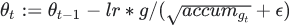

## Class  `Adagrad` 
实现adagrad算法的优化器。

Inherits From: [ `Optimizer` ](https://tensorflow.google.cn/api_docs/python/tf/keras/optimizers/Optimizer)

**别名** : [ `tf.compat.v1.keras.optimizers.Adagrad` ](/api_docs/python/tf/keras/optimizers/Adagrad), [ `tf.compat.v2.keras.optimizers.Adagrad` ](/api_docs/python/tf/keras/optimizers/Adagrad), [ `tf.compat.v2.optimizers.Adagrad` ](/api_docs/python/tf/keras/optimizers/Adagrad), [ `tf.optimizers.Adagrad` ](/api_docs/python/tf/keras/optimizers/Adagrad)

Adagrad is an optimizer with parameter-specific learning rates,which are adapted relative to how frequently a parameter getsupdated during training. The more updates a parameter receives,the smaller the updates.

#### 初始化：

accumg0:=initial_accumulator_value


#### 更新步骤：


#### 参考文献：
- [Paper](http://www.jmlr.org/papers/volume12/duchi11a/duchi11a.pdf).
- [Introduction](https://ppasupat.github.io/a9online/uploads/proximal_notes.pdf).


##  `__init__` 
[View source](https://github.com/tensorflow/tensorflow/blob/r2.0/tensorflow/python/keras/optimizer_v2/adagrad.py#L61-L102)

```
 __init__(
    learning_rate=0.001,
    initial_accumulator_value=0.1,
    epsilon=1e-07,
    name='Adagrad',
    **kwargs
)
 
```

构造一个新的adagrad优化器。

#### 参数：
- **`learning_rate`** : A  `Tensor`  or a floating point value.  The learning rate.
- **`initial_accumulator_value`** : A floating point value.Starting value for the accumulators, must be positive.
- **`epsilon`** : A floating point value.Starting value for the accumulators, must be positive.
- **`name`** : Optional name prefix for the operations created when applyinggradients.  Defaults to "Adagrad".
- **`**kwargs`** : keyword arguments. Allowed to be { `clipnorm` ,  `clipvalue` ,  `lr` , `decay` }.  `clipnorm`  is clip gradients by norm;  `clipvalue`  is clipgradients by value,  `decay`  is included for backward compatibility toallow time inverse decay of learning rate.  `lr`  is included for backwardcompatibility, recommended to use  `learning_rate`  instead.


#### 加薪：
- **`ValueError`** : If the  `initial_accumulator_value`  or  `epsilon`  is invalid.


#### 迫切的兼容性
When eager execution is enabled,  `learning_rate`  can be a callable thattakes no arguments and returns the actual value to use. This can be usefulfor changing these values across different invocations of optimizerfunctions.

## 属性


###  `iterations` 
变量。此优化器已运行的训练步骤数。

###  `weights` 
根据创建的顺序返回此优化器的变量。

## 方法


###  `add_slot` 
[View source](https://github.com/tensorflow/tensorflow/blob/r2.0/tensorflow/python/keras/optimizer_v2/optimizer_v2.py#L567-L594)

```
 add_slot(
    var,
    slot_name,
    initializer='zeros'
)
 
```

Add a new slot variable for  `var` .

###  `add_weight` 
[View source](https://github.com/tensorflow/tensorflow/blob/r2.0/tensorflow/python/keras/optimizer_v2/optimizer_v2.py#L768-L808)

```
 add_weight(
    name,
    shape,
    dtype=None,
    initializer='zeros',
    trainable=None,
    synchronization=tf.VariableSynchronization.AUTO,
    aggregation=tf.compat.v1.VariableAggregation.NONE
)
 
```

###  `apply_gradients` 
[View source](https://github.com/tensorflow/tensorflow/blob/r2.0/tensorflow/python/keras/optimizer_v2/optimizer_v2.py#L408-L441)

```
 apply_gradients(
    grads_and_vars,
    name=None
)
 
```

对变量应用渐变。

This is the second part of  `minimize()` . It returns an  `Operation`  thatapplies gradients.

#### 参数：
- **`grads_and_vars`** : List of (gradient, variable) pairs.
- **`name`** : Optional name for the returned operation.  Default to the namepassed to the  `Optimizer`  constructor.


#### 返回：
An  `Operation`  that applies the specified gradients. If  `global_step` was not None, that operation also increments  `global_step` .

#### 加薪：
- **`TypeError`** : If  `grads_and_vars`  is malformed.
- **`ValueError`** : If none of the variables have gradients.


###  `from_config` 
[View source](https://github.com/tensorflow/tensorflow/blob/r2.0/tensorflow/python/keras/optimizer_v2/adagrad.py#L128-L149)

```
 @classmethod
from_config(
    cls,
    config,
    custom_objects=None
)
 
```

从其配置创建优化器。

This method is the reverse of  `get_config` ,capable of instantiating the same optimizer from the configdictionary.

#### 参数：
- **`config`** : A Python dictionary, typically the output of get_config.
- **`custom_objects`** : A Python dictionary mapping names to additional Pythonobjects used to create this optimizer, such as a function used for ahyperparameter.


#### 返回：
优化器实例。

###  `get_config` 
[View source](https://github.com/tensorflow/tensorflow/blob/r2.0/tensorflow/python/keras/optimizer_v2/adagrad.py#L198-L206)

```
 get_config()
 
```

返回优化程序的配置。

An optimizer config is a Python dictionary (serializable)containing the configuration of an optimizer.The same optimizer can be reinstantiated later(without any saved state) from this configuration.

#### 返回：
python字典。

###  `get_gradients` 
[View source](https://github.com/tensorflow/tensorflow/blob/r2.0/tensorflow/python/keras/optimizer_v2/optimizer_v2.py#L374-L406)

```
 get_gradients(
    loss,
    params
)
 
```

Returns gradients of  `loss`  with respect to  `params` .

#### 参数：
- **`loss`** : Loss tensor.
- **`params`** : List of variables.


#### 返回：
梯度张量列表。

#### 加薪：
- **`ValueError`** : In case any gradient cannot be computed (e.g. if gradientfunction not implemented).


###  `get_slot` 
[View source](https://github.com/tensorflow/tensorflow/blob/r2.0/tensorflow/python/keras/optimizer_v2/optimizer_v2.py#L596-L599)

```
 get_slot(
    var,
    slot_name
)
 
```

###  `get_slot_names` 
[View source](https://github.com/tensorflow/tensorflow/blob/r2.0/tensorflow/python/keras/optimizer_v2/optimizer_v2.py#L563-L565)

```
 get_slot_names()
 
```

此优化器插槽的名称列表。

###  `get_updates` 
[View source](https://github.com/tensorflow/tensorflow/blob/r2.0/tensorflow/python/keras/optimizer_v2/optimizer_v2.py#L499-L506)

```
 get_updates(
    loss,
    params
)
 
```

###  `get_weights` 
[View source](https://github.com/tensorflow/tensorflow/blob/r2.0/tensorflow/python/keras/optimizer_v2/optimizer_v2.py#L743-L745)

```
 get_weights()
 
```

###  `minimize` 
[View source](https://github.com/tensorflow/tensorflow/blob/r2.0/tensorflow/python/keras/optimizer_v2/optimizer_v2.py#L290-L319)

```
 minimize(
    loss,
    var_list,
    grad_loss=None,
    name=None
)
 
```

Minimize  `loss`  by updating  `var_list` .

This method simply computes gradient using [ `tf.GradientTape` ](https://tensorflow.google.cn/api_docs/python/tf/GradientTape) and calls `apply_gradients()` . If you want to process the gradient before applyingthen call [ `tf.GradientTape` ](https://tensorflow.google.cn/api_docs/python/tf/GradientTape) and  `apply_gradients()`  explicitly insteadof using this function.

#### 参数：
- **`loss`** : A callable taking no arguments which returns the value to minimize.
- **`var_list`** : list or tuple of  `Variable`  objects to update to minimize `loss` , or a callable returning the list or tuple of  `Variable`  objects.Use callable when the variable list would otherwise be incomplete before `minimize`  since the variables are created at the first time  `loss`  iscalled.
- **`grad_loss`** : Optional. A  `Tensor`  holding the gradient computed for  `loss` .
- **`name`** : Optional name for the returned operation.


#### 返回：
An Operation that updates the variables in  `var_list` .  If  `global_step` was not  `None` , that operation also increments  `global_step` .

#### 加薪：
- **`ValueError`** : If some of the variables are not  `Variable`  objects.


###  `set_weights` 
[View source](https://github.com/tensorflow/tensorflow/blob/r2.0/tensorflow/python/keras/optimizer_v2/adagrad.py#L119-L126)

```
 set_weights(weights)
 
```

###  `variables` 
[View source](https://github.com/tensorflow/tensorflow/blob/r2.0/tensorflow/python/keras/optimizer_v2/optimizer_v2.py#L734-L736)

```
 variables()
 
```

根据创建的顺序返回此优化器的变量。

