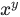

## Class  `RaggedTensor` 

Represents a ragged tensor.


### Aliases:
- Class [ `tf.compat.v1.RaggedTensor` ](/api_docs/python/tf/RaggedTensor)
- Class [ `tf.compat.v2.RaggedTensor` ](/api_docs/python/tf/RaggedTensor)


### Used in the guide:
- [Ragged tensors](https://tensorflow.google.cn/guide/ragged_tensor)


### Used in the tutorials:
- [Unicode strings](https://tensorflow.google.cn/tutorials/load_data/unicode)

A  `RaggedTensor`  is a tensor with one or more <em>ragged dimensions</em>, which aredimensions whose slices may have different lengths.  For example, the inner(column) dimension of  `rt=[[3, 1, 4, 1], [], [5, 9, 2], [6], []]`  is ragged,since the column slices ( `rt[0, :]` , ...,  `rt[4, :]` ) have different lengths.Dimensions whose slices all have the same length are called <em>uniformdimensions</em>.  The outermost dimension of a  `RaggedTensor`  is always uniform,since it consists of a single slice (and so there is no possibility fordiffering slice lengths).

The total number of dimensions in a  `RaggedTensor`  is called its <em>rank</em>,and the number of ragged dimensions in a  `RaggedTensor`  is called its<em>ragged-rank</em>.  A  `RaggedTensor` 's ragged-rank is fixed at graph creationtime: it can't depend on the runtime values of  `Tensor` s, and can't varydynamically for different session runs.


### Potentially Ragged Tensors

Many ops support both  `Tensor` s and  `RaggedTensor` s.  The term "potentiallyragged tensor" may be used to refer to a tensor that might be either a `Tensor`  or a  `RaggedTensor` .  The ragged-rank of a  `Tensor`  is zero.


### Documenting RaggedTensor Shapes

When documenting the shape of a RaggedTensor, ragged dimensions can beindicated by enclosing them in parentheses.  For example, the shape ofa 3-D  `RaggedTensor`  that stores the fixed-size word embedding for eachword in a sentence, for each sentence in a batch, could be written as `[num_sentences, (num_words), embedding_size]` .  The parentheses around `(num_words)`  indicate that dimension is ragged, and that the lengthof each element list in that dimension may vary for each item.


### Component Tensors

Internally, a  `RaggedTensor`  consists of a concatenated list of values thatare partitioned into variable-length rows.  In particular, each  `RaggedTensor` consists of:
- <p>A  `values`  tensor, which concatenates the variable-length rows into aflattened list.  For example, the  `values`  tensor for `[[3, 1, 4, 1], [], [5, 9, 2], [6], []]`  is  `[3, 1, 4, 1, 5, 9, 2, 6]` .</p>
- <p>A  `row_splits`  vector, which indicates how those flattened values aredivided into rows.  In particular, the values for row  `rt[i]`  are storedin the slice  `rt.values[rt.row_splits[i]:rt.row_splits[i+1]]` .</p>


#### Example:


```
>>" dir="ltr">print(tf.RaggedTensor.from_row_splits(
```


### Alternative Row-Partitioning Schemes

In addition to  `row_splits` , ragged tensors provide support for four otherrow-partitioning schemes:
- <p> `row_lengths` : a vector with shape  `[nrows]` , which specifies the lengthof each row.</p>
- <p> `value_rowids`  and  `nrows` :  `value_rowids`  is a vector with shape `[nvals]` , corresponding one-to-one with  `values` , which specifieseach value's row index.  In particular, the row  `rt[row]`  consists of thevalues  `rt.values[j]`  where  `value_rowids[j]==row` .   `nrows`  is aninteger scalar that specifies the number of rows in the `RaggedTensor` . ( `nrows`  is used to indicate trailing empty rows.)</p>
- <p> `row_starts` : a vector with shape  `[nrows]` , which specifies the startoffset of each row.  Equivalent to  `row_splits[:-1]` .</p>
- <p> `row_limits` : a vector with shape  `[nrows]` , which specifies the stopoffset of each row.  Equivalent to  `row_splits[1:]` .</p>

Example: The following ragged tensors are equivalent, and all represent thenested list  `[[3, 1, 4, 1], [], [5, 9, 2], [6], []]` .


```
>>" dir="ltr">values = [3, 1, 4, 1, 5, 9, 2, 6]
```


### Multiple Ragged Dimensions

 `RaggedTensor` s with multiple ragged dimensions can be defined by usinga nested  `RaggedTensor`  for the  `values`  tensor.  Each nested  `RaggedTensor` adds a single ragged dimension.


```
>>" dir="ltr">inner_rt = RaggedTensor.from_row_splits(  # =rt1 from above
```


The factory function [ `RaggedTensor.from_nested_row_splits` ](https://tensorflow.google.cn/api_docs/python/tf/RaggedTensor#from_nested_row_splits) may be used toconstruct a  `RaggedTensor`  with multiple ragged dimensions directly, byproviding a list of  `row_splits`  tensors:


```
>>" dir="ltr">RaggedTensor.from_nested_row_splits(
```


### Uniform Inner Dimensions

 `RaggedTensor` s with uniform inner dimensions can be definedby using a multidimensional  `Tensor`  for  `values` .


```
>>" dir="ltr">rt = RaggedTensor.from_row_splits(values=tf.ones([5, 3]),
```


### RaggedTensor Shape Restrictions

The shape of a RaggedTensor is currently restricted to have the followingform:
- A single uniform dimension
- Followed by one or more ragged dimensions
- Followed by zero or more uniform dimensions.

This restriction follows from the fact that each nested  `RaggedTensor` replaces the uniform outermost dimension of its  `values`  with a uniformdimension followed by a ragged dimension.


##  `__init__` 

[View source](https://github.com/tensorflow/tensorflow/blob/r2.0/tensorflow/python/ops/ragged/ragged_tensor.py#L206-L279)


```
__init__(
    values,
    row_splits,
    cached_row_lengths=None,
    cached_value_rowids=None,
    cached_nrows=None,
    internal=False
)

```


Creates a  `RaggedTensor`  with a specified partitioning for  `values` .

This constructor is private -- please use one of the following ops tobuild  `RaggedTensor` s:
- [ `tf.RaggedTensor.from_row_lengths` ](https://tensorflow.google.cn/api_docs/python/tf/RaggedTensor#from_row_lengths)
- [ `tf.RaggedTensor.from_value_rowids` ](https://tensorflow.google.cn/api_docs/python/tf/RaggedTensor#from_value_rowids)
- [ `tf.RaggedTensor.from_row_splits` ](https://tensorflow.google.cn/api_docs/python/tf/RaggedTensor#from_row_splits)
- [ `tf.RaggedTensor.from_row_starts` ](https://tensorflow.google.cn/api_docs/python/tf/RaggedTensor#from_row_starts)
- [ `tf.RaggedTensor.from_row_limits` ](https://tensorflow.google.cn/api_docs/python/tf/RaggedTensor#from_row_limits)
- [ `tf.RaggedTensor.from_nested_row_splits` ](https://tensorflow.google.cn/api_docs/python/tf/RaggedTensor#from_nested_row_splits)
- [ `tf.RaggedTensor.from_nested_row_lengths` ](https://tensorflow.google.cn/api_docs/python/tf/RaggedTensor#from_nested_row_lengths)
- [ `tf.RaggedTensor.from_nested_value_rowids` ](https://tensorflow.google.cn/api_docs/python/tf/RaggedTensor#from_nested_value_rowids)


#### Args:
- **`values`** : A potentially ragged tensor of any dtype and shape  `[nvals, ...]` .
- **`row_splits`** : A 1-D integer tensor with shape  `[nrows+1]` .
- **`cached_row_lengths`** : A 1-D integer tensor with shape  `[nrows]` 
- **`cached_value_rowids`** : A 1-D integer tensor with shape  `[nvals]` .
- **`cached_nrows`** : A 1-D integer scalar tensor.
- **`internal`** : True if the constructor is being called by one of the factorymethods.  If false, an exception will be raised.


#### Raises:
- **`TypeError`** : If a row partitioning tensor has an inappropriate dtype.
- **`TypeError`** : If exactly one row partitioning argument was not specified.
- **`ValueError`** : If a row partitioning tensor has an inappropriate shape.
- **`ValueError`** : If multiple partitioning arguments are specified.
- **`ValueError`** : If nrows is specified but value_rowids is not None.


## Properties


###  `dtype` 

The  `DType`  of values in this tensor.


###  `flat_values` 

The innermost  `values`  tensor for this ragged tensor.

Concretely, if  `rt.values`  is a  `Tensor` , then  `rt.flat_values`  is `rt.values` ; otherwise,  `rt.flat_values`  is  `rt.values.flat_values` .

Conceptually,  `flat_values`  is the tensor formed by flattening theoutermost dimension and all of the ragged dimensions into a singledimension.

 `rt.flat_values.shape = [nvals] + rt.shape[rt.ragged_rank + 1:]` (where  `nvals`  is the number of items in the flattened dimensions).


#### Returns:

A  `Tensor` .


#### Example:


```
>>> rt = ragged.constant([[[3, 1, 4, 1], [], [5, 9, 2]], [], [[6], []]])
>>> print rt.flat_values()
tf.Tensor([3, 1, 4, 1, 5, 9, 2, 6])

```


###  `nested_row_splits` 

A tuple containing the row_splits for all ragged dimensions.

 `rt.nested_row_splits`  is a tuple containing the  `row_splits`  tensors forall ragged dimensions in  `rt` , ordered from outermost to innermost.  Inparticular,  `rt.nested_row_splits = (rt.row_splits,) + value_splits`  where:


```
* `value_splits = ()` if `rt.values` is a `Tensor`.
* `value_splits = rt.values.nested_row_splits` otherwise.

```


#### Returns:

A  `tuple`  of 1-D integer  `Tensor` s.


#### Example:


```
>>> rt = ragged.constant([[[[3, 1, 4, 1], [], [5, 9, 2]], [], [[6], []]]])
>>> for i, splits in enumerate(rt.nested_row_splits()):
...   print('Splits for dimension %d: %s' % (i+1, splits))
Splits for dimension 1: [0, 1]
Splits for dimension 2: [0, 3, 3, 5]
Splits for dimension 3: [0, 4, 4, 7, 8, 8]

```


###  `ragged_rank` 

The number of ragged dimensions in this ragged tensor.


#### Returns:

A Python  `int`  indicating the number of ragged dimensions in this raggedtensor.  The outermost dimension is not considered ragged.


###  `row_splits` 

The row-split indices for this ragged tensor's  `values` .

 `rt.row_splits`  specifies where the values for each row begin and end in `rt.values` .  In particular, the values for row  `rt[i]`  are stored inthe slice  `rt.values[rt.row_splits[i]:rt.row_splits[i+1]]` .


#### Returns:

A 1-D integer  `Tensor`  with shape  `[self.nrows+1]` .The returned tensor is non-empty, and is sorted in ascending order. `self.row_splits[0]`  is zero, and  `self.row_splits[-1]`  is equal to `self.values.shape[0]` .


#### Example:


```
>>> rt = ragged.constant([[3, 1, 4, 1], [], [5, 9, 2], [6], []])
>>> print rt.row_splits  # indices of row splits in rt.values
tf.Tensor([0, 4, 4, 7, 8, 8])

```


###  `shape` 

The statically known shape of this ragged tensor.


#### Returns:

A  `TensorShape`  containing the statically known shape of this raggedtensor.  Ragged dimensions have a size of  `None` .


#### Examples:


```
>>" dir="ltr">ragged.constant([[0], [1, 2]]).shape
```


###  `values` 

The concatenated rows for this ragged tensor.

 `rt.values`  is a potentially ragged tensor formed by flattening the twooutermost dimensions of  `rt`  into a single dimension.

 `rt.values.shape = [nvals] + rt.shape[2:]`  (where  `nvals`  is thenumber of items in the outer two dimensions of  `rt` ).

 `rt.ragged_rank = self.ragged_rank - 1` 


#### Returns:

A potentially ragged tensor.


#### Example:


```
>>> rt = ragged.constant([[3, 1, 4, 1], [], [5, 9, 2], [6], []])
>>> print rt.values
tf.Tensor([3, 1, 4, 1, 5, 9, 2, 6])

```


## Methods


###  `__abs__` 

[View source](https://github.com/tensorflow/tensorflow/blob/r2.0/tensorflow/python/ops/math_ops.py#L245-L278)


```
__abs__(
    x,
    name=None
)

```


Computes the absolute value of a tensor.

Given a tensor of integer or floating-point values, this operation returns atensor of the same type, where each element contains the absolute value of thecorresponding element in the input.

Given a tensor  `x`  of complex numbers, this operation returns a tensor of type `float32`  or  `float64`  that is the absolute value of each element in  `x` . Allelements in  `x`  must be complex numbers of the form . Theabsolute value is computed as .  For example:


```
x = tf.constant([[-2.25 + 4.75j], [-3.25 + 5.75j]])
tf.abs(x)  # [5.25594902, 6.60492229]

```


#### Args:
- **`x`** : A  `Tensor`  or  `SparseTensor`  of type  `float16` ,  `float32` ,  `float64` , `int32` ,  `int64` ,  `complex64`  or  `complex128` .
- **`name`** : A name for the operation (optional).


#### Returns:

A  `Tensor`  or  `SparseTensor`  the same size, type, and sparsity as  `x`  with  absolute values.Note, for  `complex64`  or  `complex128`  input, the returned  `Tensor`  will be  of type  `float32`  or  `float64` , respectively.

If  `x`  is a  `SparseTensor` , returns `SparseTensor(x.indices, tf.math.abs(x.values, ...), x.dense_shape)` 


###  `__add__` 

Defined in generated file:  `python/ops/gen_math_ops.py` 


```
__add__(
    x,
    y,
    name=None
)

```


Returns x + y element-wise.

<em>NOTE</em>: [ `math.add` ](https://tensorflow.google.cn/api_docs/python/tf/math/add) supports broadcasting.  `AddN`  does not. More about broadcasting[here](http://docs.scipy.org/doc/numpy/user/basics.broadcasting.html)


#### Args:
- **`x`** : A  `Tensor` . Must be one of the following types:  `bfloat16` ,  `half` ,  `float32` ,  `float64` ,  `uint8` ,  `int8` ,  `int16` ,  `int32` ,  `int64` ,  `complex64` ,  `complex128` ,  `string` .
- **`y`** : A  `Tensor` . Must have the same type as  `x` .
- **`name`** : A name for the operation (optional).


#### Returns:

A  `Tensor` . Has the same type as  `x` .


###  `__and__` 

Defined in generated file:  `python/ops/gen_math_ops.py` 


```
__and__(
    x,
    y,
    name=None
)

```


Returns the truth value of x AND y element-wise.

<em>NOTE</em>: [ `math.logical_and` ](https://tensorflow.google.cn/api_docs/python/tf/math/logical_and) supports broadcasting. More about broadcasting[here](http://docs.scipy.org/doc/numpy/user/basics.broadcasting.html)


#### Args:
- **`x`** : A  `Tensor`  of type  `bool` .
- **`y`** : A  `Tensor`  of type  `bool` .
- **`name`** : A name for the operation (optional).


#### Returns:

A  `Tensor`  of type  `bool` .


###  `__bool__` 

[View source](https://github.com/tensorflow/tensorflow/blob/r2.0/tensorflow/python/ops/ragged/ragged_operators.py#L72-L74)


```
__bool__(_)

```


Dummy method to prevent a RaggedTensor from being used as a Python bool.


###  `__div__` 

[View source](https://github.com/tensorflow/tensorflow/blob/r2.0/tensorflow/python/ops/math_ops.py#L1069-L1092)


```
__div__(
    x,
    y,
    name=None
)

```


Divides x / y elementwise (using Python 2 division operator semantics). (deprecated)

>**Warning:**  THIS FUNCTION IS DEPRECATED. It will be removed in a future version.Instructions for updating:Deprecated in favor of operator or tf.math.divide.

NOTE: Prefer using the Tensor division operator or tf.divide which obey Python3 division operator semantics.

This function divides  `x`  and  `y` , forcing Python 2 semantics. That is, if  `x` and  `y`  are both integers then the result will be an integer. This is incontrast to Python 3, where division with  `/`  is always a float while divisionwith  `//`  is always an integer.


#### Args:
- **`x`** :  `Tensor`  numerator of real numeric type.
- **`y`** :  `Tensor`  denominator of real numeric type.
- **`name`** : A name for the operation (optional).


#### Returns:

 `x / y`  returns the quotient of x and y.


###  `__floordiv__` 

[View source](https://github.com/tensorflow/tensorflow/blob/r2.0/tensorflow/python/ops/math_ops.py#L1152-L1180)


```
__floordiv__(
    x,
    y,
    name=None
)

```


Divides  `x / y`  elementwise, rounding toward the most negative integer.

The same as [ `tf.compat.v1.div(x,y)` ](https://tensorflow.google.cn/api_docs/python/tf/RaggedTensor#__div__) for integers, but uses `tf.floor(tf.compat.v1.div(x,y))`  forfloating point arguments so that the result is always an integer (thoughpossibly an integer represented as floating point).  This op is generated by `x // y`  floor division in Python 3 and in Python 2.7 with `from __future__ import division` .

 `x`  and  `y`  must have the same type, and the result will have the same typeas well.


#### Args:
- **`x`** :  `Tensor`  numerator of real numeric type.
- **`y`** :  `Tensor`  denominator of real numeric type.
- **`name`** : A name for the operation (optional).


#### Returns:

 `x / y`  rounded down.


#### Raises:
- **`TypeError`** : If the inputs are complex.


###  `__ge__` 

Defined in generated file:  `python/ops/gen_math_ops.py` 


```
__ge__(
    x,
    y,
    name=None
)

```


Returns the truth value of (x >= y) element-wise.

<em>NOTE</em>: [ `math.greater_equal` ](https://tensorflow.google.cn/api_docs/python/tf/math/greater_equal) supports broadcasting. More about broadcasting[here](http://docs.scipy.org/doc/numpy/user/basics.broadcasting.html)


#### Args:
- **`x`** : A  `Tensor` . Must be one of the following types:  `float32` ,  `float64` ,  `int32` ,  `uint8` ,  `int16` ,  `int8` ,  `int64` ,  `bfloat16` ,  `uint16` ,  `half` ,  `uint32` ,  `uint64` .
- **`y`** : A  `Tensor` . Must have the same type as  `x` .
- **`name`** : A name for the operation (optional).


#### Returns:

A  `Tensor`  of type  `bool` .


###  `__getitem__` 

[View source](https://github.com/tensorflow/tensorflow/blob/r2.0/tensorflow/python/ops/ragged/ragged_getitem.py#L31-L104)


```
__getitem__(key)

```


Returns the specified piece of this RaggedTensor.

Supports multidimensional indexing and slicing, with one restriction:indexing into a ragged inner dimension is not allowed.  This case isproblematic because the indicated value may exist in some rows but notothers.  In such cases, it's not obvious whether we should (1) report anIndexError; (2) use a default value; or (3) skip that value and return atensor with fewer rows than we started with.  Following the guidingprinciples of Python ("In the face of ambiguity, refuse the temptation toguess"), we simply disallow this operation.

Any dimensions added by  `array_ops.newaxis`  will be ragged if the followingdimension is ragged.


#### Args:
- **`self`** : The RaggedTensor to slice.
- <p>**`key`** : Indicates which piece of the RaggedTensor to return, using standardPython semantics (e.g., negative values index from the end).   `key` may have any of the following types:</p>
    -  `int`  constant
    - Scalar integer  `Tensor` 
    -  `slice`  containing integer constants and/or scalar integer `Tensor` s
    -  `Ellipsis` 
    -  `tf.newaxis` 
    -  `tuple`  containing any of the above (for multidimentional indexing)


#### Returns:

A  `Tensor`  or  `RaggedTensor`  object.  Values that include at least oneragged dimension are returned as  `RaggedTensor` .  Values that include noragged dimensions are returned as  `Tensor` .  See above for examples ofexpressions that return  `Tensor` s vs  `RaggedTensor` s.


#### Raises:
- **`ValueError`** : If  `key`  is out of bounds.
- **`ValueError`** : If  `key`  is not supported.
- **`TypeError`** : If the indices in  `key`  have an unsupported type.


#### Examples:


```
>>" dir="ltr"># A 2-D ragged tensor with 1 ragged dimension.</code>
<code class="devsite-terminal" data-terminal-prefix=">>>" dir="ltr">rt = ragged.constant([['a', 'b', 'c'], ['d', 'e'], ['f'], ['g']])</code>
<code class="devsite-terminal" data-terminal-prefix=">>>" dir="ltr">rt[0].eval().tolist()       # First row (1-D `Tensor`)</code>
<code class="no-select nocode" dir="ltr">['a', 'b', 'c']</code>
<code class="devsite-terminal" data-terminal-prefix=">>>" dir="ltr">rt[:3].eval().tolist()      # First three rows (2-D RaggedTensor)</code>
<code class="no-select nocode" dir="ltr">[['a', 'b', 'c'], ['d', 'e'], '[f'], [g']]</code>
<code class="devsite-terminal" data-terminal-prefix=">>>" dir="ltr">rt[3, 0].eval().tolist()    # 1st element of 4th row (scalar)</code>
<code class="no-select nocode" dir="ltr">'g'</code>
<code class="no-select nocode" dir="ltr"></code>
<code class="devsite-terminal" data-terminal-prefix=">>>" dir="ltr"># A 3-D ragged tensor with 2 ragged dimensions.
```


###  `__gt__` 

Defined in generated file:  `python/ops/gen_math_ops.py` 


```
__gt__(
    x,
    y,
    name=None
)

```


Returns the truth value of (x > y) element-wise.

<em>NOTE</em>: [ `math.greater` ](https://tensorflow.google.cn/api_docs/python/tf/math/greater) supports broadcasting. More about broadcasting[here](http://docs.scipy.org/doc/numpy/user/basics.broadcasting.html)


#### Args:
- **`x`** : A  `Tensor` . Must be one of the following types:  `float32` ,  `float64` ,  `int32` ,  `uint8` ,  `int16` ,  `int8` ,  `int64` ,  `bfloat16` ,  `uint16` ,  `half` ,  `uint32` ,  `uint64` .
- **`y`** : A  `Tensor` . Must have the same type as  `x` .
- **`name`** : A name for the operation (optional).


#### Returns:

A  `Tensor`  of type  `bool` .


###  `__invert__` 

Defined in generated file:  `python/ops/gen_math_ops.py` 


```
__invert__(
    x,
    name=None
)

```


Returns the truth value of NOT x element-wise.


#### Args:
- **`x`** : A  `Tensor`  of type  `bool` .
- **`name`** : A name for the operation (optional).


#### Returns:

A  `Tensor`  of type  `bool` .


###  `__le__` 

Defined in generated file:  `python/ops/gen_math_ops.py` 


```
__le__(
    x,
    y,
    name=None
)

```


Returns the truth value of (x <= y) element-wise.

<em>NOTE</em>: [ `math.less_equal` ](https://tensorflow.google.cn/api_docs/python/tf/math/less_equal) supports broadcasting. More about broadcasting[here](http://docs.scipy.org/doc/numpy/user/basics.broadcasting.html)


#### Args:
- **`x`** : A  `Tensor` . Must be one of the following types:  `float32` ,  `float64` ,  `int32` ,  `uint8` ,  `int16` ,  `int8` ,  `int64` ,  `bfloat16` ,  `uint16` ,  `half` ,  `uint32` ,  `uint64` .
- **`y`** : A  `Tensor` . Must have the same type as  `x` .
- **`name`** : A name for the operation (optional).


#### Returns:

A  `Tensor`  of type  `bool` .


###  `__lt__` 

Defined in generated file:  `python/ops/gen_math_ops.py` 


```
__lt__(
    x,
    y,
    name=None
)

```


Returns the truth value of (x < y) element-wise.

<em>NOTE</em>: [ `math.less` ](https://tensorflow.google.cn/api_docs/python/tf/math/less) supports broadcasting. More about broadcasting[here](http://docs.scipy.org/doc/numpy/user/basics.broadcasting.html)


#### Args:
- **`x`** : A  `Tensor` . Must be one of the following types:  `float32` ,  `float64` ,  `int32` ,  `uint8` ,  `int16` ,  `int8` ,  `int64` ,  `bfloat16` ,  `uint16` ,  `half` ,  `uint32` ,  `uint64` .
- **`y`** : A  `Tensor` . Must have the same type as  `x` .
- **`name`** : A name for the operation (optional).


#### Returns:

A  `Tensor`  of type  `bool` .


###  `__mod__` 

Defined in generated file:  `python/ops/gen_math_ops.py` 


```
__mod__(
    x,
    y,
    name=None
)

```


Returns element-wise remainder of division. When  `x < 0`  xor  `y < 0`  is

true, this follows Python semantics in that the result here is consistentwith a flooring divide. E.g.  `floor(x / y) * y + mod(x, y) = x` .

<em>NOTE</em>: [ `math.floormod` ](https://tensorflow.google.cn/api_docs/python/tf/math/floormod) supports broadcasting. More about broadcasting[here](http://docs.scipy.org/doc/numpy/user/basics.broadcasting.html)


#### Args:
- **`x`** : A  `Tensor` . Must be one of the following types:  `int32` ,  `int64` ,  `bfloat16` ,  `half` ,  `float32` ,  `float64` .
- **`y`** : A  `Tensor` . Must have the same type as  `x` .
- **`name`** : A name for the operation (optional).


#### Returns:

A  `Tensor` . Has the same type as  `x` .


###  `__mul__` 

[View source](https://github.com/tensorflow/tensorflow/blob/r2.0/tensorflow/python/ops/math_ops.py#L328-L331)


```
__mul__(
    x,
    y,
    name=None
)

```


Returns x * y element-wise.

<em>NOTE</em>: [ `tf.multiply` ](https://tensorflow.google.cn/api_docs/python/tf/math/multiply) supports broadcasting. More about broadcasting[here](http://docs.scipy.org/doc/numpy/user/basics.broadcasting.html)


#### Args:
- **`x`** : A  `Tensor` . Must be one of the following types:  `bfloat16` ,  `half` ,  `float32` ,  `float64` ,  `uint8` ,  `int8` ,  `uint16` ,  `int16` ,  `int32` ,  `int64` ,  `complex64` ,  `complex128` .
- **`y`** : A  `Tensor` . Must have the same type as  `x` .
- **`name`** : A name for the operation (optional).


#### Returns:

A  `Tensor` . Has the same type as  `x` .


###  `__neg__` 

Defined in generated file:  `python/ops/gen_math_ops.py` 


```
__neg__(
    x,
    name=None
)

```


Computes numerical negative value element-wise.

I.e., .


#### Args:
- **`x`** : A  `Tensor` . Must be one of the following types:  `bfloat16` ,  `half` ,  `float32` ,  `float64` ,  `int32` ,  `int64` ,  `complex64` ,  `complex128` .
- **`name`** : A name for the operation (optional).


#### Returns:

A  `Tensor` . Has the same type as  `x` .

If  `x`  is a  `SparseTensor` , returns `SparseTensor(x.indices, tf.math.negative(x.values, ...), x.dense_shape)` 


###  `__nonzero__` 

[View source](https://github.com/tensorflow/tensorflow/blob/r2.0/tensorflow/python/ops/ragged/ragged_operators.py#L72-L74)


```
__nonzero__(_)

```


Dummy method to prevent a RaggedTensor from being used as a Python bool.


###  `__or__` 

Defined in generated file:  `python/ops/gen_math_ops.py` 


```
__or__(
    x,
    y,
    name=None
)

```


Returns the truth value of x OR y element-wise.

<em>NOTE</em>: [ `math.logical_or` ](https://tensorflow.google.cn/api_docs/python/tf/math/logical_or) supports broadcasting. More about broadcasting[here](http://docs.scipy.org/doc/numpy/user/basics.broadcasting.html)


#### Args:
- **`x`** : A  `Tensor`  of type  `bool` .
- **`y`** : A  `Tensor`  of type  `bool` .
- **`name`** : A name for the operation (optional).


#### Returns:

A  `Tensor`  of type  `bool` .


###  `__pow__` 

[View source](https://github.com/tensorflow/tensorflow/blob/r2.0/tensorflow/python/ops/math_ops.py#L434-L459)


```
__pow__(
    x,
    y,
    name=None
)

```


Computes the power of one value to another.

Given a tensor  `x`  and a tensor  `y` , this operation computes  forcorresponding elements in  `x`  and  `y` . For example:


```
x = tf.constant([[2, 2], [3, 3]])
y = tf.constant([[8, 16], [2, 3]])
tf.pow(x, y)  # [[256, 65536], [9, 27]]

```


#### Args:
- **`x`** : A  `Tensor`  of type  `float16` ,  `float32` ,  `float64` ,  `int32` ,  `int64` , `complex64` , or  `complex128` .
- **`y`** : A  `Tensor`  of type  `float16` ,  `float32` ,  `float64` ,  `int32` ,  `int64` , `complex64` , or  `complex128` .
- **`name`** : A name for the operation (optional).


#### Returns:

A  `Tensor` .


###  `__radd__` 

Defined in generated file:  `python/ops/gen_math_ops.py` 


```
__radd__(
    x,
    y,
    name=None
)

```


Returns x + y element-wise.

<em>NOTE</em>: [ `math.add` ](https://tensorflow.google.cn/api_docs/python/tf/math/add) supports broadcasting.  `AddN`  does not. More about broadcasting[here](http://docs.scipy.org/doc/numpy/user/basics.broadcasting.html)


#### Args:
- **`x`** : A  `Tensor` . Must be one of the following types:  `bfloat16` ,  `half` ,  `float32` ,  `float64` ,  `uint8` ,  `int8` ,  `int16` ,  `int32` ,  `int64` ,  `complex64` ,  `complex128` ,  `string` .
- **`y`** : A  `Tensor` . Must have the same type as  `x` .
- **`name`** : A name for the operation (optional).


#### Returns:

A  `Tensor` . Has the same type as  `x` .


###  `__rand__` 

Defined in generated file:  `python/ops/gen_math_ops.py` 


```
__rand__(
    x,
    y,
    name=None
)

```


Returns the truth value of x AND y element-wise.

<em>NOTE</em>: [ `math.logical_and` ](https://tensorflow.google.cn/api_docs/python/tf/math/logical_and) supports broadcasting. More about broadcasting[here](http://docs.scipy.org/doc/numpy/user/basics.broadcasting.html)


#### Args:
- **`x`** : A  `Tensor`  of type  `bool` .
- **`y`** : A  `Tensor`  of type  `bool` .
- **`name`** : A name for the operation (optional).


#### Returns:

A  `Tensor`  of type  `bool` .


###  `__rdiv__` 

[View source](https://github.com/tensorflow/tensorflow/blob/r2.0/tensorflow/python/ops/math_ops.py#L1069-L1092)


```
__rdiv__(
    x,
    y,
    name=None
)

```


Divides x / y elementwise (using Python 2 division operator semantics). (deprecated)

>**Warning:**  THIS FUNCTION IS DEPRECATED. It will be removed in a future version.Instructions for updating:Deprecated in favor of operator or tf.math.divide.

NOTE: Prefer using the Tensor division operator or tf.divide which obey Python3 division operator semantics.

This function divides  `x`  and  `y` , forcing Python 2 semantics. That is, if  `x` and  `y`  are both integers then the result will be an integer. This is incontrast to Python 3, where division with  `/`  is always a float while divisionwith  `//`  is always an integer.


#### Args:
- **`x`** :  `Tensor`  numerator of real numeric type.
- **`y`** :  `Tensor`  denominator of real numeric type.
- **`name`** : A name for the operation (optional).


#### Returns:

 `x / y`  returns the quotient of x and y.


###  `__rfloordiv__` 

[View source](https://github.com/tensorflow/tensorflow/blob/r2.0/tensorflow/python/ops/math_ops.py#L1152-L1180)


```
__rfloordiv__(
    x,
    y,
    name=None
)

```


Divides  `x / y`  elementwise, rounding toward the most negative integer.

The same as [ `tf.compat.v1.div(x,y)` ](https://tensorflow.google.cn/api_docs/python/tf/RaggedTensor#__div__) for integers, but uses `tf.floor(tf.compat.v1.div(x,y))`  forfloating point arguments so that the result is always an integer (thoughpossibly an integer represented as floating point).  This op is generated by `x // y`  floor division in Python 3 and in Python 2.7 with `from __future__ import division` .

 `x`  and  `y`  must have the same type, and the result will have the same typeas well.


#### Args:
- **`x`** :  `Tensor`  numerator of real numeric type.
- **`y`** :  `Tensor`  denominator of real numeric type.
- **`name`** : A name for the operation (optional).


#### Returns:

 `x / y`  rounded down.


#### Raises:
- **`TypeError`** : If the inputs are complex.


###  `__rmod__` 

Defined in generated file:  `python/ops/gen_math_ops.py` 


```
__rmod__(
    x,
    y,
    name=None
)

```


Returns element-wise remainder of division. When  `x < 0`  xor  `y < 0`  is

true, this follows Python semantics in that the result here is consistentwith a flooring divide. E.g.  `floor(x / y) * y + mod(x, y) = x` .

<em>NOTE</em>: [ `math.floormod` ](https://tensorflow.google.cn/api_docs/python/tf/math/floormod) supports broadcasting. More about broadcasting[here](http://docs.scipy.org/doc/numpy/user/basics.broadcasting.html)


#### Args:
- **`x`** : A  `Tensor` . Must be one of the following types:  `int32` ,  `int64` ,  `bfloat16` ,  `half` ,  `float32` ,  `float64` .
- **`y`** : A  `Tensor` . Must have the same type as  `x` .
- **`name`** : A name for the operation (optional).


#### Returns:

A  `Tensor` . Has the same type as  `x` .


###  `__rmul__` 

[View source](https://github.com/tensorflow/tensorflow/blob/r2.0/tensorflow/python/ops/math_ops.py#L328-L331)


```
__rmul__(
    x,
    y,
    name=None
)

```


Returns x * y element-wise.

<em>NOTE</em>: [ `tf.multiply` ](https://tensorflow.google.cn/api_docs/python/tf/math/multiply) supports broadcasting. More about broadcasting[here](http://docs.scipy.org/doc/numpy/user/basics.broadcasting.html)


#### Args:
- **`x`** : A  `Tensor` . Must be one of the following types:  `bfloat16` ,  `half` ,  `float32` ,  `float64` ,  `uint8` ,  `int8` ,  `uint16` ,  `int16` ,  `int32` ,  `int64` ,  `complex64` ,  `complex128` .
- **`y`** : A  `Tensor` . Must have the same type as  `x` .
- **`name`** : A name for the operation (optional).


#### Returns:

A  `Tensor` . Has the same type as  `x` .


###  `__ror__` 

Defined in generated file:  `python/ops/gen_math_ops.py` 


```
__ror__(
    x,
    y,
    name=None
)

```


Returns the truth value of x OR y element-wise.

<em>NOTE</em>: [ `math.logical_or` ](https://tensorflow.google.cn/api_docs/python/tf/math/logical_or) supports broadcasting. More about broadcasting[here](http://docs.scipy.org/doc/numpy/user/basics.broadcasting.html)


#### Args:
- **`x`** : A  `Tensor`  of type  `bool` .
- **`y`** : A  `Tensor`  of type  `bool` .
- **`name`** : A name for the operation (optional).


#### Returns:

A  `Tensor`  of type  `bool` .


###  `__rpow__` 

[View source](https://github.com/tensorflow/tensorflow/blob/r2.0/tensorflow/python/ops/math_ops.py#L434-L459)


```
__rpow__(
    x,
    y,
    name=None
)

```


Computes the power of one value to another.

Given a tensor  `x`  and a tensor  `y` , this operation computes  forcorresponding elements in  `x`  and  `y` . For example:


```
x = tf.constant([[2, 2], [3, 3]])
y = tf.constant([[8, 16], [2, 3]])
tf.pow(x, y)  # [[256, 65536], [9, 27]]

```


#### Args:
- **`x`** : A  `Tensor`  of type  `float16` ,  `float32` ,  `float64` ,  `int32` ,  `int64` , `complex64` , or  `complex128` .
- **`y`** : A  `Tensor`  of type  `float16` ,  `float32` ,  `float64` ,  `int32` ,  `int64` , `complex64` , or  `complex128` .
- **`name`** : A name for the operation (optional).


#### Returns:

A  `Tensor` .


###  `__rsub__` 

[View source](https://github.com/tensorflow/tensorflow/blob/r2.0/tensorflow/python/ops/math_ops.py#L349-L352)


```
__rsub__(
    x,
    y,
    name=None
)

```


Returns x - y element-wise.

<em>NOTE</em>:  `Subtract`  supports broadcasting. More about broadcasting[here](http://docs.scipy.org/doc/numpy/user/basics.broadcasting.html)


#### Args:
- **`x`** : A  `Tensor` . Must be one of the following types:  `bfloat16` ,  `half` ,  `float32` ,  `float64` ,  `uint8` ,  `int8` ,  `uint16` ,  `int16` ,  `int32` ,  `int64` ,  `complex64` ,  `complex128` .
- **`y`** : A  `Tensor` . Must have the same type as  `x` .
- **`name`** : A name for the operation (optional).


#### Returns:

A  `Tensor` . Has the same type as  `x` .


###  `__rtruediv__` 

[View source](https://github.com/tensorflow/tensorflow/blob/r2.0/tensorflow/python/ops/math_ops.py#L1036-L1066)


```
__rtruediv__(
    x,
    y,
    name=None
)

```


Divides x / y elementwise (using Python 3 division operator semantics).

NOTE: Prefer using the Tensor operator or tf.divide which obey Pythondivision operator semantics.

This function forces Python 3 division operator semantics where all integerarguments are cast to floating types first.   This op is generated by normal `x / y`  division in Python 3 and in Python 2.7 with `from __future__ import division` .  If you want integer division that roundsdown, use  `x // y`  or  `tf.math.floordiv` .

 `x`  and  `y`  must have the same numeric type.  If the inputs are floatingpoint, the output will have the same type.  If the inputs are integral, theinputs are cast to  `float32`  for  `int8`  and  `int16`  and  `float64`  for  `int32` and  `int64`  (matching the behavior of Numpy).


#### Args:
- **`x`** :  `Tensor`  numerator of numeric type.
- **`y`** :  `Tensor`  denominator of numeric type.
- **`name`** : A name for the operation (optional).


#### Returns:

 `x / y`  evaluated in floating point.


#### Raises:
- **`TypeError`** : If  `x`  and  `y`  have different dtypes.


###  `__rxor__` 

[View source](https://github.com/tensorflow/tensorflow/blob/r2.0/tensorflow/python/ops/math_ops.py#L1234-L1265)


```
__rxor__(
    x,
    y,
    name='LogicalXor'
)

```


Logical XOR function.

x ^ y = (x | y) &amp; ~(x &amp; y)

Inputs are tensor and if the tensors contains more than one element, anelement-wise logical XOR is computed.


#### Usage:


```
x = tf.constant([False, False, True, True], dtype = tf.bool)
y = tf.constant([False, True, False, True], dtype = tf.bool)
z = tf.logical_xor(x, y, name="LogicalXor")
#  here z = [False  True  True False]

```


#### Args:
- **`x`** : A  `Tensor`  type bool.
- **`y`** : A  `Tensor`  of type bool.


#### Returns:

A  `Tensor`  of type bool with the same size as that of x or y.


###  `__sub__` 

[View source](https://github.com/tensorflow/tensorflow/blob/r2.0/tensorflow/python/ops/math_ops.py#L349-L352)


```
__sub__(
    x,
    y,
    name=None
)

```


Returns x - y element-wise.

<em>NOTE</em>:  `Subtract`  supports broadcasting. More about broadcasting[here](http://docs.scipy.org/doc/numpy/user/basics.broadcasting.html)


#### Args:
- **`x`** : A  `Tensor` . Must be one of the following types:  `bfloat16` ,  `half` ,  `float32` ,  `float64` ,  `uint8` ,  `int8` ,  `uint16` ,  `int16` ,  `int32` ,  `int64` ,  `complex64` ,  `complex128` .
- **`y`** : A  `Tensor` . Must have the same type as  `x` .
- **`name`** : A name for the operation (optional).


#### Returns:

A  `Tensor` . Has the same type as  `x` .


###  `__truediv__` 

[View source](https://github.com/tensorflow/tensorflow/blob/r2.0/tensorflow/python/ops/math_ops.py#L1036-L1066)


```
__truediv__(
    x,
    y,
    name=None
)

```


Divides x / y elementwise (using Python 3 division operator semantics).

NOTE: Prefer using the Tensor operator or tf.divide which obey Pythondivision operator semantics.

This function forces Python 3 division operator semantics where all integerarguments are cast to floating types first.   This op is generated by normal `x / y`  division in Python 3 and in Python 2.7 with `from __future__ import division` .  If you want integer division that roundsdown, use  `x // y`  or  `tf.math.floordiv` .

 `x`  and  `y`  must have the same numeric type.  If the inputs are floatingpoint, the output will have the same type.  If the inputs are integral, theinputs are cast to  `float32`  for  `int8`  and  `int16`  and  `float64`  for  `int32` and  `int64`  (matching the behavior of Numpy).


#### Args:
- **`x`** :  `Tensor`  numerator of numeric type.
- **`y`** :  `Tensor`  denominator of numeric type.
- **`name`** : A name for the operation (optional).


#### Returns:

 `x / y`  evaluated in floating point.


#### Raises:
- **`TypeError`** : If  `x`  and  `y`  have different dtypes.


###  `__xor__` 

[View source](https://github.com/tensorflow/tensorflow/blob/r2.0/tensorflow/python/ops/math_ops.py#L1234-L1265)


```
__xor__(
    x,
    y,
    name='LogicalXor'
)

```


Logical XOR function.

x ^ y = (x | y) &amp; ~(x &amp; y)

Inputs are tensor and if the tensors contains more than one element, anelement-wise logical XOR is computed.


#### Usage:


```
x = tf.constant([False, False, True, True], dtype = tf.bool)
y = tf.constant([False, True, False, True], dtype = tf.bool)
z = tf.logical_xor(x, y, name="LogicalXor")
#  here z = [False  True  True False]

```


#### Args:
- **`x`** : A  `Tensor`  type bool.
- **`y`** : A  `Tensor`  of type bool.


#### Returns:

A  `Tensor`  of type bool with the same size as that of x or y.


###  `bounding_shape` 

[View source](https://github.com/tensorflow/tensorflow/blob/r2.0/tensorflow/python/ops/ragged/ragged_tensor.py#L1169-L1219)


```
bounding_shape(
    axis=None,
    name=None,
    out_type=None
)

```


Returns the tight bounding box shape for this  `RaggedTensor` .


#### Args:
- **`axis`** : An integer scalar or vector indicating which axes to return thebounding box for.  If not specified, then the full bounding box isreturned.
- **`name`** : A name prefix for the returned tensor (optional).
- **`out_type`** :  `dtype`  for the returned tensor.  Defaults to `self.row_splits.dtype` .


#### Returns:

An integer  `Tensor`  ( `dtype=self.row_splits.dtype` ).  If  `axis`  is notspecified, then  `output`  is a vector with `output.shape=[self.shape.ndims]` .  If  `axis`  is a scalar, then the `output`  is a scalar.  If  `axis`  is a vector, then  `output`  is a vector,where  `output[i]`  is the bounding size for dimension  `axis[i]` .


#### Example:


```
>>> rt = ragged.constant([[1, 2, 3, 4], [5], [], [6, 7, 8, 9], [10]])
>>> rt.bounding_shape()
[5, 4]

```


###  `consumers` 

[View source](https://github.com/tensorflow/tensorflow/blob/r2.0/tensorflow/python/ops/ragged/ragged_tensor.py#L1867-L1868)


```
consumers()

```


###  `from_nested_row_lengths` 

[View source](https://github.com/tensorflow/tensorflow/blob/r2.0/tensorflow/python/ops/ragged/ragged_tensor.py#L718-L754)


```
@classmethod
from_nested_row_lengths(
    cls,
    flat_values,
    nested_row_lengths,
    name=None,
    validate=True
)

```


Creates a  `RaggedTensor`  from a nested list of  `row_lengths`  tensors.


#### Equivalent to:


```
result = flat_values
for row_lengths in reversed(nested_row_lengths):
  result = from_row_lengths(result, row_lengths)

```


#### Args:
- **`flat_values`** : A potentially ragged tensor.
- **`nested_row_lengths`** : A list of 1-D integer tensors.  The  `i` th tensor isused as the  `row_lengths`  for the  `i` th ragged dimension.
- **`name`** : A name prefix for the RaggedTensor (optional).
- **`validate`** : If true, then use assertions to check that the arguments forma valid  `RaggedTensor` .


#### Returns:

A  `RaggedTensor`  (or  `flat_values`  if  `nested_row_lengths`  is empty).


###  `from_nested_row_splits` 

[View source](https://github.com/tensorflow/tensorflow/blob/r2.0/tensorflow/python/ops/ragged/ragged_tensor.py#L680-L716)


```
@classmethod
from_nested_row_splits(
    cls,
    flat_values,
    nested_row_splits,
    name=None,
    validate=True
)

```


Creates a  `RaggedTensor`  from a nested list of  `row_splits`  tensors.


#### Equivalent to:


```
result = flat_values
for row_splits in reversed(nested_row_splits):
  result = from_row_splits(result, row_splits)

```


#### Args:
- **`flat_values`** : A potentially ragged tensor.
- **`nested_row_splits`** : A list of 1-D integer tensors.  The  `i` th tensor isused as the  `row_splits`  for the  `i` th ragged dimension.
- **`name`** : A name prefix for the RaggedTensor (optional).
- **`validate`** : If true, then use assertions to check that the arguments form avalid  `RaggedTensor` .


#### Returns:

A  `RaggedTensor`  (or  `flat_values`  if  `nested_row_splits`  is empty).


###  `from_nested_value_rowids` 

[View source](https://github.com/tensorflow/tensorflow/blob/r2.0/tensorflow/python/ops/ragged/ragged_tensor.py#L624-L678)


```
@classmethod
from_nested_value_rowids(
    cls,
    flat_values,
    nested_value_rowids,
    nested_nrows=None,
    name=None,
    validate=True
)

```


Creates a  `RaggedTensor`  from a nested list of  `value_rowids`  tensors.


#### Equivalent to:


```
result = flat_values
for (rowids, nrows) in reversed(zip(nested_value_rowids, nested_nrows)):
  result = from_value_rowids(result, rowids, nrows)

```


#### Args:
- **`flat_values`** : A potentially ragged tensor.
- **`nested_value_rowids`** : A list of 1-D integer tensors.  The  `i` th tensor isused as the  `value_rowids`  for the  `i` th ragged dimension.
- **`nested_nrows`** : A list of integer scalars.  The  `i` th scalar is used as the `nrows`  for the  `i` th ragged dimension.
- **`name`** : A name prefix for the RaggedTensor (optional).
- **`validate`** : If true, then use assertions to check that the arguments forma valid  `RaggedTensor` .


#### Returns:

A  `RaggedTensor`  (or  `flat_values`  if  `nested_value_rowids`  is empty).


#### Raises:
- **`ValueError`** : If  `len(nested_values_rowids) != len(nested_nrows)` .


###  `from_row_lengths` 

[View source](https://github.com/tensorflow/tensorflow/blob/r2.0/tensorflow/python/ops/ragged/ragged_tensor.py#L465-L522)


```
@classmethod
from_row_lengths(
    cls,
    values,
    row_lengths,
    name=None,
    validate=True
)

```


Creates a  `RaggedTensor`  with rows partitioned by  `row_lengths` .

The returned  `RaggedTensor`  corresponds with the python list defined by:


```
result = [[values.pop(0) for i in range(length)]
          for length in row_lengths]

```


#### Args:
- **`values`** : A potentially ragged tensor with shape  `[nvals, ...]` .
- **`row_lengths`** : A 1-D integer tensor with shape  `[nrows]` .  Must benonnegative.   `sum(row_lengths)`  must be  `nvals` .
- **`name`** : A name prefix for the RaggedTensor (optional).
- **`validate`** : If true, then use assertions to check that the arguments forma valid  `RaggedTensor` .


#### Returns:

A  `RaggedTensor` .   `result.rank = values.rank + 1` . `result.ragged_rank = values.ragged_rank + 1` .


#### Example:


```
>>> print(tf.RaggedTensor.from_row_lengths(
...     values=[3, 1, 4, 1, 5, 9, 2, 6],
...     row_lengths=[4, 0, 3, 1, 0]))
<tf.RaggedTensor [[3, 1, 4, 1], [], [5, 9, 2], [6], []])>

```


###  `from_row_limits` 

[View source](https://github.com/tensorflow/tensorflow/blob/r2.0/tensorflow/python/ops/ragged/ragged_tensor.py#L574-L622)


```
@classmethod
from_row_limits(
    cls,
    values,
    row_limits,
    name=None,
    validate=True
)

```


Creates a  `RaggedTensor`  with rows partitioned by  `row_limits` .

Equivalent to:  `from_row_splits(values, concat([0, row_limits]))` .


#### Args:
- **`values`** : A potentially ragged tensor with shape  `[nvals, ...]` .
- **`row_limits`** : A 1-D integer tensor with shape  `[nrows]` .  Must be sorted inascending order.  If  `nrows>0` , then  `row_limits[-1]`  must be  `nvals` .
- **`name`** : A name prefix for the RaggedTensor (optional).
- **`validate`** : If true, then use assertions to check that the arguments forma valid  `RaggedTensor` .


#### Returns:

A  `RaggedTensor` .   `result.rank = values.rank + 1` . `result.ragged_rank = values.ragged_rank + 1` .


#### Example:


```
>>> print(tf.RaggedTensor.from_row_limits(
...     values=[3, 1, 4, 1, 5, 9, 2, 6],
...     row_limits=[4, 4, 7, 8, 8]))
<tf.RaggedTensor [[3, 1, 4, 1], [], [5, 9, 2], [6], []]>

```


###  `from_row_splits` 

[View source](https://github.com/tensorflow/tensorflow/blob/r2.0/tensorflow/python/ops/ragged/ragged_tensor.py#L403-L463)


```
@classmethod
from_row_splits(
    cls,
    values,
    row_splits,
    name=None,
    validate=True
)

```


Creates a  `RaggedTensor`  with rows partitioned by  `row_splits` .

The returned  `RaggedTensor`  corresponds with the python list defined by:


```
result = [values[row_splits[i]:row_splits[i + 1]]
          for i in range(len(row_splits) - 1)]

```


#### Args:
- **`values`** : A potentially ragged tensor with shape  `[nvals, ...]` .
- **`row_splits`** : A 1-D integer tensor with shape  `[nrows+1]` .  Must not beempty, and must be sorted in ascending order.   `row_splits[0]`  must bezero and  `row_splits[-1]`  must be  `nvals` .
- **`name`** : A name prefix for the RaggedTensor (optional).
- **`validate`** : If true, then use assertions to check that the arguments forma valid  `RaggedTensor` .


#### Returns:

A  `RaggedTensor` .   `result.rank = values.rank + 1` . `result.ragged_rank = values.ragged_rank + 1` .


#### Raises:
- **`ValueError`** : If  `row_splits`  is an empty list.


#### Example:


```
>>> print(tf.RaggedTensor.from_row_splits(
...     values=[3, 1, 4, 1, 5, 9, 2, 6],
...     row_splits=[0, 4, 4, 7, 8, 8]))
<tf.RaggedTensor [[3, 1, 4, 1], [], [5, 9, 2], [6], []]>

```


###  `from_row_starts` 

[View source](https://github.com/tensorflow/tensorflow/blob/r2.0/tensorflow/python/ops/ragged/ragged_tensor.py#L524-L572)


```
@classmethod
from_row_starts(
    cls,
    values,
    row_starts,
    name=None,
    validate=True
)

```


Creates a  `RaggedTensor`  with rows partitioned by  `row_starts` .

Equivalent to:  `from_row_splits(values, concat([row_starts, nvals]))` .


#### Args:
- **`values`** : A potentially ragged tensor with shape  `[nvals, ...]` .
- **`row_starts`** : A 1-D integer tensor with shape  `[nrows]` .  Must benonnegative and sorted in ascending order.  If  `nrows>0` , then `row_starts[0]`  must be zero.
- **`name`** : A name prefix for the RaggedTensor (optional).
- **`validate`** : If true, then use assertions to check that the arguments forma valid  `RaggedTensor` .


#### Returns:

A  `RaggedTensor` .   `result.rank = values.rank + 1` . `result.ragged_rank = values.ragged_rank + 1` .


#### Example:


```
>>> print(tf.RaggedTensor.from_row_starts(
...     values=[3, 1, 4, 1, 5, 9, 2, 6],
...     row_starts=[0, 4, 4, 7, 8]))
<tf.RaggedTensor [[3, 1, 4, 1], [], [5, 9, 2], [6], []]>

```


###  `from_sparse` 

[View source](https://github.com/tensorflow/tensorflow/blob/r2.0/tensorflow/python/ops/ragged/ragged_tensor.py#L1591-L1653)


```
@classmethod
from_sparse(
    cls,
    st_input,
    name=None,
    row_splits_dtype=tf.dtypes.int64
)

```


Converts a 2D [ `tf.SparseTensor` ](https://tensorflow.google.cn/api_docs/python/tf/sparse/SparseTensor) to a  `RaggedTensor` .

Each row of the  `output`   `RaggedTensor`  will contain the explicit valuesfrom the same row in  `st_input` .   `st_input`  must be ragged-right.  If notit is not ragged-right, then an error will be generated.


#### Example:


```
>>" dir="ltr">st = SparseTensor(indices=[[0, 1], [0, 2], [0, 3], [1, 0], [3, 0]],
```


Currently, only two-dimensional  `SparseTensors`  are supported.


#### Args:
- **`st_input`** : The sparse tensor to convert.  Must have rank 2.
- **`name`** : A name prefix for the returned tensors (optional).
- **`row_splits_dtype`** :  `dtype`  for the returned  `RaggedTensor` 's  `row_splits` tensor.  One of [ `tf.int32` ](https://tensorflow.google.cn/api_docs/python/tf#int32) or [ `tf.int64` ](https://tensorflow.google.cn/api_docs/python/tf#int64).


#### Returns:

A  `RaggedTensor`  with the same values as  `st_input` . `output.ragged_rank = rank(st_input) - 1` . `output.shape = [st_input.dense_shape[0], None]` .


#### Raises:
- **`ValueError`** : If the number of dimensions in  `st_input`  is not knownstatically, or is not two.


###  `from_tensor` 

[View source](https://github.com/tensorflow/tensorflow/blob/r2.0/tensorflow/python/ops/ragged/ragged_tensor.py#L1320-L1503)


```
@classmethod
from_tensor(
    cls,
    tensor,
    lengths=None,
    padding=None,
    ragged_rank=1,
    name=None,
    row_splits_dtype=tf.dtypes.int64
)

```


Converts a [ `tf.Tensor` ](https://tensorflow.google.cn/api_docs/python/tf/Tensor) into a  `RaggedTensor` .

The set of absent/default values may be specified using a vector of lengthsor a padding value (but not both).  If  `lengths`  is specified, then theoutput tensor will satisfy  `output[row] = tensor[row][:lengths[row]]` . If'lengths' is a list of lists or tuple of lists, those lists will be usedas nested row lengths. If  `padding`  is specified, then any row <em>suffix</em>consisting entirely of  `padding`  will be excluded from the returned `RaggedTensor` .  If neither  `lengths`  nor  `padding`  is specified, then thereturned  `RaggedTensor`  will have no absent/default values.


#### Examples:


```
>>" dir="ltr">dt = tf.constant([[5, 7, 0], [0, 3, 0], [6, 0, 0]])
```


```
>>" dir="ltr">dt = tf.constant([[[5, 0], [7, 0], [0, 0]],
```


```

#### Args:


* `tensor`</b>: The `Tensor` to convert.  Must have rank `ragged_rank + 1` or
  higher.
* <b>`lengths`</b>: An optional set of row lengths, specified using a 1-D integer
  `Tensor` whose length is equal to `tensor.shape[0]` (the number of rows
  in `tensor`).  If specified, then `output[row]` will contain
  `tensor[row][:lengths[row]]`.  Negative lengths are treated as zero. You
  may optionally pass a list or tuple of lengths to this argument, which
  will be used as nested row lengths to construct a ragged tensor with
  multiple ragged dimensions.
* `padding`</b>: An optional padding value.  If specified, then any row suffix
  consisting entirely of `padding` will be excluded from the returned
  RaggedTensor.  `padding` is a `Tensor` with the same dtype as `tensor`
  and with `shape=tensor.shape[ragged_rank + 1:]`.
* <b>`ragged_rank`</b>: Integer specifying the ragged rank for the returned
  `RaggedTensor`.  Must be greater than zero.
* `name`</b>: A name prefix for the returned tensors (optional).
* <b>`row_splits_dtype`</b>: `dtype` for the returned `RaggedTensor`'s `row_splits`
  tensor.  One of <a href="../tf#int32"><code>tf.int32</code></a> or <a href="../tf#int64"><code>tf.int64</code></a>.


#### Returns:

A `RaggedTensor` with the specified `ragged_rank`.  The shape of the
returned ragged tensor is compatible with the shape of `tensor`.


#### Raises:


* <b>`ValueError`</b>: If both `lengths` and `padding` are specified.

<h3 id="from_value_rowids"><code>from_value_rowids</code></h3>

<a target="_blank" href="https://github.com/tensorflow/tensorflow/blob/r2.0/tensorflow/python/ops/ragged/ragged_tensor.py#L285-L401">View source
```


Creates a  `RaggedTensor`  with rows partitioned by  `value_rowids` .

The returned  `RaggedTensor`  corresponds with the python list defined by:


```
result = [[values[i] for i in range(len(values)) if value_rowids[i] == row]
          for row in range(nrows)]

```


#### Args:
- **`values`** : A potentially ragged tensor with shape  `[nvals, ...]` .
- **`value_rowids`** : A 1-D integer tensor with shape  `[nvals]` , which correspondsone-to-one with  `values` , and specifies each value's row index.  Must benonnegative, and must be sorted in ascending order.
- **`nrows`** : An integer scalar specifying the number of rows.  This should bespecified if the  `RaggedTensor`  may containing empty training rows. Mustbe greater than  `value_rowids[-1]`  (or zero if  `value_rowids`  is empty).Defaults to  `value_rowids[-1]`  (or zero if  `value_rowids`  is empty).
- **`name`** : A name prefix for the RaggedTensor (optional).
- **`validate`** : If true, then use assertions to check that the arguments forma valid  `RaggedTensor` .


#### Returns:

A  `RaggedTensor` .   `result.rank = values.rank + 1` . `result.ragged_rank = values.ragged_rank + 1` .


#### Raises:
- **`ValueError`** : If  `nrows`  is incompatible with  `value_rowids` .


#### Example:


```
>>> print(tf.RaggedTensor.from_value_rowids(
...     values=[3, 1, 4, 1, 5, 9, 2, 6],
...     value_rowids=[0, 0, 0, 0, 2, 2, 2, 3],
...     nrows=5))
<tf.RaggedTensor [[3, 1, 4, 1], [], [5, 9, 2], [6], []]>

```


###  `nested_row_lengths` 

[View source](https://github.com/tensorflow/tensorflow/blob/r2.0/tensorflow/python/ops/ragged/ragged_tensor.py#L1148-L1167)


```
nested_row_lengths(name=None)

```


Returns a tuple containing the row_lengths for all ragged dimensions.

 `rt.nested_row_lengths()`  is a tuple containing the  `row_lengths`  tensorsfor all ragged dimensions in  `rt` , ordered from outermost to innermost.


#### Args:
- **`name`** : A name prefix for the returned tensors (optional).


#### Returns:

A  `tuple`  of 1-D integer  `Tensors` .  The length of the tuple is equal to `self.ragged_rank` .


###  `nested_value_rowids` 

[View source](https://github.com/tensorflow/tensorflow/blob/r2.0/tensorflow/python/ops/ragged/ragged_tensor.py#L987-L1023)


```
nested_value_rowids(name=None)

```


Returns a tuple containing the value_rowids for all ragged dimensions.

 `rt.nested_value_rowids`  is a tuple containing the  `value_rowids`  tensorsforall ragged dimensions in  `rt` , ordered from outermost to innermost.  Inparticular,  `rt.nested_value_rowids = (rt.value_rowids(),) + value_ids` where:


```
* `value_ids = ()` if `rt.values` is a `Tensor`.
* `value_ids = rt.values.nested_value_rowids` otherwise.

```


#### Args:
- **`name`** : A name prefix for the returned tensors (optional).


#### Returns:

A  `tuple`  of 1-D integer  `Tensor` s.


#### Example:


```
>>> rt = ragged.constant([[[[3, 1, 4, 1], [], [5, 9, 2]], [], [[6], []]]])
>>> for i, ids in enumerate(rt.nested_value_rowids()):
...   print('row ids for dimension %d: %s' % (i+1, ids))
row ids for dimension 1: [0]
row ids for dimension 2: [0, 0, 0, 2, 2]
row ids for dimension 3: [0, 0, 0, 0, 2, 2, 2, 3]

```


###  `nrows` 

[View source](https://github.com/tensorflow/tensorflow/blob/r2.0/tensorflow/python/ops/ragged/ragged_tensor.py#L1025-L1052)


```
nrows(
    out_type=None,
    name=None
)

```


Returns the number of rows in this ragged tensor.

I.e., the size of the outermost dimension of the tensor.


#### Args:
- **`out_type`** :  `dtype`  for the returned tensor.  Defaults to `self.row_splits.dtype` .
- **`name`** : A name prefix for the returned tensor (optional).


#### Returns:

A scalar  `Tensor`  with dtype  `out_type` .


#### Example:


```
>>> rt = ragged.constant([[3, 1, 4, 1], [], [5, 9, 2], [6], []])
>>> rt.nrows()  # rt has 5 rows.
5

```


###  `row_lengths` 

[View source](https://github.com/tensorflow/tensorflow/blob/r2.0/tensorflow/python/ops/ragged/ragged_tensor.py#L1104-L1146)


```
row_lengths(
    axis=1,
    name=None
)

```


Returns the lengths of the rows in this ragged tensor.

 `rt.row_lengths()[i]`  indicates the number of values in the `i` th row of  `rt` .


#### Args:
- **`axis`** : An integer constant indicating the axis whose row lengths should bereturned.
- **`name`** : A name prefix for the returned tensor (optional).


#### Returns:

A potentially ragged integer Tensor with shape  `self.shape[:axis]` .


#### Raises:
- **`ValueError`** : If  `axis`  is out of bounds.


#### Example:


```
>>> rt = ragged.constant([[[3, 1, 4], [1]], [], [[5, 9], [2]], [[6]], []])
>>> rt.row_lengths(rt)  # lengths of rows in rt
tf.Tensor([2, 0, 2, 1, 0])
>>> rt.row_lengths(axis=2)  # lengths of axis=2 rows.
<tf.RaggedTensor [[3, 1], [], [2, 1], [1], []]>

```


###  `row_limits` 

[View source](https://github.com/tensorflow/tensorflow/blob/r2.0/tensorflow/python/ops/ragged/ragged_tensor.py#L1079-L1102)


```
row_limits(name=None)

```


Returns the limit indices for rows in this ragged tensor.

These indices specify where the values for each row end in `self.values` .   `rt.row_limits(self)`  is equal to  `rt.row_splits[:-1]` .


#### Args:
- **`name`** : A name prefix for the returned tensor (optional).


#### Returns:

A 1-D integer Tensor with shape  `[nrows]` .The returned tensor is nonnegative, and is sorted in ascending order.


#### Example:


```
>>> rt = ragged.constant([[3, 1, 4, 1], [], [5, 9, 2], [6], []])
>>> rt.values
tf.Tensor([3, 1, 4, 1, 5, 9, 2, 6])
>>> rt.row_limits()  # indices of row limits in rt.values
tf.Tensor([4, 4, 7, 8, 8])

```


###  `row_starts` 

[View source](https://github.com/tensorflow/tensorflow/blob/r2.0/tensorflow/python/ops/ragged/ragged_tensor.py#L1054-L1077)


```
row_starts(name=None)

```


Returns the start indices for rows in this ragged tensor.

These indices specify where the values for each row begin in `self.values` .   `rt.row_starts()`  is equal to  `rt.row_splits[:-1]` .


#### Args:
- **`name`** : A name prefix for the returned tensor (optional).


#### Returns:

A 1-D integer Tensor with shape  `[nrows]` .The returned tensor is nonnegative, and is sorted in ascending order.


#### Example:


```
>>> rt = ragged.constant([[3, 1, 4, 1], [], [5, 9, 2], [6], []])
>>> rt.values
tf.Tensor([3, 1, 4, 1, 5, 9, 2, 6])
>>> rt.row_starts()  # indices of row starts in rt.values
tf.Tensor([0, 4, 4, 7, 8])

```


###  `to_list` 

[View source](https://github.com/tensorflow/tensorflow/blob/r2.0/tensorflow/python/ops/ragged/ragged_tensor.py#L1794-L1807)


```
to_list()

```


Returns a nested Python  `list`  with the values for this  `RaggedTensor` .

Requires that  `rt`  was constructed in eager execution mode.


#### Returns:

A nested Python  `list` .


###  `to_sparse` 

[View source](https://github.com/tensorflow/tensorflow/blob/r2.0/tensorflow/python/ops/ragged/ragged_tensor.py#L1655-L1679)


```
to_sparse(name=None)

```


Converts this  `RaggedTensor`  into a [ `tf.SparseTensor` ](https://tensorflow.google.cn/api_docs/python/tf/sparse/SparseTensor).


#### Example:


```
>>" dir="ltr">rt = ragged.constant([[1, 2, 3], [4], [], [5, 6]])
```


#### Args:
- **`name`** : A name prefix for the returned tensors (optional).


#### Returns:

A SparseTensor with the same values as  `self` .


###  `to_tensor` 

[View source](https://github.com/tensorflow/tensorflow/blob/r2.0/tensorflow/python/ops/ragged/ragged_tensor.py#L1505-L1589)


```
to_tensor(
    default_value=None,
    name=None
)

```


Converts this  `RaggedTensor`  into a [ `tf.Tensor` ](https://tensorflow.google.cn/api_docs/python/tf/Tensor).


#### Example:


```
>>" dir="ltr">rt = ragged.constant([[9, 8, 7], [], [6, 5], [4]])
```


#### Args:
- **`default_value`** : Value to set for indices not specified in  `self` . Defaultsto zero.   `default_value`  must be broadcastable to `self.shape[self.ragged_rank + 1:]` .
- **`name`** : A name prefix for the returned tensors (optional).


#### Returns:

A  `Tensor`  with shape  `ragged.bounding_shape(self)`  and thevalues specified by the non-empty values in  `self` .  Empty values areassigned  `default_value` .


###  `value_rowids` 

[View source](https://github.com/tensorflow/tensorflow/blob/r2.0/tensorflow/python/ops/ragged/ragged_tensor.py#L957-L985)


```
value_rowids(name=None)

```


Returns the row indices for the  `values`  in this ragged tensor.

 `rt.value_rowids()`  corresponds one-to-one with the outermost dimension of `rt.values` , and specifies the row containing each value.  In particular,the row  `rt[row]`  consists of the values  `rt.values[j]`  where `rt.value_rowids()[j] == row` .


#### Args:
- **`name`** : A name prefix for the returned tensor (optional).


#### Returns:

A 1-D integer  `Tensor`  with shape  `self.values.shape[:1]` .The returned tensor is nonnegative, and is sorted in ascending order.


#### Example:


```
>>> rt = ragged.constant([[3, 1, 4, 1], [], [5, 9, 2], [6], []])
>>> rt.values
tf.Tensor([3, 1, 4, 1, 5, 9, 2, 6])
>>> rt.value_rowids()
tf.Tensor([0, 0, 0, 0, 2, 2, 2, 3])  # corresponds 1:1 with rt.values

```


###  `with_flat_values` 

[View source](https://github.com/tensorflow/tensorflow/blob/r2.0/tensorflow/python/ops/ragged/ragged_tensor.py#L1258-L1277)


```
with_flat_values(new_values)

```


Returns a copy of  `self`  with  `flat_values`  replaced by  `new_value` .

Preserves cached row-partitioning tensors such as  `self.cached_nrows`  and `self.cached_value_rowids`  if they have values.


#### Args:
- **`new_values`** : Potentially ragged tensor that should replace `self.flat_values` .  Must have  `rank > 0` , and must have the samenumber of rows as  `self.flat_values` .


#### Returns:

A  `RaggedTensor` . `result.rank = self.ragged_rank + new_values.rank` . `result.ragged_rank = self.ragged_rank + new_values.ragged_rank` .


###  `with_row_splits_dtype` 

[View source](https://github.com/tensorflow/tensorflow/blob/r2.0/tensorflow/python/ops/ragged/ragged_tensor.py#L1279-L1314)


```
with_row_splits_dtype(dtype)

```


Returns a copy of this RaggedTensor with the given  `row_splits`  dtype.

For RaggedTensors with multiple ragged dimensions, the  `row_splits`  for allnested  `RaggedTensor`  objects are cast to the given dtype.


#### Args:
- **`dtype`** : The dtype for  `row_splits` .  One of [ `tf.int32` ](https://tensorflow.google.cn/api_docs/python/tf#int32) or [ `tf.int64` ](https://tensorflow.google.cn/api_docs/python/tf#int64).


#### Returns:

A copy of this RaggedTensor, with the  `row_splits`  cast to the giventype.


###  `with_values` 

[View source](https://github.com/tensorflow/tensorflow/blob/r2.0/tensorflow/python/ops/ragged/ragged_tensor.py#L1225-L1256)


```
with_values(new_values)

```


Returns a copy of  `self`  with  `values`  replaced by  `new_value` .

Preserves cached row-partitioning tensors such as  `self.cached_nrows`  and `self.cached_value_rowids`  if they have values.


#### Args:
- **`new_values`** : Potentially ragged tensor to use as the  `values`  for thereturned  `RaggedTensor` .  Must have  `rank > 0` , and must have the samenumber of rows as  `self.values` .


#### Returns:

A  `RaggedTensor` .   `result.rank = 1 + new_values.rank` . `result.ragged_rank = 1 + new_values.ragged_rank` 
