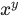
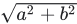

## Class  `Variable` 
See the [Variables Guide](https://tensorflow.org/guide/variables).

### 在指南中使用：
- [Training checkpoints](https://tensorflow.google.cn/guide/checkpoint)
- [Eager execution](https://tensorflow.google.cn/guide/eager)
- [Writing custom layers and models with Keras](https://tensorflow.google.cn/guide/keras/custom_layers_and_models)
- [Migrate your TensorFlow 1 code to TensorFlow 2](https://tensorflow.google.cn/guide/migrate)
- [Better performance with tf.function and AutoGraph](https://tensorflow.google.cn/guide/function)


### 在教程中使用：
- [Better performance with tf.function](https://tensorflow.google.cn/tutorials/customization/performance)
- [Custom training: basics](https://tensorflow.google.cn/tutorials/customization/custom_training)
- [Custom training with tf.distribute.Strategy](https://tensorflow.google.cn/tutorials/distribute/custom_training)
- [Neural style transfer](https://tensorflow.google.cn/tutorials/generative/style_transfer)
- [Automatic differentiation and gradient tape](https://tensorflow.google.cn/tutorials/customization/autodiff)
A variable maintains state in the graph across calls to  `run()` . You add avariable to the graph by constructing an instance of the class  `Variable` .

The  `Variable()`  constructor requires an initial value for the variable,which can be a  `Tensor`  of any type and shape. The initial value defines thetype and shape of the variable. After construction, the type and shape ofthe variable are fixed. The value can be changed using one of the assignmethods.

If you want to change the shape of a variable later you have to use an `assign`  Op with  `validate_shape=False` .

Just like any  `Tensor` , variables created with  `Variable()`  can be used asinputs for other Ops in the graph. Additionally, all the operatorsoverloaded for the  `Tensor`  class are carried over to variables, so you canalso add nodes to the graph by just doing arithmetic on variables.

```
 import tensorflow as tf

# Create a variable.
w = tf.Variable(<initial-value>, name=<optional-name>)

# Use the variable in the graph like any Tensor.
y = tf.matmul(w, ...another variable or tensor...)

# The overloaded operators are available too.
z = tf.sigmoid(w + y)

# Assign a new value to the variable with `assign()` or a related method.
w.assign(w + 1.0)
w.assign_add(1.0)
 
```

When you launch the graph, variables have to be explicitly initialized beforeyou can run Ops that use their value. You can initialize a variable byrunning its *initializer op*, restoring the variable from a save file, orsimply running an  `assign`  Op that assigns a value to the variable. In fact,the variable *initializer op* is just an  `assign`  Op that assigns thevariable's initial value to the variable itself.

```
 # Launch the graph in a session.
with tf.compat.v1.Session() as sess:
    # Run the variable initializer.
    sess.run(w.initializer)
    # ...you now can run ops that use the value of 'w'...
 
```

The most common initialization pattern is to use the convenience function `global_variables_initializer()`  to add an Op to the graph that initializesall the variables. You then run that Op after launching the graph.

```
 # Add an Op to initialize global variables.
init_op = tf.compat.v1.global_variables_initializer()

# Launch the graph in a session.
with tf.compat.v1.Session() as sess:
    # Run the Op that initializes global variables.
    sess.run(init_op)
    # ...you can now run any Op that uses variable values...
 
```

If you need to create a variable with an initial value dependent on anothervariable, use the other variable's  `initialized_value()` . This ensures thatvariables are initialized in the right order.

All variables are automatically collected in the graph where they arecreated. By default, the constructor adds the new variable to the graphcollection  `GraphKeys.GLOBAL_VARIABLES` . The convenience function `global_variables()`  returns the contents of that collection.

When building a machine learning model it is often convenient to distinguishbetween variables holding the trainable model parameters and other variablessuch as a  `global step`  variable used to count training steps. To make thiseasier, the variable constructor supports a  `trainable=<bool>`  parameter. If `True` , the new variable is also added to the graph collection `GraphKeys.TRAINABLE_VARIABLES` . The convenience function `trainable_variables()`  returns the contents of this collection. Thevarious  `Optimizer`  classes use this collection as the default list ofvariables to optimize.

##  `__init__` 
[View source](https://github.com/tensorflow/tensorflow/blob/r2.0/tensorflow/python/ops/variables.py#L353-L432)

```
 __init__(
    initial_value=None,
    trainable=None,
    validate_shape=True,
    caching_device=None,
    name=None,
    variable_def=None,
    dtype=None,
    import_scope=None,
    constraint=None,
    synchronization=tf.VariableSynchronization.AUTO,
    aggregation=tf.compat.v1.VariableAggregation.NONE,
    shape=None
)
 
```

Creates a new variable with value  `initial_value` .

The new variable is added to the graph collections listed in  `collections` ,which defaults to  `[GraphKeys.GLOBAL_VARIABLES]` .

If  `trainable`  is  `True`  the variable is also added to the graph collection `GraphKeys.TRAINABLE_VARIABLES` .

This constructor creates both a  `variable`  Op and an  `assign`  Op to set thevariable to its initial value.

#### 参数：
- **`initial_value`** : A  `Tensor` , or Python object convertible to a  `Tensor` ,which is the initial value for the Variable. The initial value must havea shape specified unless  `validate_shape`  is set to False. Can also be acallable with no argument that returns the initial value when called. Inthat case,  `dtype`  must be specified. (Note that initializer functionsfrom init_ops.py must first be bound to a shape before being used here.)
- **`trainable`** : If  `True` , GradientTapes automatically watch uses of thisvariable. Defaults to  `True` , unless  `synchronization`  is set to `ON_READ` , in which case it defaults to  `False` .
- **`validate_shape`** : If  `False` , allows the variable to be initialized with avalue of unknown shape. If  `True` , the default, the shape of `initial_value`  must be known.
- **`caching_device`** : Optional device string describing where the Variableshould be cached for reading.  Defaults to the Variable's device. If not `None` , caches on another device.  Typical use is to cache on the devicewhere the Ops using the Variable reside, to deduplicate copying through `Switch`  and other conditional statements.
- **`name`** : Optional name for the variable. Defaults to  `'Variable'`  and getsuniquified automatically.
- **`variable_def`** :  `VariableDef`  protocol buffer. If not  `None` , recreates theVariable object with its contents, referencing the variable's nodes inthe graph, which must already exist. The graph is not changed. `variable_def`  and the other arguments are mutually exclusive.
- **`dtype`** : If set, initial_value will be converted to the given type. If `None` , either the datatype will be kept (if  `initial_value`  is aTensor), or  `convert_to_tensor`  will decide.
- **`import_scope`** : Optional  `string` . Name scope to add to the  `Variable.`  Onlyused when initializing from protocol buffer.
- **`constraint`** : An optional projection function to be applied to the variableafter being updated by an  `Optimizer`  (e.g. used to implement normconstraints or value constraints for layer weights). The function musttake as input the unprojected Tensor representing the value of thevariable and return the Tensor for the projected value (which must havethe same shape). Constraints are not safe to use when doing asynchronousdistributed training.
- **`synchronization`** : Indicates when a distributed a variable will beaggregated. Accepted values are constants defined in the class[ `tf.VariableSynchronization` ](https://tensorflow.google.cn/api_docs/python/tf/VariableSynchronization). By default the synchronization is set to `AUTO`  and the current  `DistributionStrategy`  chooses when tosynchronize.
- **`aggregation`** : Indicates how a distributed variable will be aggregated.Accepted values are constants defined in the class[ `tf.VariableAggregation` ](https://tensorflow.google.cn/api_docs/python/tf/VariableAggregation).
- **`shape`** : (optional) The shape of this variable. If None, the shape of `initial_value`  will be used. When setting this argument to[ `tf.TensorShape(None)` ](https://tensorflow.google.cn/api_docs/python/tf/TensorShape) (representing an unspecified shape), the variablecan be assigned with values of different shapes.


#### 加薪：
- **`ValueError`** : If both  `variable_def`  and initial_value are specified.
- **`ValueError`** : If the initial value is not specified, or does not have ashape and  `validate_shape`  is  `True` .
- **`RuntimeError`** : If eager execution is enabled.


## 子类
[ `class SaveSliceInfo` ](https://tensorflow.google.cn/api_docs/python/tf/Variable/SaveSliceInfo)

## 属性


###  `aggregation` 


###  `constraint` 
返回与此变量关联的约束函数。

#### 返回：
The constraint function that was passed to the variable constructor.Can be  `None`  if no constraint was passed.

###  `device` 
这个变量的装置。

###  `dtype` 
The  `DType`  of this variable.

###  `graph` 
The  `Graph`  of this variable.

###  `initial_value` 
返回用作变量初始值的张量。

Note that this is different from  `initialized_value()`  which runsthe op that initializes the variable before returning its value.This method returns the tensor that is used by the op that initializesthe variable.

#### 返回：
A  `Tensor` .

###  `initializer` 
此变量的初始值设定项操作。

###  `name` 
此变量的名称。

###  `op` 
The  `Operation`  of this variable.

###  `shape` 
The  `TensorShape`  of this variable.

#### 返回：
A  `TensorShape` .

###  `synchronization` 


###  `trainable` 


## 方法


###  `__abs__` 
[View source](https://github.com/tensorflow/tensorflow/blob/r2.0/tensorflow/python/ops/math_ops.py#L245-L278)

```
 __abs__(
    x,
    name=None
)
 
```

计算张量的绝对值。

Given a tensor of integer or floating-point values, this operation returns atensor of the same type, where each element contains the absolute value of thecorresponding element in the input.

Given a tensor  `x`  of complex numbers, this operation returns a tensor of type `float32`  or  `float64`  that is the absolute value of each element in  `x` . Allelements in  `x`  must be complex numbers of the form . Theabsolute value is computed as .  For example:

```
 x = tf.constant([[-2.25 + 4.75j], [-3.25 + 5.75j]])
tf.abs(x)  # [5.25594902, 6.60492229]
 
```

#### 参数：
- **`x`** : A  `Tensor`  or  `SparseTensor`  of type  `float16` ,  `float32` ,  `float64` , `int32` ,  `int64` ,  `complex64`  or  `complex128` .
- **`name`** : A name for the operation (optional).


#### 返回：
A  `Tensor`  or  `SparseTensor`  the same size, type, and sparsity as  `x`  with  absolute values.Note, for  `complex64`  or  `complex128`  input, the returned  `Tensor`  will be  of type  `float32`  or  `float64` , respectively.

###  `__add__` 
[View source](https://github.com/tensorflow/tensorflow/blob/r2.0/tensorflow/python/ops/variables.py#L896-L912)

```
 __add__(
    a,
    *args,
    **kwargs
)
 
```

Dispatches to add for strings and add_v2 for all other types.

###  `__and__` 
[View source](https://github.com/tensorflow/tensorflow/blob/r2.0/tensorflow/python/ops/variables.py#L896-L912)

```
 __and__(
    a,
    *args,
    **kwargs
)
 
```

Returns the truth value of x AND y element-wise.

*NOTE*: [ `math.logical_and` ](https://tensorflow.google.cn/api_docs/python/tf/math/logical_and) supports broadcasting. More about broadcasting[here](http://docs.scipy.org/doc/numpy/user/basics.broadcasting.html)

#### 参数：
- **`x`** : A  `Tensor`  of type  `bool` .
- **`y`** : A  `Tensor`  of type  `bool` .
- **`name`** : A name for the operation (optional).


#### 返回：
A  `Tensor`  of type  `bool` .

###  `__div__` 
[View source](https://github.com/tensorflow/tensorflow/blob/r2.0/tensorflow/python/ops/variables.py#L896-L912)

```
 __div__(
    a,
    *args,
    **kwargs
)
 
```

使用python 2语义划分两个值。

Used for Tensor.**div** .

#### 参数：
- **`x`** :  `Tensor`  numerator of real numeric type.
- **`y`** :  `Tensor`  denominator of real numeric type.
- **`name`** : A name for the operation (optional).


#### 返回：
 `x / y`  returns the quotient of x and y.

###  `__eq__` 
[View source](https://github.com/tensorflow/tensorflow/blob/r2.0/tensorflow/python/ops/variables.py#L1092-L1101)

```
 __eq__(other)
 
```

Compares two variables element-wise for equality.

###  `__floordiv__` 
[View source](https://github.com/tensorflow/tensorflow/blob/r2.0/tensorflow/python/ops/variables.py#L896-L912)

```
 __floordiv__(
    a,
    *args,
    **kwargs
)
 
```

Divides  `x / y`  elementwise, rounding toward the most negative integer.

The same as [ `tf.compat.v1.div(x,y)` ](https://tensorflow.google.cn/api_docs/python/tf/RaggedTensor#__div__) for integers, but uses `tf.floor(tf.compat.v1.div(x,y))`  forfloating point arguments so that the result is always an integer (thoughpossibly an integer represented as floating point).  This op is generated by `x // y`  floor division in Python 3 and in Python 2.7 with `from __future__ import division` .

 `x`  and  `y`  must have the same type, and the result will have the same typeas well.

#### 参数：
- **`x`** :  `Tensor`  numerator of real numeric type.
- **`y`** :  `Tensor`  denominator of real numeric type.
- **`name`** : A name for the operation (optional).


#### 返回：
 `x / y`  rounded down.

#### 加薪：
- **`TypeError`** : If the inputs are complex.


###  `__ge__` 
[View source](https://github.com/tensorflow/tensorflow/blob/r2.0/tensorflow/python/ops/variables.py#L4437-L4494)

```
 __ge__(
    a,
    *args,
    **kwargs
)
 
```

Returns the truth value of (x >= y) element-wise.

*NOTE*: [ `math.greater_equal` ](https://tensorflow.google.cn/api_docs/python/tf/math/greater_equal) supports broadcasting. More about broadcasting[here](http://docs.scipy.org/doc/numpy/user/basics.broadcasting.html)

#### 参数：
- **`x`** : A  `Tensor` . Must be one of the following types:  `float32` ,  `float64` ,  `int32` ,  `uint8` ,  `int16` ,  `int8` ,  `int64` ,  `bfloat16` ,  `uint16` ,  `half` ,  `uint32` ,  `uint64` .
- **`y`** : A  `Tensor` . Must have the same type as  `x` .
- **`name`** : A name for the operation (optional).


#### 返回：
A  `Tensor`  of type  `bool` .

###  `__getitem__` 
[View source](https://github.com/tensorflow/tensorflow/blob/r2.0/tensorflow/python/ops/array_ops.py#L1010-L1053)

```
 __getitem__(
    var,
    slice_spec
)
 
```

创建给定变量的切片辅助对象。

This allows creating a sub-tensor from part of the current contentsof a variable. See [ `tf.Tensor.**getitem** ` ](https://tensorflow.google.cn/api_docs/python/tf/Tensor#__getitem__) for detailed examplesof slicing.

This function in addition also allows assignment to a sliced range.This is similar to  `__setitem__`  functionality in Python. However,the syntax is different so that the user can capture the assignmentoperation for grouping or passing to  `sess.run()` .For example,

```
 import tensorflow as tf
A = tf.Variable([[1,2,3], [4,5,6], [7,8,9]], dtype=tf.float32)
with tf.compat.v1.Session() as sess:
  sess.run(tf.compat.v1.global_variables_initializer())
  print(sess.run(A[:2, :2]))  # => [[1,2], [4,5]]

  op = A[:2,:2].assign(22. * tf.ones((2, 2)))
  print(sess.run(op))  # => [[22, 22, 3], [22, 22, 6], [7,8,9]]
 
```

Note that assignments currently do not support NumPy broadcastingsemantics.

#### 参数：
- **`var`** : An  `ops.Variable`  object.
- **`slice_spec`** : The arguments to [ `Tensor.**getitem** ` ](https://tensorflow.google.cn/api_docs/python/tf/Tensor#__getitem__).


#### 返回：
The appropriate slice of "tensor", based on "slice_spec".As an operator. The operator also has a  `assign()`  methodthat can be used to generate an assignment operator.

#### 加薪：
- **`ValueError`** : If a slice range is negative size.
- **`TypeError`** : TypeError: If the slice indices aren't int, slice,ellipsis, tf.newaxis or int32/int64 tensors.


###  `__gt__` 
[View source](https://github.com/tensorflow/tensorflow/blob/r2.0/tensorflow/python/ops/variables.py#L4354-L4411)

```
 __gt__(
    a,
    *args,
    **kwargs
)
 
```

Returns the truth value of (x > y) element-wise.

*NOTE*: [ `math.greater` ](https://tensorflow.google.cn/api_docs/python/tf/math/greater) supports broadcasting. More about broadcasting[here](http://docs.scipy.org/doc/numpy/user/basics.broadcasting.html)

#### 参数：
- **`x`** : A  `Tensor` . Must be one of the following types:  `float32` ,  `float64` ,  `int32` ,  `uint8` ,  `int16` ,  `int8` ,  `int64` ,  `bfloat16` ,  `uint16` ,  `half` ,  `uint32` ,  `uint64` .
- **`y`** : A  `Tensor` . Must have the same type as  `x` .
- **`name`** : A name for the operation (optional).


#### 返回：
A  `Tensor`  of type  `bool` .

###  `__invert__` 
[View source](https://github.com/tensorflow/tensorflow/blob/r2.0/tensorflow/python/ops/variables.py#L5922-L5975)

```
 __invert__(
    a,
    *args,
    **kwargs
)
 
```

Returns the truth value of NOT x element-wise.

#### 参数：
- **`x`** : A  `Tensor`  of type  `bool` .
- **`name`** : A name for the operation (optional).


#### 返回：
A  `Tensor`  of type  `bool` .

###  `__iter__` 
[View source](https://github.com/tensorflow/tensorflow/blob/r2.0/tensorflow/python/ops/variables.py#L1116-L1128)

```
 __iter__()
 
```

防止迭代的虚拟方法。

不要打电话。

NOTE(mrry): If we register **getitem**  as an overloaded operator,Python will valiantly attempt to iterate over the variable's Tensor from 0to infinity.  Declaring this method prevents this unintended behavior.

#### 加薪：
- **`TypeError`** : when invoked.


###  `__le__` 
[View source](https://github.com/tensorflow/tensorflow/blob/r2.0/tensorflow/python/ops/variables.py#L5419-L5476)

```
 __le__(
    a,
    *args,
    **kwargs
)
 
```

Returns the truth value of (x <= y) element-wise.

*NOTE*: [ `math.less_equal` ](https://tensorflow.google.cn/api_docs/python/tf/math/less_equal) supports broadcasting. More about broadcasting[here](http://docs.scipy.org/doc/numpy/user/basics.broadcasting.html)

#### 参数：
- **`x`** : A  `Tensor` . Must be one of the following types:  `float32` ,  `float64` ,  `int32` ,  `uint8` ,  `int16` ,  `int8` ,  `int64` ,  `bfloat16` ,  `uint16` ,  `half` ,  `uint32` ,  `uint64` .
- **`y`** : A  `Tensor` . Must have the same type as  `x` .
- **`name`** : A name for the operation (optional).


#### 返回：
A  `Tensor`  of type  `bool` .

###  `__lt__` 
[View source](https://github.com/tensorflow/tensorflow/blob/r2.0/tensorflow/python/ops/variables.py#L5336-L5393)

```
 __lt__(
    a,
    *args,
    **kwargs
)
 
```

Returns the truth value of (x < y) element-wise.

*NOTE*: [ `math.less` ](https://tensorflow.google.cn/api_docs/python/tf/math/less) supports broadcasting. More about broadcasting[here](http://docs.scipy.org/doc/numpy/user/basics.broadcasting.html)

#### 参数：
- **`x`** : A  `Tensor` . Must be one of the following types:  `float32` ,  `float64` ,  `int32` ,  `uint8` ,  `int16` ,  `int8` ,  `int64` ,  `bfloat16` ,  `uint16` ,  `half` ,  `uint32` ,  `uint64` .
- **`y`** : A  `Tensor` . Must have the same type as  `x` .
- **`name`** : A name for the operation (optional).


#### 返回：
A  `Tensor`  of type  `bool` .

###  `__matmul__` 
[View source](https://github.com/tensorflow/tensorflow/blob/r2.0/tensorflow/python/ops/variables.py#L896-L912)

```
 __matmul__(
    a,
    *args,
    **kwargs
)
 
```

Multiplies matrix  `a`  by matrix  `b` , producing  `a`  *  `b` .

The inputs must, following any transpositions, be tensors of rank >= 2where the inner 2 dimensions specify valid matrix multiplication arguments,and any further outer dimensions match.

Both matrices must be of the same type. The supported types are: `float16` ,  `float32` ,  `float64` ,  `int32` ,  `complex64` ,  `complex128` .

Either matrix can be transposed or adjointed (conjugated and transposed) onthe fly by setting one of the corresponding flag to  `True` . These are  `False` by default.

If one or both of the matrices contain a lot of zeros, a more efficientmultiplication algorithm can be used by setting the corresponding `a_is_sparse`  or  `b_is_sparse`  flag to  `True` . These are  `False`  by default.This optimization is only available for plain matrices (rank-2 tensors) withdatatypes  `bfloat16`  or  `float32` .

#### 例如：


```
 # 2-D tensor `a`
# [[1, 2, 3],
#  [4, 5, 6]]
a = tf.constant([1, 2, 3, 4, 5, 6], shape=[2, 3])

# 2-D tensor `b`
# [[ 7,  8],
#  [ 9, 10],
#  [11, 12]]
b = tf.constant([7, 8, 9, 10, 11, 12], shape=[3, 2])

# `a` * `b`
# [[ 58,  64],
#  [139, 154]]
c = tf.matmul(a, b)


# 3-D tensor `a`
# [[[ 1,  2,  3],
#   [ 4,  5,  6]],
#  [[ 7,  8,  9],
#   [10, 11, 12]]]
a = tf.constant(np.arange(1, 13, dtype=np.int32),
                shape=[2, 2, 3])

# 3-D tensor `b`
# [[[13, 14],
#   [15, 16],
#   [17, 18]],
#  [[19, 20],
#   [21, 22],
#   [23, 24]]]
b = tf.constant(np.arange(13, 25, dtype=np.int32),
                shape=[2, 3, 2])

# `a` * `b`
# [[[ 94, 100],
#   [229, 244]],
#  [[508, 532],
#   [697, 730]]]
c = tf.matmul(a, b)

# Since python >= 3.5 the @ operator is supported (see PEP 465).
# In TensorFlow, it simply calls the `tf.matmul()` function, so the
# following lines are equivalent:
d = a @ b @ [[10.], [11.]]
d = tf.matmul(tf.matmul(a, b), [[10.], [11.]])
 
```

#### 参数：
- **`a`** :  `Tensor`  of type  `float16` ,  `float32` ,  `float64` ,  `int32` ,  `complex64` , `complex128`  and rank > 1.
- **`b`** :  `Tensor`  with same type and rank as  `a` .
- **`transpose_a`** : If  `True` ,  `a`  is transposed before multiplication.
- **`transpose_b`** : If  `True` ,  `b`  is transposed before multiplication.
- **`adjoint_a`** : If  `True` ,  `a`  is conjugated and transposed beforemultiplication.
- **`adjoint_b`** : If  `True` ,  `b`  is conjugated and transposed beforemultiplication.
- **`a_is_sparse`** : If  `True` ,  `a`  is treated as a sparse matrix.
- **`b_is_sparse`** : If  `True` ,  `b`  is treated as a sparse matrix.
- **`name`** : Name for the operation (optional).


#### 返回：
A  `Tensor`  of the same type as  `a`  and  `b`  where each inner-most matrix isthe product of the corresponding matrices in  `a`  and  `b` , e.g. if alltranspose or adjoint attributes are  `False` :

 `output` [..., i, j] = sum_k ( `a` [..., i, k] *  `b` [..., k, j]),for all indices i, j.

- **`Note`** : This is matrix product, not element-wise product.


#### 加薪：
- **`ValueError`** : If transpose_a and adjoint_a, or transpose_b and adjoint_bare both set to True.


###  `__mod__` 
[View source](https://github.com/tensorflow/tensorflow/blob/r2.0/tensorflow/python/ops/variables.py#L896-L912)

```
 __mod__(
    a,
    *args,
    **kwargs
)
 
```

Returns element-wise remainder of division. When  `x < 0`  xor  `y < 0`  is

true, this follows Python semantics in that the result here is consistentwith a flooring divide. E.g.  `floor(x / y) * y + mod(x, y) = x` .

*NOTE*: [ `math.floormod` ](https://tensorflow.google.cn/api_docs/python/tf/math/floormod) supports broadcasting. More about broadcasting[here](http://docs.scipy.org/doc/numpy/user/basics.broadcasting.html)

#### 参数：
- **`x`** : A  `Tensor` . Must be one of the following types:  `int32` ,  `int64` ,  `bfloat16` ,  `half` ,  `float32` ,  `float64` .
- **`y`** : A  `Tensor` . Must have the same type as  `x` .
- **`name`** : A name for the operation (optional).


#### 返回：
A  `Tensor` . Has the same type as  `x` .

###  `__mul__` 
[View source](https://github.com/tensorflow/tensorflow/blob/r2.0/tensorflow/python/ops/variables.py#L896-L912)

```
 __mul__(
    a,
    *args,
    **kwargs
)
 
```

Dispatches cwise mul for "Dense*Dense" and "Dense*Sparse".

###  `__ne__` 
[View source](https://github.com/tensorflow/tensorflow/blob/r2.0/tensorflow/python/ops/variables.py#L1104-L1114)

```
 __ne__(other)
 
```

Compares two variables element-wise for equality.

###  `__neg__` 
[View source](https://github.com/tensorflow/tensorflow/blob/r2.0/tensorflow/python/ops/variables.py#L6802-L6857)

```
 __neg__(
    a,
    *args,
    **kwargs
)
 
```

Computes numerical negative value element-wise.

I.e., .

#### 参数：
- **`x`** : A  `Tensor` . Must be one of the following types:  `bfloat16` ,  `half` ,  `float32` ,  `float64` ,  `int32` ,  `int64` ,  `complex64` ,  `complex128` .
- **`name`** : A name for the operation (optional).


#### 返回：
A  `Tensor` . Has the same type as  `x` .

###  `__or__` 
[View source](https://github.com/tensorflow/tensorflow/blob/r2.0/tensorflow/python/ops/variables.py#L896-L912)

```
 __or__(
    a,
    *args,
    **kwargs
)
 
```

Returns the truth value of x OR y element-wise.

*NOTE*: [ `math.logical_or` ](https://tensorflow.google.cn/api_docs/python/tf/math/logical_or) supports broadcasting. More about broadcasting[here](http://docs.scipy.org/doc/numpy/user/basics.broadcasting.html)

#### 参数：
- **`x`** : A  `Tensor`  of type  `bool` .
- **`y`** : A  `Tensor`  of type  `bool` .
- **`name`** : A name for the operation (optional).


#### 返回：
A  `Tensor`  of type  `bool` .

###  `__pow__` 
[View source](https://github.com/tensorflow/tensorflow/blob/r2.0/tensorflow/python/ops/variables.py#L896-L912)

```
 __pow__(
    a,
    *args,
    **kwargs
)
 
```

计算一个值对另一个值的幂。

Given a tensor  `x`  and a tensor  `y` , this operation computes  forcorresponding elements in  `x`  and  `y` . For example:

```
 x = tf.constant([[2, 2], [3, 3]])
y = tf.constant([[8, 16], [2, 3]])
tf.pow(x, y)  # [[256, 65536], [9, 27]]
 
```

#### 参数：
- **`x`** : A  `Tensor`  of type  `float16` ,  `float32` ,  `float64` ,  `int32` ,  `int64` , `complex64` , or  `complex128` .
- **`y`** : A  `Tensor`  of type  `float16` ,  `float32` ,  `float64` ,  `int32` ,  `int64` , `complex64` , or  `complex128` .
- **`name`** : A name for the operation (optional).


#### 返回：
A  `Tensor` .

###  `__radd__` 
[View source](https://github.com/tensorflow/tensorflow/blob/r2.0/tensorflow/python/ops/variables.py#L922-L925)

```
 __radd__(
    a,
    *args,
    **kwargs
)
 
```

Dispatches to add for strings and add_v2 for all other types.

###  `__rand__` 
[View source](https://github.com/tensorflow/tensorflow/blob/r2.0/tensorflow/python/ops/variables.py#L922-L925)

```
 __rand__(
    a,
    *args,
    **kwargs
)
 
```

Returns the truth value of x AND y element-wise.

*NOTE*: [ `math.logical_and` ](https://tensorflow.google.cn/api_docs/python/tf/math/logical_and) supports broadcasting. More about broadcasting[here](http://docs.scipy.org/doc/numpy/user/basics.broadcasting.html)

#### 参数：
- **`x`** : A  `Tensor`  of type  `bool` .
- **`y`** : A  `Tensor`  of type  `bool` .
- **`name`** : A name for the operation (optional).


#### 返回：
A  `Tensor`  of type  `bool` .

###  `__rdiv__` 
[View source](https://github.com/tensorflow/tensorflow/blob/r2.0/tensorflow/python/ops/variables.py#L922-L925)

```
 __rdiv__(
    a,
    *args,
    **kwargs
)
 
```

使用python 2语义划分两个值。

Used for Tensor.**div** .

#### 参数：
- **`x`** :  `Tensor`  numerator of real numeric type.
- **`y`** :  `Tensor`  denominator of real numeric type.
- **`name`** : A name for the operation (optional).


#### 返回：
 `x / y`  returns the quotient of x and y.

###  `__rfloordiv__` 
[View source](https://github.com/tensorflow/tensorflow/blob/r2.0/tensorflow/python/ops/variables.py#L922-L925)

```
 __rfloordiv__(
    a,
    *args,
    **kwargs
)
 
```

Divides  `x / y`  elementwise, rounding toward the most negative integer.

The same as [ `tf.compat.v1.div(x,y)` ](https://tensorflow.google.cn/api_docs/python/tf/RaggedTensor#__div__) for integers, but uses `tf.floor(tf.compat.v1.div(x,y))`  forfloating point arguments so that the result is always an integer (thoughpossibly an integer represented as floating point).  This op is generated by `x // y`  floor division in Python 3 and in Python 2.7 with `from __future__ import division` .

 `x`  and  `y`  must have the same type, and the result will have the same typeas well.

#### 参数：
- **`x`** :  `Tensor`  numerator of real numeric type.
- **`y`** :  `Tensor`  denominator of real numeric type.
- **`name`** : A name for the operation (optional).


#### 返回：
 `x / y`  rounded down.

#### 加薪：
- **`TypeError`** : If the inputs are complex.


###  `__rmatmul__` 
[View source](https://github.com/tensorflow/tensorflow/blob/r2.0/tensorflow/python/ops/variables.py#L922-L925)

```
 __rmatmul__(
    a,
    *args,
    **kwargs
)
 
```

Multiplies matrix  `a`  by matrix  `b` , producing  `a`  *  `b` .

The inputs must, following any transpositions, be tensors of rank >= 2where the inner 2 dimensions specify valid matrix multiplication arguments,and any further outer dimensions match.

Both matrices must be of the same type. The supported types are: `float16` ,  `float32` ,  `float64` ,  `int32` ,  `complex64` ,  `complex128` .

Either matrix can be transposed or adjointed (conjugated and transposed) onthe fly by setting one of the corresponding flag to  `True` . These are  `False` by default.

If one or both of the matrices contain a lot of zeros, a more efficientmultiplication algorithm can be used by setting the corresponding `a_is_sparse`  or  `b_is_sparse`  flag to  `True` . These are  `False`  by default.This optimization is only available for plain matrices (rank-2 tensors) withdatatypes  `bfloat16`  or  `float32` .

#### 例如：


```
 # 2-D tensor `a`
# [[1, 2, 3],
#  [4, 5, 6]]
a = tf.constant([1, 2, 3, 4, 5, 6], shape=[2, 3])

# 2-D tensor `b`
# [[ 7,  8],
#  [ 9, 10],
#  [11, 12]]
b = tf.constant([7, 8, 9, 10, 11, 12], shape=[3, 2])

# `a` * `b`
# [[ 58,  64],
#  [139, 154]]
c = tf.matmul(a, b)


# 3-D tensor `a`
# [[[ 1,  2,  3],
#   [ 4,  5,  6]],
#  [[ 7,  8,  9],
#   [10, 11, 12]]]
a = tf.constant(np.arange(1, 13, dtype=np.int32),
                shape=[2, 2, 3])

# 3-D tensor `b`
# [[[13, 14],
#   [15, 16],
#   [17, 18]],
#  [[19, 20],
#   [21, 22],
#   [23, 24]]]
b = tf.constant(np.arange(13, 25, dtype=np.int32),
                shape=[2, 3, 2])

# `a` * `b`
# [[[ 94, 100],
#   [229, 244]],
#  [[508, 532],
#   [697, 730]]]
c = tf.matmul(a, b)

# Since python >= 3.5 the @ operator is supported (see PEP 465).
# In TensorFlow, it simply calls the `tf.matmul()` function, so the
# following lines are equivalent:
d = a @ b @ [[10.], [11.]]
d = tf.matmul(tf.matmul(a, b), [[10.], [11.]])
 
```

#### 参数：
- **`a`** :  `Tensor`  of type  `float16` ,  `float32` ,  `float64` ,  `int32` ,  `complex64` , `complex128`  and rank > 1.
- **`b`** :  `Tensor`  with same type and rank as  `a` .
- **`transpose_a`** : If  `True` ,  `a`  is transposed before multiplication.
- **`transpose_b`** : If  `True` ,  `b`  is transposed before multiplication.
- **`adjoint_a`** : If  `True` ,  `a`  is conjugated and transposed beforemultiplication.
- **`adjoint_b`** : If  `True` ,  `b`  is conjugated and transposed beforemultiplication.
- **`a_is_sparse`** : If  `True` ,  `a`  is treated as a sparse matrix.
- **`b_is_sparse`** : If  `True` ,  `b`  is treated as a sparse matrix.
- **`name`** : Name for the operation (optional).


#### 返回：
A  `Tensor`  of the same type as  `a`  and  `b`  where each inner-most matrix isthe product of the corresponding matrices in  `a`  and  `b` , e.g. if alltranspose or adjoint attributes are  `False` :

 `output` [..., i, j] = sum_k ( `a` [..., i, k] *  `b` [..., k, j]),for all indices i, j.

- **`Note`** : This is matrix product, not element-wise product.


#### 加薪：
- **`ValueError`** : If transpose_a and adjoint_a, or transpose_b and adjoint_bare both set to True.


###  `__rmod__` 
[View source](https://github.com/tensorflow/tensorflow/blob/r2.0/tensorflow/python/ops/variables.py#L922-L925)

```
 __rmod__(
    a,
    *args,
    **kwargs
)
 
```

Returns element-wise remainder of division. When  `x < 0`  xor  `y < 0`  is

true, this follows Python semantics in that the result here is consistentwith a flooring divide. E.g.  `floor(x / y) * y + mod(x, y) = x` .

*NOTE*: [ `math.floormod` ](https://tensorflow.google.cn/api_docs/python/tf/math/floormod) supports broadcasting. More about broadcasting[here](http://docs.scipy.org/doc/numpy/user/basics.broadcasting.html)

#### 参数：
- **`x`** : A  `Tensor` . Must be one of the following types:  `int32` ,  `int64` ,  `bfloat16` ,  `half` ,  `float32` ,  `float64` .
- **`y`** : A  `Tensor` . Must have the same type as  `x` .
- **`name`** : A name for the operation (optional).


#### 返回：
A  `Tensor` . Has the same type as  `x` .

###  `__rmul__` 
[View source](https://github.com/tensorflow/tensorflow/blob/r2.0/tensorflow/python/ops/variables.py#L922-L925)

```
 __rmul__(
    a,
    *args,
    **kwargs
)
 
```

Dispatches cwise mul for "Dense*Dense" and "Dense*Sparse".

###  `__ror__` 
[View source](https://github.com/tensorflow/tensorflow/blob/r2.0/tensorflow/python/ops/variables.py#L922-L925)

```
 __ror__(
    a,
    *args,
    **kwargs
)
 
```

Returns the truth value of x OR y element-wise.

*NOTE*: [ `math.logical_or` ](https://tensorflow.google.cn/api_docs/python/tf/math/logical_or) supports broadcasting. More about broadcasting[here](http://docs.scipy.org/doc/numpy/user/basics.broadcasting.html)

#### 参数：
- **`x`** : A  `Tensor`  of type  `bool` .
- **`y`** : A  `Tensor`  of type  `bool` .
- **`name`** : A name for the operation (optional).


#### 返回：
A  `Tensor`  of type  `bool` .

###  `__rpow__` 
[View source](https://github.com/tensorflow/tensorflow/blob/r2.0/tensorflow/python/ops/variables.py#L922-L925)

```
 __rpow__(
    a,
    *args,
    **kwargs
)
 
```

计算一个值对另一个值的幂。

Given a tensor  `x`  and a tensor  `y` , this operation computes  forcorresponding elements in  `x`  and  `y` . For example:

```
 x = tf.constant([[2, 2], [3, 3]])
y = tf.constant([[8, 16], [2, 3]])
tf.pow(x, y)  # [[256, 65536], [9, 27]]
 
```

#### 参数：
- **`x`** : A  `Tensor`  of type  `float16` ,  `float32` ,  `float64` ,  `int32` ,  `int64` , `complex64` , or  `complex128` .
- **`y`** : A  `Tensor`  of type  `float16` ,  `float32` ,  `float64` ,  `int32` ,  `int64` , `complex64` , or  `complex128` .
- **`name`** : A name for the operation (optional).


#### 返回：
A  `Tensor` .

###  `__rsub__` 
[View source](https://github.com/tensorflow/tensorflow/blob/r2.0/tensorflow/python/ops/variables.py#L922-L925)

```
 __rsub__(
    a,
    *args,
    **kwargs
)
 
```

Returns x - y element-wise.

*NOTE*:  `Subtract`  supports broadcasting. More about broadcasting[here](http://docs.scipy.org/doc/numpy/user/basics.broadcasting.html)

#### 参数：
- **`x`** : A  `Tensor` . Must be one of the following types:  `bfloat16` ,  `half` ,  `float32` ,  `float64` ,  `uint8` ,  `int8` ,  `uint16` ,  `int16` ,  `int32` ,  `int64` ,  `complex64` ,  `complex128` .
- **`y`** : A  `Tensor` . Must have the same type as  `x` .
- **`name`** : A name for the operation (optional).


#### 返回：
A  `Tensor` . Has the same type as  `x` .

###  `__rtruediv__` 
[View source](https://github.com/tensorflow/tensorflow/blob/r2.0/tensorflow/python/ops/variables.py#L922-L925)

```
 __rtruediv__(
    a,
    *args,
    **kwargs
)
 
```

###  `__rxor__` 
[View source](https://github.com/tensorflow/tensorflow/blob/r2.0/tensorflow/python/ops/variables.py#L922-L925)

```
 __rxor__(
    a,
    *args,
    **kwargs
)
 
```

逻辑异或函数。

x ^ y = (x | y) &amp; ~(x &amp; y)

Inputs are tensor and if the tensors contains more than one element, anelement-wise logical XOR is computed.

#### 用法：


```
 x)
#  here z = [False  True  True False]
 
```

#### 参数：
- **`x`** : A  `Tensor`  type bool.
- **`y`** : A  `Tensor`  of type bool.


#### 返回：
A  `Tensor`  of type bool with the same size as that of x or y.

###  `__sub__` 
[View source](https://github.com/tensorflow/tensorflow/blob/r2.0/tensorflow/python/ops/variables.py#L896-L912)

```
 __sub__(
    a,
    *args,
    **kwargs
)
 
```

Returns x - y element-wise.

*NOTE*:  `Subtract`  supports broadcasting. More about broadcasting[here](http://docs.scipy.org/doc/numpy/user/basics.broadcasting.html)

#### 参数：
- **`x`** : A  `Tensor` . Must be one of the following types:  `bfloat16` ,  `half` ,  `float32` ,  `float64` ,  `uint8` ,  `int8` ,  `uint16` ,  `int16` ,  `int32` ,  `int64` ,  `complex64` ,  `complex128` .
- **`y`** : A  `Tensor` . Must have the same type as  `x` .
- **`name`** : A name for the operation (optional).


#### 返回：
A  `Tensor` . Has the same type as  `x` .

###  `__truediv__` 
[View source](https://github.com/tensorflow/tensorflow/blob/r2.0/tensorflow/python/ops/variables.py#L896-L912)

```
 __truediv__(
    a,
    *args,
    **kwargs
)
 
```

###  `__xor__` 
[View source](https://github.com/tensorflow/tensorflow/blob/r2.0/tensorflow/python/ops/variables.py#L896-L912)

```
 __xor__(
    a,
    *args,
    **kwargs
)
 
```

逻辑异或函数。

x ^ y = (x | y) &amp; ~(x &amp; y)

Inputs are tensor and if the tensors contains more than one element, anelement-wise logical XOR is computed.

#### 用法：


```
 x)
#  here z = [False  True  True False]
 
```

#### 参数：
- **`x`** : A  `Tensor`  type bool.
- **`y`** : A  `Tensor`  of type bool.


#### 返回：
A  `Tensor`  of type bool with the same size as that of x or y.

###  `assign` 
[View source](https://github.com/tensorflow/tensorflow/blob/r2.0/tensorflow/python/ops/variables.py#L570-L586)

```
 assign(
    value,
    use_locking=False,
    name=None,
    read_value=True
)
 
```

为变量指定一个新值。

This is essentially a shortcut for  `assign(self, value)` .

#### 参数：
- **`value`** : A  `Tensor` . The new value for this variable.
- **`use_locking`** : If  `True` , use locking during the assignment.
- **`name`** : The name of the operation to be created
- **`read_value`** : if True, will return something which evaluates to the newvalue of the variable; if False will return the assign op.


#### 返回：
A  `Tensor`  that will hold the new value of this variable afterthe assignment has completed.

###  `assign_add` 
[View source](https://github.com/tensorflow/tensorflow/blob/r2.0/tensorflow/python/ops/variables.py#L588-L604)

```
 assign_add(
    delta,
    use_locking=False,
    name=None,
    read_value=True
)
 
```

向此变量添加值。

This is essentially a shortcut for  `assign_add(self, delta)` .

#### 参数：
- **`delta`** : A  `Tensor` . The value to add to this variable.
- **`use_locking`** : If  `True` , use locking during the operation.
- **`name`** : The name of the operation to be created
- **`read_value`** : if True, will return something which evaluates to the newvalue of the variable; if False will return the assign op.


#### 返回：
A  `Tensor`  that will hold the new value of this variable afterthe addition has completed.

###  `assign_sub` 
[View source](https://github.com/tensorflow/tensorflow/blob/r2.0/tensorflow/python/ops/variables.py#L606-L622)

```
 assign_sub(
    delta,
    use_locking=False,
    name=None,
    read_value=True
)
 
```

从这个变量中减去一个值。

This is essentially a shortcut for  `assign_sub(self, delta)` .

#### 参数：
- **`delta`** : A  `Tensor` . The value to subtract from this variable.
- **`use_locking`** : If  `True` , use locking during the operation.
- **`name`** : The name of the operation to be created
- **`read_value`** : if True, will return something which evaluates to the newvalue of the variable; if False will return the assign op.


#### 返回：
A  `Tensor`  that will hold the new value of this variable afterthe subtraction has completed.

###  `batch_scatter_update` 
[View source](https://github.com/tensorflow/tensorflow/blob/r2.0/tensorflow/python/ops/variables.py#L745-L790)

```
 batch_scatter_update(
    sparse_delta,
    use_locking=False,
    name=None
)
 
```

Assigns [ `tf.IndexedSlices` ](https://tensorflow.google.cn/api_docs/python/tf/IndexedSlices) to this variable batch-wise.

Analogous to  `batch_gather` . This assumes that this variable and thesparse_delta IndexedSlices have a series of leading dimensions that are thesame for all of them, and the updates are performed on the last dimension ofindices. In other words, the dimensions should be the following:

 `num_prefix_dims = sparse_delta.indices.ndims - 1`  `batch_dim = num_prefix_dims + 1`  `sparse_delta.updates.shape = sparse_delta.indices.shape + var.shape[     batch_dim:]` 

where

 `sparse_delta.updates.shape[:num_prefix_dims]`  `== sparse_delta.indices.shape[:num_prefix_dims]`  `== var.shape[:num_prefix_dims]` 

所进行的操作可以表示为：

 `var[i_1, ..., i_n,     sparse_delta.indices[i_1, ..., i_n, j]] = sparse_delta.updates[        i_1, ..., i_n, j]` 

When sparse_delta.indices is a 1D tensor, this operation is equivalent to `scatter_update` .

To avoid this operation one can looping over the first  `ndims`  of thevariable and using  `scatter_update`  on the subtensors that result of slicingthe first dimension. This is a valid option for  `ndims = 1` , but lessefficient than this implementation.

#### 参数：
- **`sparse_delta`** : [ `tf.IndexedSlices` ](https://tensorflow.google.cn/api_docs/python/tf/IndexedSlices) to be assigned to this variable.
- **`use_locking`** : If  `True` , use locking during the operation.
- **`name`** : the name of the operation.


#### 返回：
A  `Tensor`  that will hold the new value of this variable afterthe scattered assignment has completed.

#### 加薪：
- **`TypeError`** : if  `sparse_delta`  is not an  `IndexedSlices` .


###  `count_up_to` 
[View source](https://github.com/tensorflow/tensorflow/blob/r2.0/tensorflow/python/ops/variables.py#L967-L988)

```
 count_up_to(limit)
 
```

Increments this variable until it reaches  `limit` . (deprecated)


**Warning:**  THIS FUNCTION IS DEPRECATED. It will be removed in a future version.Instructions for updating:Prefer Dataset.range instead.
When that Op is run it tries to increment the variable by  `1` . Ifincrementing the variable would bring it above  `limit`  then the Op raisesthe exception  `OutOfRangeError` .

If no error is raised, the Op outputs the value of the variable beforethe increment.

This is essentially a shortcut for  `count_up_to(self, limit)` .

#### 参数：
- **`limit`** : value at which incrementing the variable raises an error.


#### 返回：
A  `Tensor`  that will hold the variable value before the increment. If noother Op modifies this variable, the values produced will all bedistinct.

###  `eval` 
[View source](https://github.com/tensorflow/tensorflow/blob/r2.0/tensorflow/python/ops/variables.py#L487-L517)

```
 eval(session=None)
 
```

In a session, computes and returns the value of this variable.

This is not a graph construction method, it does not add ops to the graph.

This convenience method requires a session where the graphcontaining this variable has been launched. If no session ispassed, the default session is used.  See [ `tf.compat.v1.Session` ](https://tensorflow.google.cn/api_docs/python/tf/compat/v1/Session) for moreinformation on launching a graph and on sessions.

```
 v = tf.Variable([1, 2])
init = tf.compat.v1.global_variables_initializer()

with tf.compat.v1.Session() as sess:
    sess.run(init)
    # Usage passing the session explicitly.
    print(v.eval(sess))
    # Usage with the default session.  The 'with' block
    # above makes 'sess' the default session.
    print(v.eval())
 
```

#### 参数：
- **`session`** : The session to use to evaluate this variable. If none, thedefault session is used.


#### 返回：
A numpy  `ndarray`  with a copy of the value of this variable.

###  `experimental_ref` 
[View source](https://github.com/tensorflow/tensorflow/blob/r2.0/tensorflow/python/ops/variables.py#L1226-L1277)

```
 experimental_ref()
 
```

返回对此变量的哈希引用对象。


**Warning:**  Experimental API that could be changed or removed.
The primary usecase for this API is to put variables in a set/dictionary.We can't put variables in a set/dictionary as  `variable.__hash__()`  is nolonger available starting Tensorflow 2.0.

```
 import tensorflow as tf

x = tf.Variable(5)
y = tf.Variable(10)
z = tf.Variable(10)

# The followings will raise an exception starting 2.0
# TypeError: Variable is unhashable if Variable equality is enabled.
variable_set = {x, y, z}
variable_dict = {x: 'five', y: 'ten'}
 
```

Instead, we can use  `variable.experimental_ref()` .

```
 variable_set = {x.experimental_ref(),
                y.experimental_ref(),
                z.experimental_ref()}

print(x.experimental_ref() in variable_set)
==> True

variable_dict = {x.experimental_ref(): 'five',
                 y.experimental_ref(): 'ten',
                 z.experimental_ref(): 'ten'}

print(variable_dict[y.experimental_ref()])
==> ten
 
```

Also, the reference object provides  `.deref()`  function that returns theoriginal Variable.

```
 x = tf.Variable(5)
print(x.experimental_ref().deref())
==> <tf.Variable 'Variable:0' shape=() dtype=int32, numpy=5>
 
```

###  `from_proto` 
[View source](https://github.com/tensorflow/tensorflow/blob/r2.0/tensorflow/python/ops/variables.py#L1210-L1213)

```
 @staticmethod
from_proto(
    variable_def,
    import_scope=None
)
 
```

Returns a  `Variable`  object created from  `variable_def` .

###  `gather_nd` 
[View source](https://github.com/tensorflow/tensorflow/blob/r2.0/tensorflow/python/ops/variables.py#L952-L965)

```
 gather_nd(
    indices,
    name=None
)
 
```

Gather slices from  `params`  into a Tensor with shape specified by  `indices` .

See tf.gather_nd for details.

#### 参数：
- **`indices`** : A  `Tensor` . Must be one of the following types:  `int32` ,  `int64` .Index tensor.
- **`name`** : A name for the operation (optional).


#### 返回：
A  `Tensor` . Has the same type as  `params` .

###  `get_shape` 
[View source](https://github.com/tensorflow/tensorflow/blob/r2.0/tensorflow/python/ops/variables.py#L1190-L1192)

```
 get_shape()
 
```

Alias of [ `Variable.shape` ](https://tensorflow.google.cn/api_docs/python/tf/Variable#shape).

###  `initialized_value` 
[View source](https://github.com/tensorflow/tensorflow/blob/r2.0/tensorflow/python/ops/variables.py#L519-L544)

```
 initialized_value()
 
```

Returns the value of the initialized variable. (deprecated)


**Warning:**  THIS FUNCTION IS DEPRECATED. It will be removed in a future version.Instructions for updating:Use Variable.read_value. Variables in 2.X are initialized automatically both in eager and graph (inside tf.defun) contexts.
You should use this instead of the variable itself to initialize anothervariable with a value that depends on the value of this variable.

```
 # Initialize 'v' with a random tensor.
v = tf.Variable(tf.random.truncated_normal([10, 40]))
# Use `initialized_value` to guarantee that `v` has been
# initialized before its value is used to initialize `w`.
# The random values are picked only once.
w = tf.Variable(v.initialized_value() * 2.0)
 
```

#### 返回：
A  `Tensor`  holding the value of this variable after its initializerhas run.

###  `load` 
[View source](https://github.com/tensorflow/tensorflow/blob/r2.0/tensorflow/python/ops/variables.py#L990-L1033)

```
 load(
    value,
    session=None
)
 
```

Load new value into this variable. (deprecated)


**Warning:**  THIS FUNCTION IS DEPRECATED. It will be removed in a future version.Instructions for updating:Prefer Variable.assign which has equivalent behavior in 2.X.
将新值写入变量的内存。不向图表添加操作。

This convenience method requires a session where the graphcontaining this variable has been launched. If no session ispassed, the default session is used.  See [ `tf.compat.v1.Session` ](https://tensorflow.google.cn/api_docs/python/tf/compat/v1/Session) for moreinformation on launching a graph and on sessions.

```
 v = tf.Variable([1, 2])
init = tf.compat.v1.global_variables_initializer()

with tf.compat.v1.Session() as sess:
    sess.run(init)
    # Usage passing the session explicitly.
    v.load([2, 3], sess)
    print(v.eval(sess)) # prints [2 3]
    # Usage with the default session.  The 'with' block
    # above makes 'sess' the default session.
    v.load([3, 4], sess)
    print(v.eval()) # prints [3 4]
 
```

#### 参数：
- **`value`** : New variable value
- **`session`** : The session to use to evaluate this variable. If none, thedefault session is used.


#### 加薪：
- **`ValueError`** : Session is not passed and no default session


###  `read_value` 
[View source](https://github.com/tensorflow/tensorflow/blob/r2.0/tensorflow/python/ops/variables.py#L456-L465)

```
 read_value()
 
```

Returns the value of this variable, read in the current context.

Can be different from value() if it's on another device, with controldependencies, etc.

#### 返回：
A  `Tensor`  containing the value of the variable.

###  `scatter_add` 
[View source](https://github.com/tensorflow/tensorflow/blob/r2.0/tensorflow/python/ops/variables.py#L641-L656)

```
 scatter_add(
    sparse_delta,
    use_locking=False,
    name=None
)
 
```

Adds [ `tf.IndexedSlices` ](https://tensorflow.google.cn/api_docs/python/tf/IndexedSlices) to this variable.

#### 参数：
- **`sparse_delta`** : [ `tf.IndexedSlices` ](https://tensorflow.google.cn/api_docs/python/tf/IndexedSlices) to be added to this variable.
- **`use_locking`** : If  `True` , use locking during the operation.
- **`name`** : the name of the operation.


#### 返回：
A  `Tensor`  that will hold the new value of this variable afterthe scattered addition has completed.

#### 加薪：
- **`TypeError`** : if  `sparse_delta`  is not an  `IndexedSlices` .


###  `scatter_div` 
[View source](https://github.com/tensorflow/tensorflow/blob/r2.0/tensorflow/python/ops/variables.py#L711-L726)

```
 scatter_div(
    sparse_delta,
    use_locking=False,
    name=None
)
 
```

Divide this variable by [ `tf.IndexedSlices` ](https://tensorflow.google.cn/api_docs/python/tf/IndexedSlices).

#### 参数：
- **`sparse_delta`** : [ `tf.IndexedSlices` ](https://tensorflow.google.cn/api_docs/python/tf/IndexedSlices) to divide this variable by.
- **`use_locking`** : If  `True` , use locking during the operation.
- **`name`** : the name of the operation.


#### 返回：
A  `Tensor`  that will hold the new value of this variable afterthe scattered division has completed.

#### 加薪：
- **`TypeError`** : if  `sparse_delta`  is not an  `IndexedSlices` .


###  `scatter_max` 
[View source](https://github.com/tensorflow/tensorflow/blob/r2.0/tensorflow/python/ops/variables.py#L658-L674)

```
 scatter_max(
    sparse_delta,
    use_locking=False,
    name=None
)
 
```

Updates this variable with the max of [ `tf.IndexedSlices` ](https://tensorflow.google.cn/api_docs/python/tf/IndexedSlices) and itself.

#### 参数：
- **`sparse_delta`** : [ `tf.IndexedSlices` ](https://tensorflow.google.cn/api_docs/python/tf/IndexedSlices) to use as an argument of max with thisvariable.
- **`use_locking`** : If  `True` , use locking during the operation.
- **`name`** : the name of the operation.


#### 返回：
A  `Tensor`  that will hold the new value of this variable afterthe scattered maximization has completed.

#### 加薪：
- **`TypeError`** : if  `sparse_delta`  is not an  `IndexedSlices` .


###  `scatter_min` 
[View source](https://github.com/tensorflow/tensorflow/blob/r2.0/tensorflow/python/ops/variables.py#L676-L692)

```
 scatter_min(
    sparse_delta,
    use_locking=False,
    name=None
)
 
```

Updates this variable with the min of [ `tf.IndexedSlices` ](https://tensorflow.google.cn/api_docs/python/tf/IndexedSlices) and itself.

#### 参数：
- **`sparse_delta`** : [ `tf.IndexedSlices` ](https://tensorflow.google.cn/api_docs/python/tf/IndexedSlices) to use as an argument of min with thisvariable.
- **`use_locking`** : If  `True` , use locking during the operation.
- **`name`** : the name of the operation.


#### 返回：
A  `Tensor`  that will hold the new value of this variable afterthe scattered minimization has completed.

#### 加薪：
- **`TypeError`** : if  `sparse_delta`  is not an  `IndexedSlices` .


###  `scatter_mul` 
[View source](https://github.com/tensorflow/tensorflow/blob/r2.0/tensorflow/python/ops/variables.py#L694-L709)

```
 scatter_mul(
    sparse_delta,
    use_locking=False,
    name=None
)
 
```

Multiply this variable by [ `tf.IndexedSlices` ](https://tensorflow.google.cn/api_docs/python/tf/IndexedSlices).

#### 参数：
- **`sparse_delta`** : [ `tf.IndexedSlices` ](https://tensorflow.google.cn/api_docs/python/tf/IndexedSlices) to multiply this variable by.
- **`use_locking`** : If  `True` , use locking during the operation.
- **`name`** : the name of the operation.


#### 返回：
A  `Tensor`  that will hold the new value of this variable afterthe scattered multiplication has completed.

#### 加薪：
- **`TypeError`** : if  `sparse_delta`  is not an  `IndexedSlices` .


###  `scatter_nd_add` 
[View source](https://github.com/tensorflow/tensorflow/blob/r2.0/tensorflow/python/ops/variables.py#L840-L886)

```
 scatter_nd_add(
    indices,
    updates,
    name=None
)
 
```

对变量中的单个值或切片应用稀疏加法。

The Variable has rank  `P`  and  `indices`  is a  `Tensor`  of rank  `Q` .

 `indices`  must be integer tensor, containing indices into self.It must be shape  `[d_0, ..., d_{Q-2}, K]`  where  `0 < K <= P` .

The innermost dimension of  `indices`  (with length  `K` ) corresponds toindices into elements (if  `K = P` ) or slices (if  `K < P` ) along the  `K` thdimension of self.

 `updates`  is  `Tensor`  of rank  `Q-1+P-K`  with shape:

```
 [d_0, ..., d_{Q-2}, self.shape[K], ..., self.shape[P-1]].
 
```

For example, say we want to add 4 scattered elements to a rank-1 tensor to8 elements. In Python, that update would look like this:

```
     v = tf.Variable([1, 2, 3, 4, 5, 6, 7, 8])
    indices = tf.constant([[4], [3], [1] ,[7]])
    updates = tf.constant([9, 10, 11, 12])
    add = v.scatter_nd_add(indices, updates)
    with tf.compat.v1.Session() as sess:
      print sess.run(add)
 
```

对v的更新结果如下：

```
 [1, 13, 3, 14, 14, 6, 7, 20]
 
```

See [ `tf.scatter_nd` ](https://tensorflow.google.cn/api_docs/python/tf/scatter_nd) for more details about how to make updates toslices.

#### 参数：
- **`indices`** : The indices to be used in the operation.
- **`updates`** : The values to be used in the operation.
- **`name`** : the name of the operation.


#### 返回：
A  `Tensor`  that will hold the new value of this variable afterthe scattered addition has completed.

###  `scatter_nd_sub` 
[View source](https://github.com/tensorflow/tensorflow/blob/r2.0/tensorflow/python/ops/variables.py#L792-L838)

```
 scatter_nd_sub(
    indices,
    updates,
    name=None
)
 
```

对变量中的单个值或切片应用稀疏减法。

Assuming the variable has rank  `P`  and  `indices`  is a  `Tensor`  of rank  `Q` .

 `indices`  must be integer tensor, containing indices into self.It must be shape  `[d_0, ..., d_{Q-2}, K]`  where  `0 < K <= P` .

The innermost dimension of  `indices`  (with length  `K` ) corresponds toindices into elements (if  `K = P` ) or slices (if  `K < P` ) along the  `K` thdimension of self.

 `updates`  is  `Tensor`  of rank  `Q-1+P-K`  with shape:

```
 [d_0, ..., d_{Q-2}, self.shape[K], ..., self.shape[P-1]].
 
```

For example, say we want to add 4 scattered elements to a rank-1 tensor to8 elements. In Python, that update would look like this:

```
     v = tf.Variable([1, 2, 3, 4, 5, 6, 7, 8])
    indices = tf.constant([[4], [3], [1] ,[7]])
    updates = tf.constant([9, 10, 11, 12])
    op = v.scatter_nd_sub(indices, updates)
    with tf.compat.v1.Session() as sess:
      print sess.run(op)
 
```

对v的更新结果如下：

```
 [1, -9, 3, -6, -6, 6, 7, -4]
 
```

See [ `tf.scatter_nd` ](https://tensorflow.google.cn/api_docs/python/tf/scatter_nd) for more details about how to make updates toslices.

#### 参数：
- **`indices`** : The indices to be used in the operation.
- **`updates`** : The values to be used in the operation.
- **`name`** : the name of the operation.


#### 返回：
A  `Tensor`  that will hold the new value of this variable afterthe scattered subtraction has completed.

###  `scatter_nd_update` 
[View source](https://github.com/tensorflow/tensorflow/blob/r2.0/tensorflow/python/ops/variables.py#L888-L934)

```
 scatter_nd_update(
    indices,
    updates,
    name=None
)
 
```

对变量中的单个值或切片应用稀疏赋值。

The Variable has rank  `P`  and  `indices`  is a  `Tensor`  of rank  `Q` .

 `indices`  must be integer tensor, containing indices into self.It must be shape  `[d_0, ..., d_{Q-2}, K]`  where  `0 < K <= P` .

The innermost dimension of  `indices`  (with length  `K` ) corresponds toindices into elements (if  `K = P` ) or slices (if  `K < P` ) along the  `K` thdimension of self.

 `updates`  is  `Tensor`  of rank  `Q-1+P-K`  with shape:

```
 [d_0, ..., d_{Q-2}, self.shape[K], ..., self.shape[P-1]].
 
```

For example, say we want to add 4 scattered elements to a rank-1 tensor to8 elements. In Python, that update would look like this:

```
     v = tf.Variable([1, 2, 3, 4, 5, 6, 7, 8])
    indices = tf.constant([[4], [3], [1] ,[7]])
    updates = tf.constant([9, 10, 11, 12])
    op = v.scatter_nd_assign(indices, updates)
    with tf.compat.v1.Session() as sess:
      print sess.run(op)
 
```

对v的更新结果如下：

```
 [1, 11, 3, 10, 9, 6, 7, 12]
 
```

See [ `tf.scatter_nd` ](https://tensorflow.google.cn/api_docs/python/tf/scatter_nd) for more details about how to make updates toslices.

#### 参数：
- **`indices`** : The indices to be used in the operation.
- **`updates`** : The values to be used in the operation.
- **`name`** : the name of the operation.


#### 返回：
A  `Tensor`  that will hold the new value of this variable afterthe scattered assignment has completed.

###  `scatter_sub` 
[View source](https://github.com/tensorflow/tensorflow/blob/r2.0/tensorflow/python/ops/variables.py#L624-L639)

```
 scatter_sub(
    sparse_delta,
    use_locking=False,
    name=None
)
 
```

Subtracts [ `tf.IndexedSlices` ](https://tensorflow.google.cn/api_docs/python/tf/IndexedSlices) from this variable.

#### 参数：
- **`sparse_delta`** : [ `tf.IndexedSlices` ](https://tensorflow.google.cn/api_docs/python/tf/IndexedSlices) to be subtracted from this variable.
- **`use_locking`** : If  `True` , use locking during the operation.
- **`name`** : the name of the operation.


#### 返回：
A  `Tensor`  that will hold the new value of this variable afterthe scattered subtraction has completed.

#### 加薪：
- **`TypeError`** : if  `sparse_delta`  is not an  `IndexedSlices` .


###  `scatter_update` 
[View source](https://github.com/tensorflow/tensorflow/blob/r2.0/tensorflow/python/ops/variables.py#L728-L743)

```
 scatter_update(
    sparse_delta,
    use_locking=False,
    name=None
)
 
```

Assigns [ `tf.IndexedSlices` ](https://tensorflow.google.cn/api_docs/python/tf/IndexedSlices) to this variable.

#### 参数：
- **`sparse_delta`** : [ `tf.IndexedSlices` ](https://tensorflow.google.cn/api_docs/python/tf/IndexedSlices) to be assigned to this variable.
- **`use_locking`** : If  `True` , use locking during the operation.
- **`name`** : the name of the operation.


#### 返回：
A  `Tensor`  that will hold the new value of this variable afterthe scattered assignment has completed.

#### 加薪：
- **`TypeError`** : if  `sparse_delta`  is not an  `IndexedSlices` .


###  `set_shape` 
[View source](https://github.com/tensorflow/tensorflow/blob/r2.0/tensorflow/python/ops/variables.py#L467-L473)

```
 set_shape(shape)
 
```

重写此变量的形状。

#### 参数：
- **`shape`** : the  `TensorShape`  representing the overridden shape.


###  `sparse_read` 
[View source](https://github.com/tensorflow/tensorflow/blob/r2.0/tensorflow/python/ops/variables.py#L936-L950)

```
 sparse_read(
    indices,
    name=None
)
 
```

根据索引从params轴收集切片。

This function supports a subset of tf.gather, see tf.gather for details onusage.

#### 参数：
- **`indices`** : The index  `Tensor` .  Must be one of the following types:  `int32` , `int64` . Must be in range  `[0, params.shape[axis])` .
- **`name`** : A name for the operation (optional).


#### 返回：
A  `Tensor` . Has the same type as  `params` .

###  `to_proto` 
[View source](https://github.com/tensorflow/tensorflow/blob/r2.0/tensorflow/python/ops/variables.py#L1198-L1208)

```
 to_proto(export_scope=None)
 
```

Converts a  `Variable`  to a  `VariableDef`  protocol buffer.

#### 参数：
- **`export_scope`** : Optional  `string` . Name scope to remove.


#### 返回：
A  `VariableDef`  protocol buffer, or  `None`  if the  `Variable`  is notin the specified name scope.

###  `value` 
[View source](https://github.com/tensorflow/tensorflow/blob/r2.0/tensorflow/python/ops/variables.py#L437-L454)

```
 value()
 
```

返回此变量的最后一个快照。

You usually do not need to call this method as all ops that need the valueof the variable call it automatically through a  `convert_to_tensor()`  call.

Returns a  `Tensor`  which holds the value of the variable.  You can notassign a new value to this tensor as it is not a reference to the variable.

To avoid copies, if the consumer of the returned value is on the same deviceas the variable, this actually returns the live value of the variable, nota copy.  Updates to the variable are seen by the consumer.  If the consumeris on a different device it will get a copy of the variable.

#### 返回：
A  `Tensor`  containing the value of the variable.

