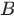
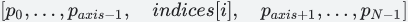

Gather slices from params axis axis according to indices.


### Aliases:

- [ `tf.compat.v2.gather` ](/api_docs/python/tf/gather)


```
 tf.gather(
    params,
    indices,
    validate_indices=None,
    axis=None,
    batch_dims=0,
    name=None
)
 
```

Gather slices from params axis  `axis`  according to  `indices` .   `indices`  must
be an integer tensor of any dimension (usually 0-D or 1-D).

For 0-D (scalar)  `indices` :


>
<p> `output` </p> [p0,...,paxis−1,paxis+1,...,pN−1]<script type="math/tex" id="MathJax-Element-1">[p_0,          ..., p_{axis-1},        \hspace{5.1em}
           p_{axis + 1}, ..., p_{N-1}]</script>  =<br>
 `params`  [p0,...,paxis−1,indices,paxis+1,...,pN−1]<script type="math/tex" id="MathJax-Element-2">[p_0,          ..., p_{axis-1},        \hspace{1em}
           indices,                              \hspace{1em}
           p_{axis + 1}, ..., p_{N-1}]</script> .<p></p>

For 1-D (vector)  `indices`  with  `batch_dims=0` :


>
<p> `output` </p> <script type="math/tex" id="MathJax-Element-3">[p_0,          ..., p_{axis-1},        \hspace{2.6em}
           i,                                    \hspace{2.6em}
           p_{axis + 1}, ..., p_{N-1}]</script>  =<br>
 `params`  <script type="math/tex" id="MathJax-Element-4">[p_0,          ..., p_{axis-1},        \hspace{1em}
           indices[i],                           \hspace{1em}
           p_{axis + 1}, ..., p_{N-1}]</script> .<p></p>

In the general case, produces an output tensor where:


<script type="math/tex; mode=display" id="MathJax-Element-5">\begin{align*}
output[p_0,             &..., p_{axis-1},                       &
     &i_{B},           ..., i_{M-1},                          &
     p_{axis + 1},    &..., p_{N-1}]                          = \\
params[p_0,             &..., p_{axis-1},                       &
     indices[p_0, ..., p_{B-1}, &i_{B}, ..., i_{M-1}],        &
     p_{axis + 1},    &..., p_{N-1}]
\end{align*}</script>
Where 


ndims(params)


ndims(indices)


batch_dims


The shape of the output tensor is:


>
<p><code translate="no" dir="ltr">output.shape = params.shape[:axis] + indices.shape[batch_dims:] +
params.shape[axis + 1:]</code>.</p>

Note that on CPU, if an out of bound index is found, an error is returned.
On GPU, if an out of bound index is found, a 0 is stored in the corresponding
output value.

See also [ `tf.gather_nd` ](https://tensorflow.google.cn/api_docs/python/tf/gather_nd).


#### Args:

- **`params`** : The  `Tensor`  from which to gather values. Must be at least rank
 `axis + 1` .

- **`indices`** : The index  `Tensor` .  Must be one of the following types:  `int32` ,
 `int64` . Must be in range  `[0, params.shape[axis])` .

- **`validate_indices`** : Deprecated, does nothing.

- **`axis`** : A  `Tensor` . Must be one of the following types:  `int32` ,  `int64` . The
 `axis`  in  `params`  to gather  `indices`  from. Must be greater than or equal
to  `batch_dims` .  Defaults to the first non-batch dimension. Supports
negative indexes.

- **`batch_dims`** : An  `integer` .  The number of batch dimensions.  Must be less
than  `rank(indices)` .

- **`name`** : A name for the operation (optional).


#### Returns:
A  `Tensor` . Has the same type as  `params` .

