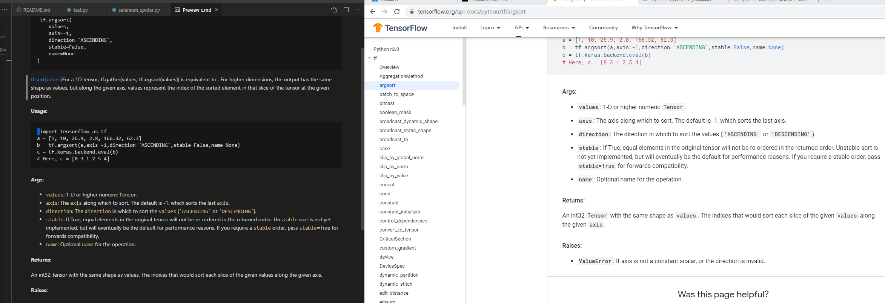

# Script 工具


## selenium_spider.py
chromedriver 镜像，需要和浏览器版本一直的驱动安装，并安装到path变量里面
https://npm.taobao.org/mirrors/chromedriver/


### selenium + webdriver 的方式是可以的
- 比较有限麻烦，
- 是通过API去控制浏览器的行为
自动化测试 selenium 模块 webdriver使用（一）：
https://www.cnblogs.com/hellosecretgarden/p/9206648.html 

在控制台里面
```python
from selenium import webdriver
driver=webdriver.Chrome()

driver.get("http://www.baidu.com")


```

### selenium_spider 负责将tensorflow api 文档爬取并调用百度API方式翻译写入

[selenium_spider](spider_tensorflow_docs.py)


```txt

html.find_elements_by_css_selector('*') # 全部

label.get_attribute('leve;') # h2
 
print(node.get_attribute('level')=="h1")

label.tag_name 

label1.clear(                              label1.get_attribute(
label1.click(                              label1.get_property(
label1.find_element(                       label1.id
label1.find_element_by_class_name(         label1.is_displayed(
label1.find_element_by_css_selector(       label1.is_enabled(
label1.find_element_by_id(                 label1.is_selected(
label1.find_element_by_link_text(          label1.location
label1.find_element_by_name(               label1.location_once_scrolled_into_view
label1.find_element_by_partial_link_text(  label1.parent
label1.find_element_by_tag_name(           label1.rect
label1.find_element_by_xpath(              label1.screenshot(
label1.find_elements(                      label1.screenshot_as_base64
label1.find_elements_by_class_name(        label1.screenshot_as_png
label1.find_elements_by_css_selector(      label1.send_keys(
label1.find_elements_by_id(                label1.size
label1.find_elements_by_link_text(         label1.submit(
label1.find_elements_by_name(              label1.tag_name
label1.find_elements_by_partial_link_text( label1.text
label1.find_elements_by_tag_name(          label1.value_of_css_property(
label1.find_elements_by_xpath(
    
```

### 成功爬取


